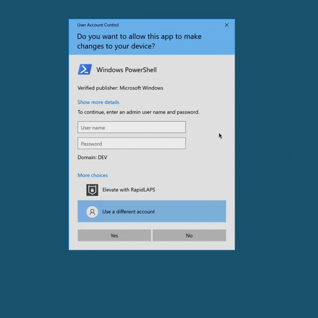
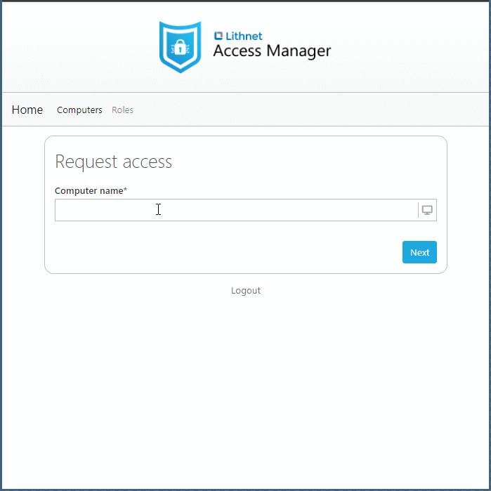
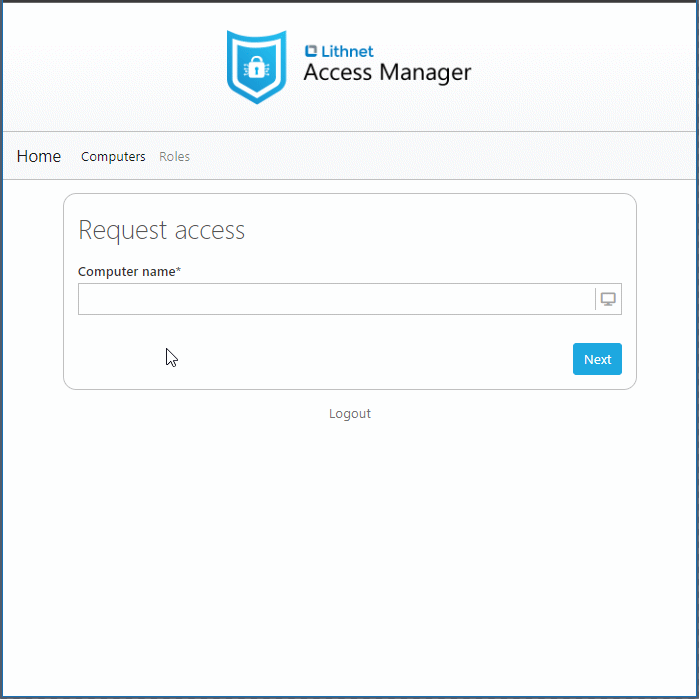
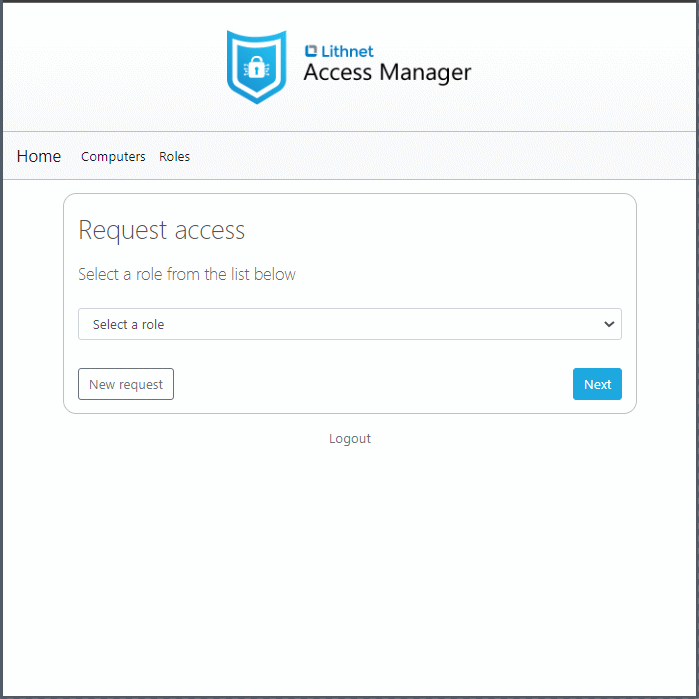
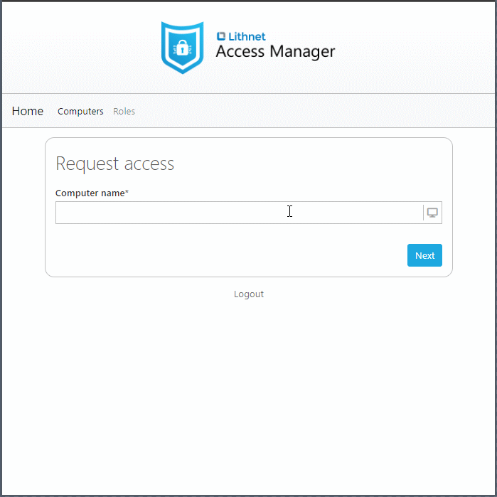

# Home

Lithnet Access Manager is a product that allows you to safely delegate sensitive administrative access to computers in your organization in a modern and user-friendly way. The product's goals are to help you deploy best practice security solutions like LAPS and just-in-time access, while minimizing the organizational friction usually associated with these sorts of tools. 

We want to help reduce the likelihood and impact of a wide-spread compromise in your environment by enabling you to effectively replace permanent administrative access to your workstations and servers. 

### Putting usability front-and-centre
While LAPS on its own helps provide best-in-class protection against lateral movement attacks, we all know that LAPS passwords are a pain to use. We humans aren't great at remembering or typing out long and complicated passwords. Getting those LAPS also requires the use of heavy-weight tools such as the _Active Directory Users and Computers_ console, which isn't always an option out the in the field. 

Lithnet Access Manager provides simple, secure, and user friendly solutions to these problems.

#### RapidLAPS brings a passwordless login experience to LAPS - removing the need to type out LAPS passwords all together
What if you could deploy and gain all the security benefits of LAPS, without ever having to enter a LAPS password?

Access Manager provides a new feature called RapidLAPS. It's a passwordless LAPS experience, that integrates directly with the Windows logon screen. It allows authorized users to login using the LAPS account, by simply scanning a QR code or entering a PIN. 

This means you can log into the LAPS account, without ever having to type or even know the LAPS password!

It also integrates with the Windows admin elevation prompt (run as administrator), allowing you to review and approve the app and user requesting administrative access.

#### When LAPS passwords are required, Access Manager makes them easy to get to
Whether you are using Microsoft legacy LAPS, new Windows LAPS, or the Access Manager Agent, your LAPS passwords are always available via a single mobile-friendly, web-based app. Simply type in the computer name, and Access Manager will find the password and present it. Whether the LAPS password is stored in Active Directory, Microsoft Entra, or AMS itself, the process is seamless to the user.

We make sure we use fonts where you can actually see the difference between a lower-case L and a capital I. We also show a breakdown of the password using the NATO phonetic alphabet to make it easy to read it out to someone. You can even have Access Manager read the password with its text-to-speech capability!

#### When LAPS passwords are required, Access Manager makes them easy to use
You can use Access Manager to manage your LAPS passwords, instead of the Microsoft agent. This you to generate passphrases, instead of random complex and difficult to comprehend passwords for the managed LAPS account.

Passphrases are generated from word lists you provide, making them fully customizable to your organizations needs.

#### Just-in-time access to computers with just a click

Using the same web interface, users can request that their account be added to a group that is a member of the local administrators group of the computer. This access is temporary and automatically removed after the allowed time period.

## Just-in-time access to custom roles

Access Manager allows you to provide your users with just-in-time access to custom roles that you define. When a user is granted access to a role, Access Manager will add them to the corresponding Active Directory group, and automatically remove them when the allowed time period has elapsed.

### Enhanced the security of accessing LAPS passwords
#### Access Manager protects LAPS passwords with strong authentication
LAPS password stored in Active Directory are vulnerable to harvesting via stolen AD credentials and tickets. There's simply no way to protect them with modern authentication and MFA. 

Access Manager provides support for modern authentication options like OpenID Connect, allowing you to protect access to LAPS passwords by using identity providers such as Microsoft Entra or Okta. You can enforce strong authentication mechanisms like passkeys, and eliminate the risk of password harvesting directly from AD.

#### Access Manager prevent mass-harvesting of LAPS passwords
If an attacker gets their hands on credentials that have permission to read LAPS passwords from AD, there's nothing stopping them from extracting all the LAPS passwords for your organization in a matter of seconds.

Access Manager prevents this by implementing rate limiting for all access request. You can set per-user and per-IP address rate limits, to limit the damage that can be done in the event that a person with AMS access has their credentials compromised.

#### Access Manager improves visibility of LAPS access events
The out-of-box auditing story for Microsoft LAPS leaves a lot to be desired. Have you ever had to search event logs to try and find out who accessed a LAPS password in Active Directory? Were the right audit events even turned on when you needed them? How many domain controller event logs did you have to search through to find what you needed?

Access Manager provides detailed audit logs for every access event, and optionally allows you to send these events via email, via webhook to Slack or Teams, to Splunk, and even to PowerShell, allowing unlimited flexibility on how you want to track these events.

### Provide a Universal tool for access management
#### Access Manager lets you deploy LAPS to your entire organization
So we can deploy LAPS to Windows devices, but what about linux and macOS devices? 

The Access Manager agent extends LAPS support to these operating systems, and allows retrieval through the exact same web app and exact same process as Windows LAPS passwords.

#### The Access Manager web app is a multi-purpose tool
We're want to be the one-stop-shop for managing privileged access to endpoints, so using the same web app that allows users to access LAPS passwords, we've enabled other scenarios like retrieving BitLocker recovery passwords and providing just-in-time access to computers and roles.

#### Access Manager is extensible
We know that each organization has its own individual needs that need to be taken into account when deploying solutions to manage and delegate privileged access. We've built Access Manager to be extensible through PowerShell, allowing you to bring your own custom auditing and authorization solutions to the product.

#### Getting started

Read our [getting started guide](installation/getting-started.md) to learn how to start using Access Manager to secure your environment today.

### Other security solutions from Lithnet
We recommend you have a look at our other product [Lithnet Password Protection for Active Directory](https:/lithnet.io/products/password-protection), for a tool to help strengthen your environment against commodity password-based attacks.
