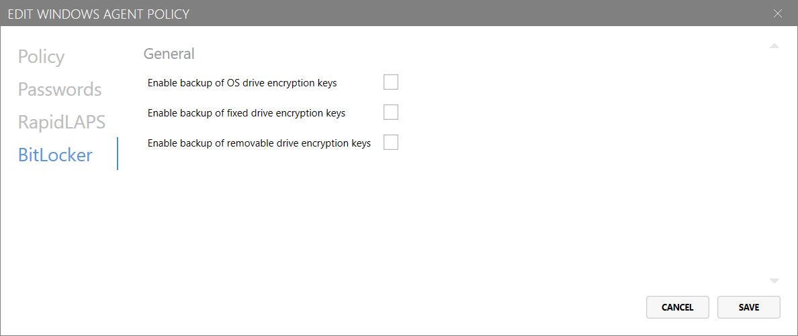

# Setting up Lithnet Access Manager Agent BitLocker recovery policies

This guide will walk you through configuring BitLocker recovery policies in an Access Manager Agent policy.

When configured, the Access Manager Agent can securely backup BitLocker encryption keys to the Access Manager server.

> Note: BitLocker recovery policies can only be configured for Windows agents.

## Step 1. Configure the types of keys to backup

### Enable backup of OS drive encryption keys

If configured, the Access Manager Agent will securely backup BitLocker encryption keys for "OS drives" to the Access Manager server.

### Enable backup of fixed drive encryption keys

If configured, the Access Manager Agent will securely backup BitLocker encryption keys for "fixed drives" to the Access Manager server.

### Enable backup of removable drive encryption keys

If configured, the Access Manager Agent will securely backup BitLocker encryption keys for "removable drives" to the Access Manager server.