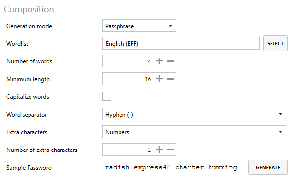

# Setting up Lithnet Access Manager Agent password management policies

This guide will walk you through configuring Password policies in an Access Manager Agent policy.

## Step 1. Enable password management

To configure the agent to manage and automatically, rotate the local administrator password on the device, tick the "Enable password management" box

> Note: if Windows LAPS (new or legacy) is already configured to manage the password on a device, the Access Manager Agent will refuse to change the password to ensure consistency.

## Step 2. Configure the local account to manage

Next, determine the local account you would like the Access Manager Agent to manage:

* If __Built-in admin account__ is selected, the Access Manager Agent will manage the password of the OS-specific "default" admin account:
    * For Windows agents, this means the [default Windows "Administrator" account](https://learn.microsoft.com/en-us/windows/security/identity-protection/access-control/local-accounts#administrator)
    * For Unix-based operating systems (e.g. macOS and Linux), this means the `root` account.
* If __Other account__ is selected, the Access Manager agent will manage the password of the account with the name specified in the field below.

## Step 3. Configure additional account settings

You can optionally configure the following settings for managing local accounts:

* __Create account if it does not exist__: If this setting is enabled, the Access Manager Agent will create a local account with the specified name if it does not exist on the device.
  * Note: This setting is unavailable for Linux.
* __Enable account if it is disabled__: If this setting is enabled, the Access Manager Agent will automatically enable the managed administrator account if it is disabled.
  * Note: This setting is unavailable for Linux.
* __Remove exiting LAPS passwords from Active Directory if present__: If this device's local administrator password was previously stored in Active Directory, this setting will clear existing passwords once the agent checks in (if applicable).

## Step 4. Configure password history settings

Access Manager can keep historical local administrator passwords, which may be useful if you need to restore machines from backup.

You can optionally configure the following settings for historical password retention:

* __Maximum password age (days)__: The maximum number of days before the password must be rotated. For example, if this is set to 7, then the password would be rotated after 7 days.
* __Number of previous passwords to keep__: The number of historical passwords to store in the Access Manager directory.
* __Number of days to keep previous passwords__: The number of days to keep historical passwords for; setting this field to "0" disables aging out of historical passwords.

## Step 4. Configure password generation

The Access Manager Agent can generate passwords in two ways:
* If the `Generation mode` is set to `Password`, Access Manager will generate random passwords with the character sets of your choosing
* If the `Generation mode` is set to `Passphrase`, Access Manager will generate random passphrases

### Step 4a. Configuring "random passwords"

First, set the `Generation mode` to `Password`.

Next, configure the different parameters for passwords the Access Manager Agent will generate:

* __Password length__: The length of passwords to be generated for local administrator accounts
* __Password composition__
    * __Use lower-case letters__: If configured, generated passwords will contain lower-case letters
    * __Use upper-case letters__: If configured, generated passwords will contain upper-case letters
    * __Use numbers__: If configured, generated passwords will contain numbers
    * __Use symbols__: If configured, generated passwords will contain symbols

> Note: It is important to ensure that the configured settings are compatible with any local account password requirements you may have in your environment.

### Step 4b. Configuring "random passphrases"

First, set the `Generation mode` to `Passphrase`.

Next, select the _wordlist_ that the Access Manager will use to generate passphrases by clicking the `Select` button next to the wordlist box.

> For more information on configuring your own wordlists, see the [passphrases & wordlists](../../../help-and-support/advanced-help-topics/passphrases-and-wordlists.md) guide.

Finally, configure the different parameters for passphrases the Access Manager Agent will generate:

* __Number of words__: The number of words to include in a generated passphrases
* __Minimum length__: The minimum length of passphrases generated by the Access Manager Agent
* __Capitalize words__: If configured, the first letter of each word in the passphrase will be capitalized.
* __Word separator__: The character used to separate words in the passphrase:
    * *Space*: Place a space " " between each word
    * *Hyphen*: Place a dash "-" between each word
    * *Underscore*: Place an underscore "_" between each word
* __Extra characters__: If required, randomly place extra characters at the end of one of the words in the passphrase to increase complexity.
    * *None*: Do not add extra characters to the passphrase
    * *Numbers*: Add extra numbers somewhere in the passphrase
    * *Symbols*: Add extra symbols somewhere in the passphrase
    * *Numbers & Symbols*: Add extra numbers & symbols somewhere in the passphrase
* __Number of extra characters__: The number of extra characters to add to the passphrase, as specified above.

## Step 5. Generate a sample password

By clicking the `Generate` button at the bottom of the page, you can generate a sample password matching the settings you have configured.