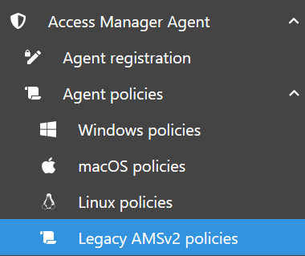
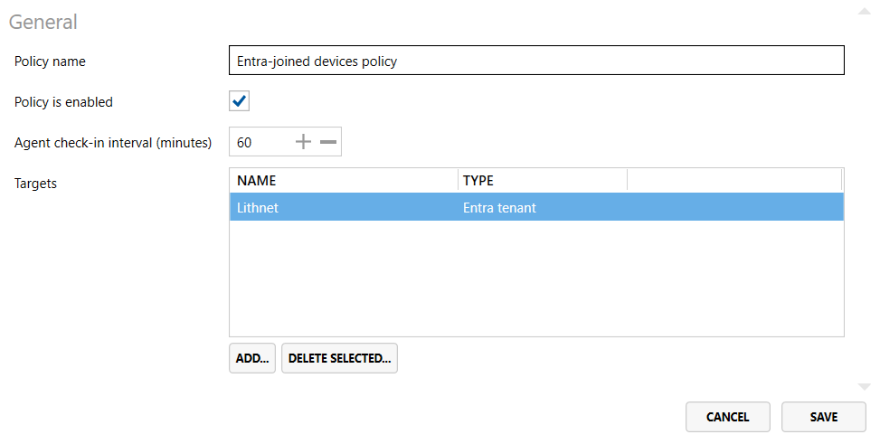

# Setting up Lithnet Access Manager Agent policies

This guide will walk you through the steps to configure policies for the Lithnet Access Manager Agent (AMA).

Agent policies are used to configure features such as *password management*, *RapidLAPS* (Windows only), and *BitLocker recovery key backup* (Windows only).

The AMA will periodically "check-in" with the Access Manager Server to retrieve the appropriate policy.

## Types of policies

Agent policies are divided into three categories, based on the target operating system: _Windows_, _macOS_ and _Linux_.

Each operating system has a __default__ policy, and a set of __custom__ policies.

You can create custom Access Manager Agent policies that are targeted at specific computers, groups and containers - from Active Directory, Microsoft Entra, or AMS.

If no custom policies are configured, or no an agent does not match any of the custom policies configured, the "Default agent policy" will be applied to the agent.

---

## Configuring the default agent policy

The following guide describes how to configure the default agent policy for your operating system of choice.

### Step 1. Navigate to an OS-specific policy page

To begin configuring a default agent policy, first select the operating system you wish to configure policy for in the sidebar under `Access Manager Agent/Agent policies`:

### Step 2. Open the default policy editor

In the agent policies page you have open, click the `Edit <OS> default policy...` button to open the default agent policy.

### Step 3. Configure check-in interval

On the first page of the policy editor - configure the "Agent check-in interval".

This setting determines how frequently the agent should attempt to check-in to the server - in minutes. When an agent checks in, it will receive policy updates, reset local administrator account passwords (if required), and backup disk encryption keys (if required).

The default value is to check-in every to 60 minutes.

### Step 4. Configure your policy settings

Next, you can configure agent settings by selecting from the tabs on the left-hand side of the policy editor.

The following guides describe the different policy settings available:
* [Setting up password management policies](./setting-up-lithnet-laps-policies-password.md)
* [Setting up RapidLAPS policies (Windows)](./setting-up-lithnet-laps-policies-rapidlaps.md)
* [Setting up BitLocker backup policies (Windows)](./setting-up-lithnet-laps-policies-bitlocker.md)

### Step 5. Save the policy

To save the default policy and make it available for clients, simply click the `Save` button in the bottom righthand corner of the policy editor.

---

## Configuring custom policies

The following guide describes how to configure custom agent policies for your operating system of choice.

### Step 1. Navigate to an OS-specific policy page

To begin configuring a default agent policy, first select the operating system you wish to configure policy for in the sidebar under `Access Manager Agent/Agent policies`:

### Step 2. Create a new custom agent policy

To create a new custom agent policy, simply click the `Create new...` button at the bottom of the custom agent policy list.

### Step 3. Configure generic policy settings

#### Step 3a. Name your policy

On the first page of the policy editor - configure a memorable name and a description for your custom policy.

#### Step 3b. Configure check-in interval

Next, configure the "Agent check-in interval".

This setting determines how frequently the agent should attempt to check-in to the server - in minutes. When an agent checks in, it will receive policy updates, reset local administrator account passwords (if required), and backup disk encryption keys (if required).

The default value is to check-in every to 60 minutes.

#### Step 3c. Add targets for your policy

Next, configure the "targets" for your custom policy. Policies can be targeted at specific computers, groups and containers - from Active Directory, Microsoft Entra, or AMS.

To add a new target to a policy, simply click `Add...` at the bottom of the target list, and follow the prompts to select your target computer, group, or container.

For more information on custom policy targeting, and tips for organising agent policies for devices in your environment, see the [agent policy development guide](../../../help-and-support/advanced-help-topics/agent-policy-development.md).

### Step 4. Configure your policy settings

Next, you can configure agent settings by selecting from the tabs on the left-hand side of the policy editor.

The following guides describe the different policy settings available:
* [Setting up password management policies](./setting-up-lithnet-laps-policies-password.md)
* [Setting up RapidLAPS policies (Windows)](./setting-up-lithnet-laps-policies-rapidlaps.md)
* [Setting up BitLocker backup policies (Windows)](./setting-up-lithnet-laps-policies-bitlocker.md)

### Step 5. Save the policy

To save the custom policy and make it available for clients, simply click the `Save` button in the bottom righthand corner of the policy editor.

---

## More information

For more information on the different settings configurable in agent policies, see the corresponding help page:
* [Windows agent policies page](../../../help-and-support/app-pages/access-manager-agent-policies-windows-page.md)
* [macOS agent policies page](../../../help-and-support/app-pages/access-manager-agent-policies-macos-page.md)
* [Linux agent policies page](../../../help-and-support/app-pages/access-manager-agent-policies-linux-page.md)
* [Legacy (v2) agent policies page](../../../help-and-support/app-pages/access-manager-agent-policies-amsv2-page.md)