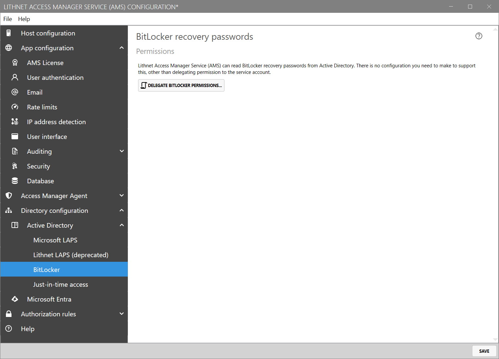
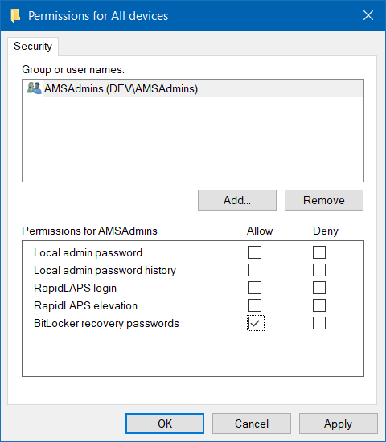

# Setting up access to BitLocker keys stored in Active Directory
You can access BitLocker recovery passwords using Lithnet Access Manager's web app. No specific configuration is needed, other than delegating permission for the AMS service account to read those passwords from Active Directory.

## Step 1: Delegate permissions

From the `Directory configuration/Active Directory/BitLocker` page, click the `Delegate BitLocker Permissions` button to access a script that will modify the necessary AD permissions to allow the AMS service account to read recovery passwords.

## Step 2: Assign access
Create an authorization rule, granting permission for your selected users and groups to access the BitLocker recovery passwords for the specified computers.

From the `Authorization rules/Computers` page, select `Add...` to create a new rule. Select the  tenant, directory, device group, or computer you want to assign access to, and provide a friendly description for this rule. This will appear in audit logs if a user is granted access.

Expand the `Access control` section and select `Edit Permissions...` to open the ACL editor.

If you'd like to be notified when someone accesses a BitLocker recovery password, select the notification channels you'd like to send to for success and failure events.

## Step 4: Validate access
Log in to the Access Manager web app as an authorized user, and request access to the recovery password for a computer. If you have performed the steps correctly, you should be able to see the machine's recovery password.

If passwords cannot be retrieved, double check that you have followed the steps in this article, and see the [troubleshooting guide](../../../help-and-support/troubleshooting.md) for how to find the Access Manager server logs to help understand and resolve the issue.