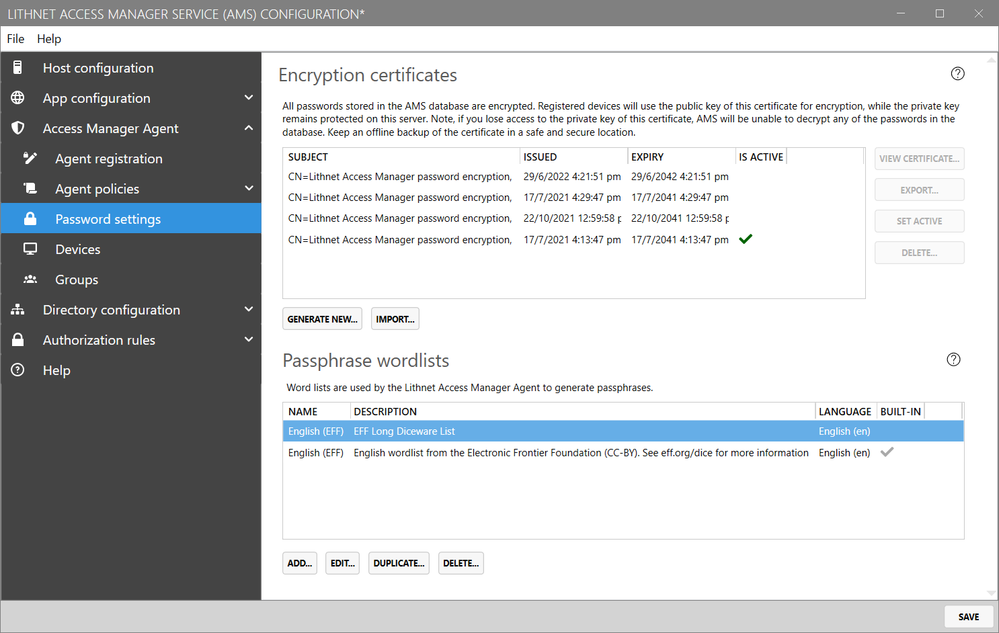

# Setting the AMS directory for Lithnet LAPS agents

When using the Lithnet Access Manager Agent (AMA) on devices that are not joined to an Active Directory (non-windows devices, Azure AD devices, and standalone Windows devices), the agent stores passwords in the Access Manager Directory.

## Step 1: Enable the AMS directory

In order to support LAPS on these devices, ensure you have followed the steps in [Setting up the AMS directory](setting-up-the-ams-directory.md)

## Step 2: Create a password encryption certificate

Access Manager requires an *encryption certificate* to be configured, to facilitate encryption of sensitive passwords in the Access Manager directory.

>Note: These certificates can be generated by AMS itself, or imported. Depending on your threat model, you may elect to store this certificate in other cryptographic backend supported by Windows CNG, such as a hardware security module (HSM).

From the `Access Manager Agent/Password settings` page, press the `Generate new...` button, to create a new encryption certificate.

```
Backup this certificate when prompted and store it in a safe place. If you lose this certificate, you will not be able to decrypt any passwords stored in the directory. There are no other recovery options.
```



## Step 3: Configure Access Manager Agent policies

AMS uses *agent policies* to configure the behaviour of Lithnet Access Manager agents.

This includes:
- Password settings
    - The account for the agent to manage
    - Historical password retention settings
    - Password composition settings (for both passwords & passphrases)
- RapidLAPS settings (Windows-only)
    - Enable *RapidLAPS* for login and/or elevation
    - Configure custom user prompts
- BitLocker settings (Windows-only)
    - Enable backup of BitLocker disk encryption keys to the Access Manager directory.

You can create custom policies and assign them to groups of computers, and you can specify a default policy that applies when no matching group-based policies are found.

For more information on configuring agent policies, see the  [setting up Lithnet LAPS policies](./setting-up-lithnet-laps-policies.md) page.