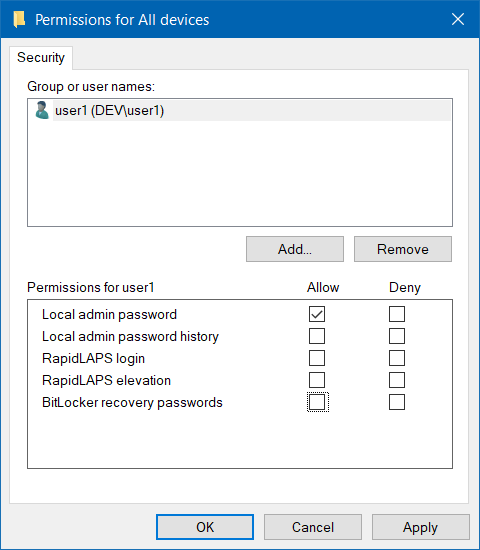

# Setting up Lithnet LAPS

The Access Manager agent can manage the local admin password for your Windows, macOS, and Linux devices, no matter if they are joined to Active Directory, Entra ID, or are managed by some other mechanism. 

The passwords are encrypted and stored on the Access Manager Server to allow retrieval via the Access Manager web app.

Lithnet LAPS provides several benefits over the Microsoft LAPS offerings
* Support for using passphrases as LAPS passwords
* Support for Windows devices that are not joined to an Active Directory or Entra ID tenant
* Support for macOS devices
* Support for Windows devices

Note, you do not need to use Lithnet LAPS to use the RapidLAPS feature if you are already using Microsoft LAPS. You will however still need to install the Lithnet Access Manager agent.

## Step 1: Enable agent support on the AMS server

Follow the steps in [Enabling agent support on the AMS server](../../../installation/installing-the-access-manager-agent/enabling-agent-support.md)

## Step 2: Deploy the Access Manager agents

Deploy the [Access Manager agent to your devices](../../../installation/installing-the-access-manager-agent/installing-the-access-manager-agent.md).

## Step 3: Create an encryption certificate

Access Manager requires an *encryption certificate* to be configured, to facilitate encryption of sensitive passwords.

From the `Access Manager Agent/Password settings` page, press the `Generate new...` button, to create a new encryption certificate.


Backup this certificate when prompted and store it in a safe place. If you lose this certificate, you will not be able to decrypt any passwords stored in the directory. There are no other recovery options.



These certificates can be generated by AMS itself, or imported. Depending on your threat model, you may elect to store this certificate in other cryptographic backend supported by Windows CNG, such as a hardware security module (HSM).


## Step 4: Configure Access Manager Agent policy
AMS uses *agent policies* to configure the behavior of Lithnet Access Manager agents.

Select the appropriate operating system policy section from under the `Access Manager agent/Agent policies` section of the config app. 

Find or create a policy that applies to the computers you want to manage the password for.

See the guide on [creating and managing policies](../../../help-and-support/advanced-help-topics/setting-up-agent-policies.md) for more information on policy targeting and creation.

## Step 5. Enable password management

To configure the agent to manage and automatically, rotate the local administrator password on the device, tick the "Enable password management" box


If Microsoft LAPS is configured to manage the password on a device, the Access Manager Agent's password change capability will be disabled


## Step 6. Configure the local account to manage

Next, determine the local account you would like the Access Manager Agent to manage:

* If `Built-in admin account` is selected, the Access Manager Agent will manage the password of the OS-specific "default" admin account:
    * For Windows agents, this means the [default Windows "Administrator" account](https://learn.microsoft.com/en-us/windows/security/identity-protection/access-control/local-accounts#administrator)
    * For Unix-based operating systems (e.g. macOS and Linux), this means the `root` account.
* If `Other account` is selected, the Access Manager agent will manage the password of the account with the name specified in the field below.

You can optionally configure the following settings for managing local accounts:

* `Create account if it does not exist`: If this setting is enabled, the Access Manager Agent will create a local account with the specified name if it does not exist on the device.
  * Note: This setting is unavailable for Linux.
* `Enable account if it is disabled`: If this setting is enabled, the Access Manager Agent will automatically enable the managed administrator account if it is disabled.
  * Note: This setting is unavailable for Linux.
* `Remove exiting LAPS passwords from Active Directory if present`: If this device's local administrator password was previously stored in Active Directory, this setting will attempt to clear existing passwords once the agent checks in (if applicable).

## Step 7. Configure password history settings

Access Manager can keep historical local administrator passwords, which may be useful if you need to restore machines from backup.

You can optionally configure the following settings for historical password retention:

* `Maximum password age (days)`: The maximum number of days before the password must be rotated. For example, if this is set to 7, then the password would be rotated after 7 days.
* `Number of previous passwords to keep`: The number of historical passwords to store in the Access Manager database.
* `Number of days to keep previous passwords`: The number of days to keep historical passwords for; setting this field to "0" disables aging out of historical passwords.

## Step 8. Configure password generation

The Access Manager Agent can generate either passwords, or passphrases.

### Generating passwords

Set the `Generation mode` to `Password`.

Next, configure the different parameters for passwords the Access Manager Agent will generate.

Use the `Generate` button at the bottom of the page to preview a password generated using the settings you selected.


It is important to ensure that the configured settings are compatible with any local account password requirements you may have in your environment.


### Generating passphrases

Set the `Generation mode` to `Passphrase`.

Next, select the word list that the Access Manager will use to generate passphrases by clicking the `Select` button next to the word list box.


For more information on configuring your own word lists, see the [managing word lists](../../../help-and-support/advanced-help-topics/managing-wordlists.md) guide.


Finally, configure the different parameters for passphrases the Access Manager Agent will generate.

Use the `Generate` button at the bottom of the page to preview a password generated using the settings you selected.

## Step 10: Assign access

Once the agent is deployed, and the policy configured, you can now configure access to individual users and groups using the AMS configuration tool.

From the `Authorization rules/Computers` page, select `Add...` to create a new target. Select the  tenant, directory, device group, or computer you want to assign access to, and provide a friendly description for this rule. This will appear in audit logs if a user is granted access.

Select `Edit Permissions...` to open the ACL editor. Assign the appropriate users and groups permission to read the local admin password.

You can optionally choose to expire the local admin password a period of time after it has been accessed. This will cause the Access Manager Agent to generate a new password after its next check-in time.

If you'd like to be notified when someone accesses a LAPS password, select the notification channels you'd like to send to for success and failure events.

## Step 11: Validate access
Log in to the Access Manager web app as an authorized user, and request access to the password for a computer. If you have performed the steps correctly, you should be able to see the machine's  password.

If passwords cannot be retrieved, double check that you have followed the steps in this article, and see the [troubleshooting guide](../../../help-and-support/troubleshooting.md) for how to find the Access Manager server logs to help understand and resolve the issue.