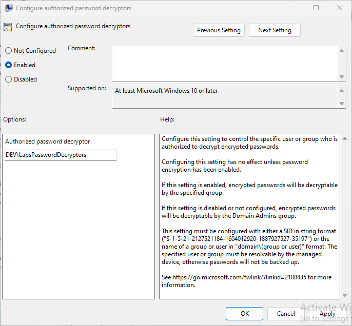

# Setting up Microsoft LAPS for Active Directory

Lithnet Access Manager provides a convenient web-based interface for accessing local admin passwords generated by both the legacy Microsoft LAPS client (using the ms-mcs-AdmPwd attribute), and the new Windows LAPS client (using the msLAPS-* attributes) built into Windows.

This guide assumes that you have one of the Microsoft LAPS agent deployed and configured appropriately.

This guide focuses on setting up support for Microsoft LAPS passwords stored in Active Directory. See our other guide for passwords stored in [Microsoft Entra](setting-up-microsoft-laps-for-aad.md).

## Step 1: Delegate Microsoft LAPS password permissions

You can use the Microsoft LAPS PowerShell cmdlets to delegate password read and reset permissions to the AMS service account, or use a script generated by AMS to do this for you.

From the `Directory configuration/Active Directory/Microsoft LAPS` page, click on `Delegate Microsoft LAPS Permissions` to see a pre-built script for delegating the appropriate permissions. Simply change the `$ou` variable to the full DN on of the container than contains the computers you want to be able to access with AMS.

Copy this script and run it with an account that has either domain admin rights, or delegated control of the specified container.

## Step 2: Assign encryption permissions (New Windows LAPS)
If you are using the new Windows LAPS along with the encrypted password functionality, then as well as delegating access to read the objects from the directory, you need to ensure the AMS service account is permitted to decrypt the passwords. Modify the Windows LAPS group policy, to ensure that the AMS service account is a member of the `Authorized password decryptor` group specified in the `Configure authorized password decryptors` setting of the `Computer configuration\Administrative Templates\System\LAPS` policy.

## Step 3: Assign access

The final step is to create an authorization rule, granting permission for your selected users and groups to access the LAPS passwords for the specified computers.

From the `Authorization rules/Computers` page, select `Add...` to create a new rule. Select the OU you delegated permissions to, and provide a friendly description for this rule. This will appear in audit logs if a user is granted access.

Expand the `Access control` section and select `Edit Permissions...` to open the ACL editor.

Note that legacy Microsoft LAPS does not support storing of LAPS history, so granting that permission will not have any effect.

You can optionally choose to expire the local admin password a period of time after it has been accessed. This will cause the LAPS agent to generate a new password _after_ its next check-in time. It may be up to 90 minutes after the time you specify.

If you'd like to be notified when someone accesses a LAPS password, select the notification channels you'd like to send to for success and failure events.

## Step 4: Validate access
Log in to the Access Manager web app as an authorized user, and request access to the password for a computer. If you have performed the steps correctly, you should be able to see the machine's  password.

If passwords cannot be retrieved, double check that you have followed the steps in this article, and see the [troubleshooting guide](../../../help-and-support/troubleshooting.md) for how to find the Access Manager server logs to help understand and resolve the issue.