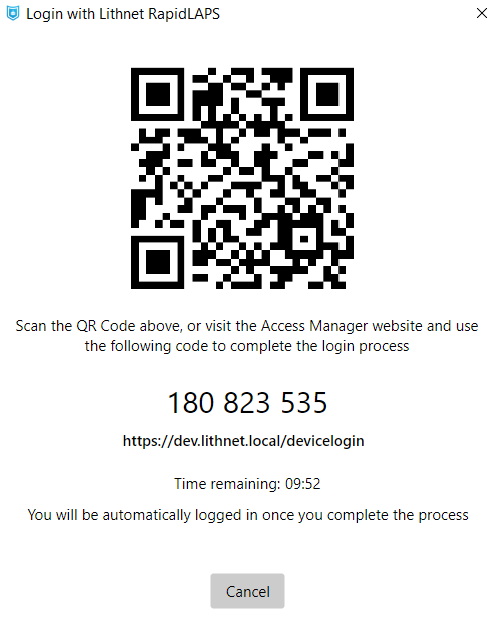

# Setting up RapidLAPS

This guide will walk you through configuring RapidLAPS in your environment.

*RapidLAPS* integrates into the Windows login screen and admin consent prompts, allowing you to speed up the process when using the LAPS password. 

With *RapidLAPS*, by simply scanning a QR code, or visiting the Access Manager web app and entering a PIN, you can remotely authorize and log into any LAPS-enabled computer without ever knowing the LAPS password. Once authorized, Access Manager securely transports the LAPS password between the server and the client, saving you from having to type out a long and complicated password.

Using RapidLAPS requires the Access Manager agent to be installed on your computers, but you do not need to configure the Access Manager agent to manage the LAPS password. RapidLAPS works whether you are using Windows LAPS, legacy LAPS, or the Access Manager agent to manage your LAPS passwords.


RapidLAPS is only available on [supported Windows operating systems](../../../installation/system-requirements.md).


## Step 1: Enable agent support on the AMS server

Follow the steps in [Enabling agent support on the AMS server](../../../installation/installing-the-access-manager-agent/enabling-agent-support.md)

## Step 2: Deploy the Access Manager agents

Deploy the [Access Manager agent to your devices](../../../installation/installing-the-access-manager-agent/installing-the-access-manager-agent.md).

## Step 4: Configure Access Manager Agent policy
AMS uses *agent policies* to configure the behavior of Lithnet Access Manager agents.

From the `Access Manager agent/Agent policies/Windows policies` page, find or create a policy that applies to the computers you want to enable RapidLAPS for.

See the guide on [creating and managing policies](../../../help-and-support/advanced-help-topics/setting-up-agent-policies.md) for more information on policy targeting and creation.

## Step 5. Configure RapidLAPS scenarios

First, select which scenarios in Windows you wish to enable RapidLAPS.

| Scenario | Description |
| --- | --- |
| Enable RapidLAPS for logins | When configured, this setting will add a "Login with RapidLAPS" tile to the Windows login screen, allowing login to the local administrator account via Access Manager. |
| Enable RapidLAPS for elevation | When configured, this setting will add an "Elevate with Lithnet RapidLAPS" tile to the Windows admin consent (UAC)() prompt, allowing elevation of applications, installers, and system actions with the local administrator account via Access Manager. |

## Step 6. Configure prompts for user input

Optionally, you can present users with a series of prompts whenever they login or elevate with RapidLAPS. Responses to these prompts are delivered to the server if a login or elevation is attempted, and are presented to the user authorizing the request in the Access Manager web app (as well as being stored in the audit log).

The following options are configurable for user prompts:
* __Usage scenarios__: Configure whether the prompt is shown with RapidLAPS requests at either the *login screen* or during *elevation*.
* __Data type__: The type of prompt
  * *Text*: A simple text-box
  * *Multiline text*: A text box with multiple lines for long-form responses
  * *Drop-down list*: A drop down box, where a user can select an option from a list
  * *Checkbox*: A simple checkbox
  * *Label*: A piece of text that will appear in the prompt window (e.g., for providing organization-specific guidance)
* __Helper text__: An optional message presented alongside the prompt
* __Required__: Whether the specific prompt is required
* `Text` and `Multiline text`-specific fields
    * __Minimum length__: The minimum length of the text input; set to "0" to disable length requirements
    * __Validation regex__: An optional regular expression for validating text
    * __Validation failure message__: An optional message to present to users when the validation requirements are not met
* `Drop-down list`-specific fields
    * __List options__: A list of options a user can select in the drop down

## Step 7. Create computer authorization rules for RapidLAPS

Once the policy is configured, you can now configure individual users and groups who can approve RapidLAPS logins or elevations using the AMS configuration tool.

From the `Authorization rules/Computers` page, select `Add...` to create a new authorization rule. Select the container containing the computers you wish to allow RapidLAPS access to, and provide a friendly description for this rule. This will appear in audit logs if a user is approves or denies a request.

Select `Edit Permissions...` to open the ACL editor. Assign the appropriate users and groups permission to allow RapidLAPS login and/or elevation approval access.

If you'd like to be notified when someone requests RapidLAPS login or elevation, select the notification channels you'd like to send to for success and failure events.

## Step 8: Validate access
Once the policy has had time to propagate to the device, you can begin the validation process. If the policy has been processed, on the login screen, you will see a `Login with RapidLAPS` tile on the bottom left corner of the screen.

Select the tile and click the arrow to login with RapidLAPS. If you have configured any user prompts, complete them on the following page and click `Submit`. The QR code will appear which you can scan with a mobile device, or visit the AMS web app using the URL shown, and enter the PIN.

Once you have authorized the request in the web app, the login should proceed as normal.

If the login process does not work, double check that you have followed the steps in this article, and see the [troubleshooting guide](../../../help-and-support/troubleshooting.md) for how to find the Access Manager server and agent logs to help understand and resolve the issue.