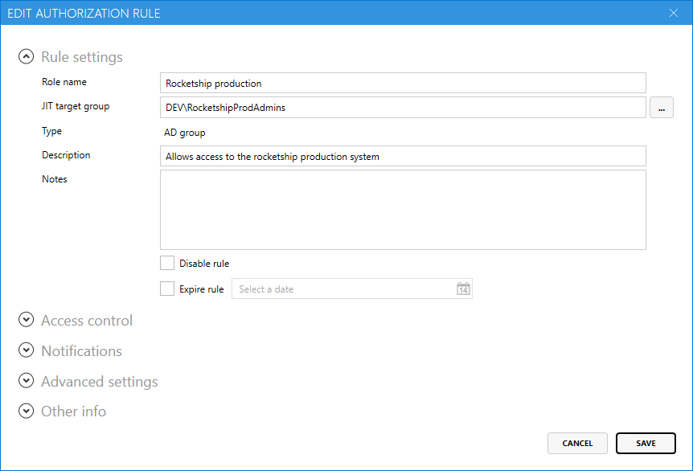
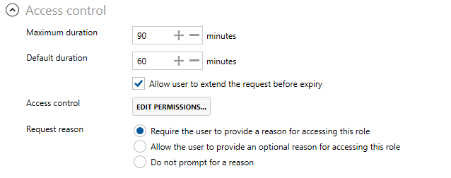

# Setting up just-in-time access to roles

 JIT for roles is an [Enterprise edition feature](../../access-manager-editions.md)

Lithnet Access Manager allows you to define a role, based on an Active Directory group, that users are allowed to request access to on a temporary basis. 

When a user requests access to a role, they are added to the Active Directory group, and when that access expires, they are removed.

## Step 1: Prepare the Active Directory

Access Manger's JIT functionality works with any version of Active Directory from Windows Server 2003 and above, but the underlying mechanism used depends on the forest functional level.

### Windows Server 2016 forest functional level and above where PAM feature is enabled

In Active Directory forests with a Windows 2016 or higher forest functional levels can take advantage of a new feature called time-based membership. This has several advantages over the dynamic group model. In this model when a user is granted JIT access to a role, Access Manager adds the user directly to the JIT group, but it can tell Active Directory that the group membership itself is time-limited. The user is added to the group with a time-to-live value and after that time, the user is automatically removed from the group by Active Directory.

Time-based membership is part of the [Privileged Access Management optional forest feature](https://docs.microsoft.com/en-us/openspecs/windows\_protocols/ms-adts/d079eee8-1bac-4b03-86e4-506a21450905) and must be explicitly enabled.

You can use the `Enable PAM feature in forest` script, available on the `Directory configuration/Active Directory/Just-in-time access' page to enable this feature in your forest.

### Other domains

If the Active Directory PAM forest feature is not enabled or not available, Access Manager will add the user to the JIT group, and use its internal scheduler to remove the user from the group when the time has expired.

## Step 2: Delegate Active Directory permission

You'll need to make sure the AMS service account has permission to read and write to the `member` attribute of any groups that you assign to roles.

## Step 3: Assign access

You can now configure access to individual users and groups using the AMS configuration tool.

From the `Authorization rules/Roles` page, select `Add...` to create a new authorization rule. Provide a role name, and select the target group that will be used to grant access to this role. In the description field, provide a friendly description that will be seen be users when they select the role to claim.

In the `Access Control` section, select `Edit Permissions...` to open the ACL editor. Assign the appropriate users and groups permission to allow JIT access.

Specify the maximum duration of time the user can hold the role for, and set the default duration that will be pre-filled for them when they make the access request.

You can optionally allow the user to extend their access before it expires.

If you'd like to be notified when someone requests JIT access, select the notification channels you'd like to send to for success and failure events.

## Step 5: Validate access
Log in to the Access Manager web app as an authorized user, click on the `Roles` page and request JIT access to a role. 
