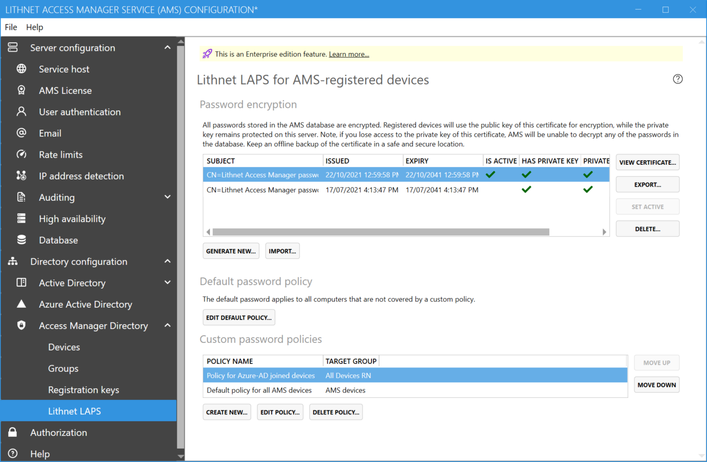
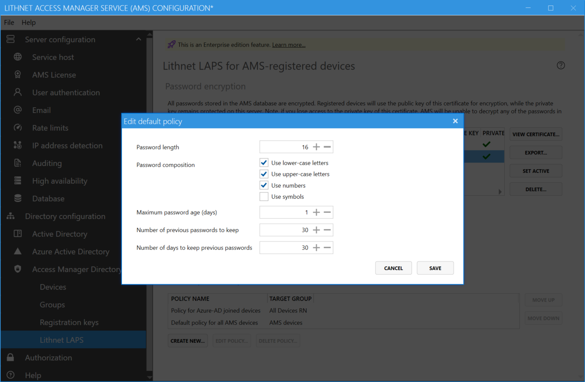

# Setting the AMS directory for Lithnet LAPS clients

When using the Lithnet Access Manager Agent (AMA) on devices that are not joined to an Active Directory (non-windows devices, Azure AD devices, and standalone Windows devices), the AMA stores passwords in the Access Manager Directory.

## Step 1: Enable the AMS directory

In order to support LAPS on these devices, ensure you have followed the steps in [Setting up the AMS directory](setting-up-the-ams-directory.md)

## Step 2: Create a password encryption certificate

From the `Directory configuration/Access Manager Directory/Lithnet LAPS` page, press the `Create new...` button, to create a new encryption certificate.

```
Backup this certificate when prompted and store it in a safe place. If you loose this certificate, you will not be able to decrypt any passwords stored in the directory. There are no other recovery options.
```



## Step 3: Adjust the default password policy

AMS uses password policy to instruct clients how to generate their LAPS passwords. You can create custom policies and assign them to groups of computers, and you can specify a default policy that applies when no matching group-based policies are found.

Set the default policy as the baseline for your environment, and create specific policies where circumstances require it.

You can create policies and assign them to either Azure AD or AMS groups containing computers.


