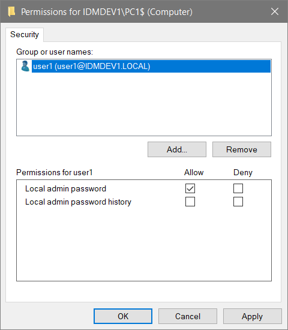

# Setting up Lithnet LAPS for Azure AD joined and registered devices

 Lithnet LAPS for Azure AD is an [Enterprise edition feature](../../../access-manager-editions.md)

This guide will walk you through the steps to configure the Access Manager service, and the Access Manager agent to support managing LAPS passwords for Azure AD-joined and registered Windows 10 and higher devices.

## Step 1: Set up the AMS directory and configure the Azure AD tenant

The Lithnet Access Manager agent uses the Access Manager directory to store passwords for Azure AD joined and registered devices. Follow the steps in the [AMS directory setup guide](setting-up-the-ams-directory.md), making sure to complete the process of setting up access for AMS to your Azure AD tenant

## Step 2: Configure Lithnet LAPS for the Access Manager directory

Next, configure[ Lithnet LAPS for the AMS directory](configuring-lithnet-laps-for-the-ams-directory.md). This process will configure the encryption certificate for the service, and set up the password policies required.

## Step 3: Install the Access Manager Agent

Follow the guide to[ install the agent](../../../installation/installing-the-access-manager-agent/installing-the-access-manager-agent-windows.md), making sure you select 'Azure Active Directory authentication' when prompted by the installer, and enter your AAD tenant ID when prompted.

The installation guide provides command lines for silently installing the MSI, which can be used with automated deployment tools such as Microsoft Intune. Configuring these deployment tools is out of scope for this guide.

## Step 4: Validate agent installation

From the `Directories/Access Manger Directory/Devices` page, ensure that the Azure AD devices where the Access Manager agent has been installed have appeared in the device list.

## Step 5: Assign access

Once the agent is deployed, and the policy configured, you can now configure access to individual users and groups using the AMS configuration tool.

From the `Authorization` page, select `Add...` to create a new target. Select either the tenant, group or computer you want to grant access to

Select `Edit Permissions...` to open the ACL editor. Assign the appropriate users and groups permission to read the local admin password.

```
For Azure AD devices, only the `Local admin password` and `Local admin password history` permissions are valid.
```



You can optionally choose to expire the local admin password a period of time after it has been accessed. This will cause the Access Manager Agent to generate a new password _after_ its next check-in time.

If you'd like to be notified when someone accesses a LAPS password, select the notification channels you'd like to send to for success and failure events.

## Step 6: Validate access

Log in to the Access Manager web app as an authorized user, and request access to the password for a computer. If you have performed the steps correctly, you should be able to see the machine's local admin password.
