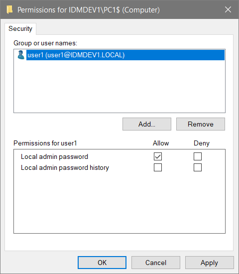

# Setting up Lithnet LAPS for standalone Windows devices

This guide will walk you through the steps to configure the Access Manager service, and the Access Manager agent to support managing the local admin password on Windows machines that are not joined to an Active Directory or Azure Active Directory.

## Step 1: Set up the AMS directory

The Lithnet Access Manager agent uses the Access Manager directory to store passwords for standalone Windows devices. Follow the steps in the[ AMS directory setup guide](setting-up-the-ams-directory.md), making sure to enable `key-based device registration`.

## Step 2: Configure Lithnet LAPS for the Access Manager directory

Next, configure[ Lithnet LAPS for the AMS directory](configuring-lithnet-laps-for-the-ams-directory.md). This process will configure the encryption certificate for the service, and set up the password policies required.

## Step 3: Create a registration key

From the `Directory configuration/Access Manager Directory/Registration keys` page, create a [new registration key](../../../help-and-support/app-pages/access-manager-directory-registrationkeys-page.md) that will be used for agent installations.

## Step 4: Install the Access Manager Agent

Following[ agent installation guide](../../../installation/installing-the-access-manager-agent/installing-the-access-manager-agent-windows.md), selecting the Access Manager password storage mode, and AMS authentication when prompted. You'll also need the AMS server name, and the registration key created in step 3.

The installation guides provide command lines for silently installing the package, which can be used with automated deployment tools such as SCCM. Configuring these deployment tools is out of scope for this guide.

## Step 5: Validate agent installation

From the `Directory configuration/Access Manger Directory/Devices` page, ensure that the devices you installed the agent have appeared in the device list. If you configured your registration key to require manual approval, you must approve the devices before they can be accessed.

## Step 6: Assign access

Once the agent is deployed, and the policy configured, you can now configure access to individual users and groups using the AMS configuration tool.

From the `Authorization rules/Computers` page, select `Add...` to create a new target. Select either the group or computer you want to grant access to. Access Manager provides some built-in groups, but you can create your own from the [groups page](../../../help-and-support/app-pages/access-manager-directory-groups-page.md).

Select `Edit Permissions...` to open the ACL editor. Assign the appropriate users and groups permission to read the local admin password.

You can optionally choose to expire the local admin password a period of time after it has been accessed. This will cause the Access Manager Agent to generate a new password _after_ its next check-in time.

If you'd like to be notified when someone accesses a LAPS password, select the notification channels you'd like to send to for success and failure events.

## Step 7: Validate access

Log in to the Access Manager web app as an authorized user, and request access to the password for a computer. If you have performed the steps correctly, you should be able to see the machine's root password.
