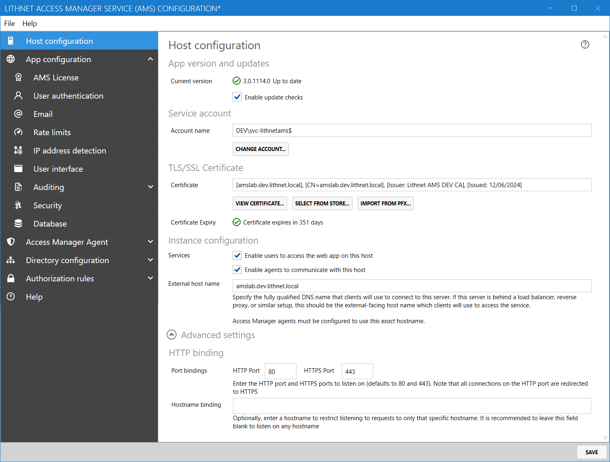
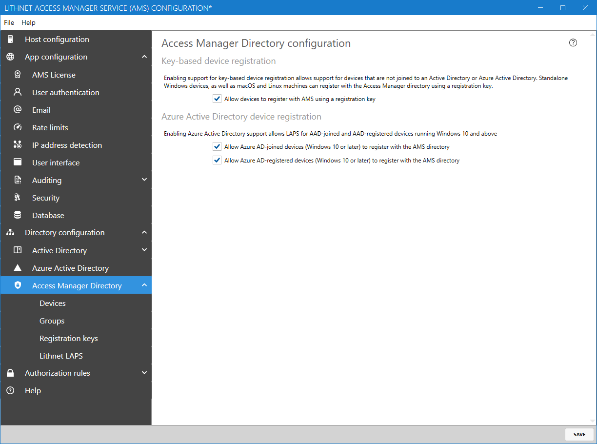

# Preparing the AMS directory

 Managing more than 100 devices in the Access Manager directory is an [Enterprise edition feature](../../../access-manager-editions.md)

When using the Lithnet Access Manager Agent (AMA) on devices that are not joined to an Active Directory (non-windows devices, Azure AD devices, and standalone Windows devices), the AMA stores passwords in the Access Manager Directory.

The agent will contact the AMS server at regular intervals, and ask if its password needs to be changed, if it does, it rotates its local password, encrypts it, and submits it to the AMS server, which then stores the password in its internal database.

The following guide outlines the steps required to enable the AMS directory service.

## Step 1: Enable API support

From the `Host configuration` page, tick `Enable the Access manager API`, and specify the host name clients will use to connect to the server. This must match the DNS name in the active TLS/SSL certificate, or clients will be unable to connect.



## Step 2: Enable device registration modes

From the `Directory configuration/Access Manager Directory` page, select mechanisms by which devices will register with the AMS server. You can use registration keys deployed at installation time to the devices, and Windows 10 and higher devices joined or registered with Azure AD, can use Azure AD authentication to register.



If you do not plan on using AAD device registration, then the setup process is complete.

## Step 3: Configure Azure Active Directory tenant details

If you enable Azure Active Directory device registration, you must register your Azure Active Directory tenant details, and grant permission for the service to read information from your AAD.

If you are using Azure AD authentication for AMS, you can reuse the app registration created for authentication. Skip to the `Granting directory permissions` section below.

If you are not using Azure AD for authentication, or you'd like to create a separate application for the directory access, then follow these steps to create a new application in Azure AD.

### Configure a new application in Azure AD

1. Log into portal.azure.com with administrative credentials, select `All services` and select `Azure Active Directory`
2. Select `App registrations` and click `New application registration`
3. Enter `Lithnet Access Manager` or another suitable application name, and select `Accounts in this organizational directory only (Lithnet only - Single tenant)` as the supported account type
4. Leave the `redirect URI` field blank
5. Click `Register`
6. Take note of the `Application ID` value, this is our client ID
7. Save the settings
8. Take note of the Directory/Tenant ID from the main application page
9. From the `Certificates and secrets` page, click `new client secret`, give your secret a name, and then take note of the value provided.

### Granting directory permissions

1. Log into portal.azure.com with administrative credentials, select `All services` and select `Azure Active Directory`
2. Select `App registrations` and select your Application registration for Lithnet Access Manager.
3. From the `API permissions` page, click `Add permission` and grant the following API permissions
   * Device.Read.All
   * Group.Read.All
   * Organization.Read.All
   * User.Read
4. Ensure that you have selected `Grant admin consent` for each item.

### Configure the service account details in Access Manager

1. Open the Lithnet Access Manager Service Configuration Tool
2. Select the `Directory configuration/Azure Active Directory` page
3. Press the `Add...` button to add a new tenant configuration
4. Add the client ID, secret, and directory/tenant ID in the fields provided
5. Save the tenant configuration

```
You may need to wait a minute or two for the secret and delegation to become active
```

Access Manager is now configured to support Azure AD joined and registered devices.
