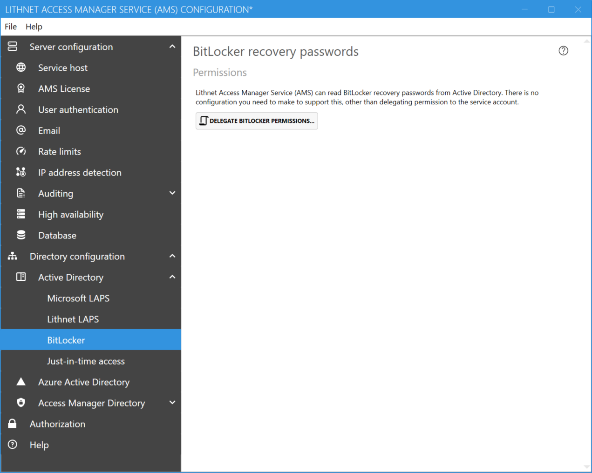

# Setting up Bitlocker access

You can access BitLocker recovery passwords using Lithnet Access Manager. No specific configuration is needed, other than delegating permission for the AMS service account to read those passwords from the directory.

From the[ BitLocker Page](../../advanced-help/app\_pages/bitlocker-page.md), click the `Delegate BitLocker Permissions` button to access a script that will modify the necessary AD permissions to allow the AMS service account to read recovery passwords.

Once directory permissions are granted to the service account, you can assign access to users using [authorization rules.](../../advanced-help/app\_pages/authorization-page.md)
