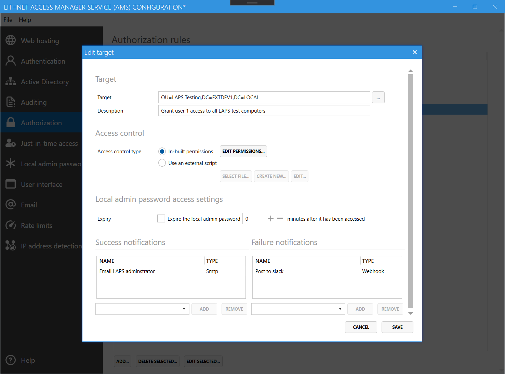
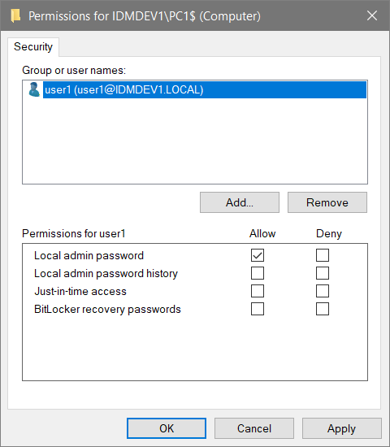

# Setting up Microsoft LAPS

Lithnet Access Manager provides a convenient web-based interface for accessing local admin passwords generated by the Microsoft LAPS client.

This guide assumes that you have the Microsoft LAPS agent deployed and configured appropriately.

## Step 1: Delegate Microsoft LAPS password permissions

You can use the Microsoft LAPS PowerShell cmdlets to delegate password read and reset permissions to the AMS service account, or use a script generated by AMS to do this for you.

From the `Local admin passwords` page, click on `Delegate Microsoft LAPS Permissions` to see a pre-built script for delegating the appropriate permissions. Simply change the `$ou` variable to the full DN on of the container than contains the computers you want to be able to access with AMS.

Copy this script and run it with an account that has either domain admin rights, or delegated control of the specified container.

## Step 2: Assign access

The final step is to create an authorization target, granting permission for your selected users and groups to access the LAPS passwords for the specified computers.

From the `Authorization` page, select `Add...` to create a new target. Select the OU you delegated permissions to, and provide a friendly description for this rule. This will appear in audit logs if a user is granted access.

Select `Edit Permissions...` to open the ACL editor.

Note that Microsoft LAPS does not support storing of LAPS history, so granting that permission will not have any effect.

You can optionally choose to expire the local admin password a period of time after it has been accessed. This will cause the LAPS agent to generate a new password _after_ its next check-in time. It may be up to 90 minutes after the time you specify.

If you'd like to be notified when someone accesses a LAPS password, select the notification channels you'd like to send to for success and failure events.
