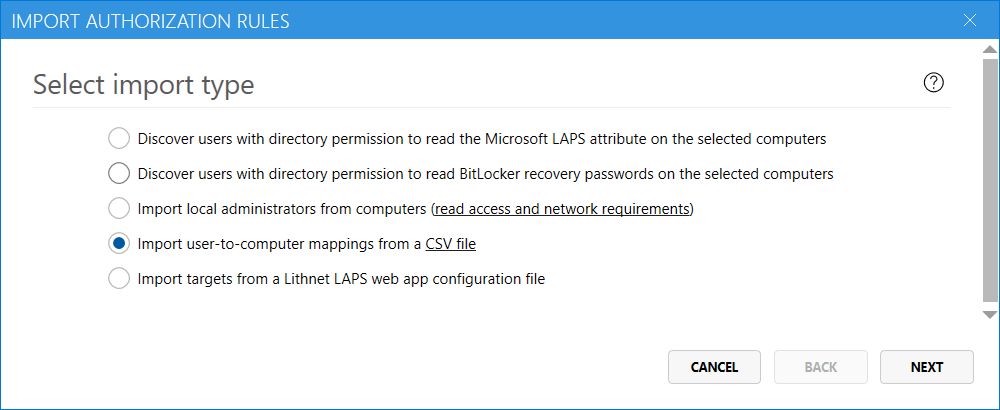
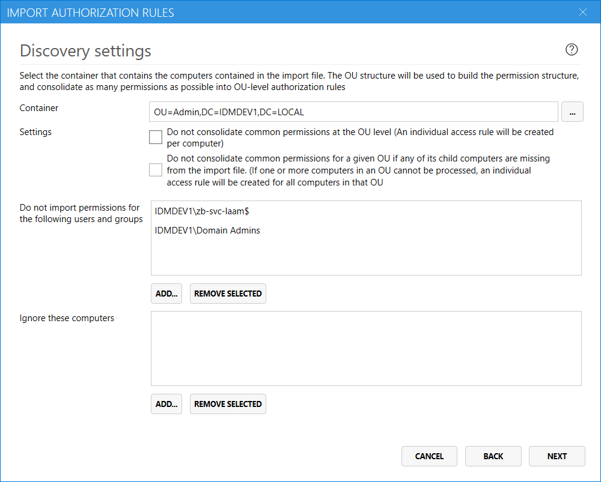
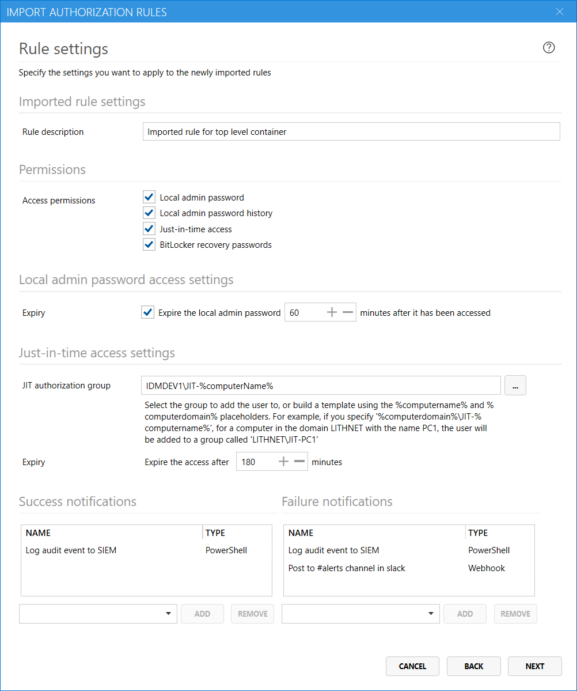
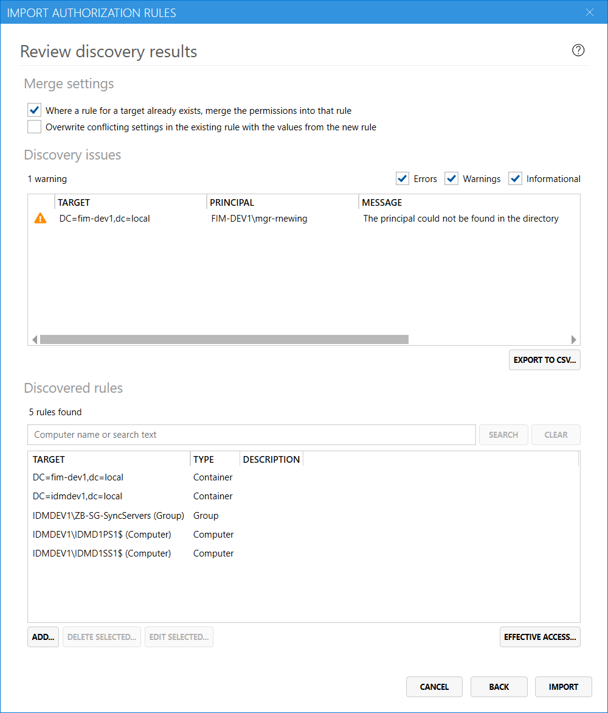

# Import mappings from a CSV file

You can prepare a CSV file of mappings between users and computer and Access Manager can consolidate that list into a set of authorization rules.

The CSV file import is a simple, but flexible method of creating rules in Access Manager

## CSV file format

The CSV file format is very simple. There are two columns. The first contains the name of the computer, the second is the name of the principal, either a user or a group, to import. Additional columns can be included, but are ignored by the import process.

Computer names may be in any of the following formats

```
ComputerName
DOMAIN\ComputerName
```

Users and group may be in any of the following formats

```
Username
GroupName
DOMAIN\Username
Domain\GroupName
SID
```

Example CSV file

```
Computer,Principal
PC1$,LITHNET\Domain Admins
PC1$,LITHNET\ServerAdmins
PC1$,LITHNET\user1
LITHNET\PC2$,S-1-5-21-633294971-2666783174-3584595190-1122
```

There should be one computer and one principal per line. For each principal that has access to a computer, add a new row. Multiple entries for a single computer will be consolidated during the import process.

## Open the import wizard

Using the Lithnet Access Manager Configuration Tool, navigate to the `Authorization` page, and click `Import authorization rules...`


## Select the import type

Select the CSV import type, and click `Next`

&#x20;

## Select the CSV file

Specify the path to the CSV file, and check the box if your CSV file has a header row. 

## Specify discovery settings



Select the container where Access Manager will find the computers specified in the CSV file.

When Access Manager finds that a user or group has permission on all computers with an OU, it will create a single access rule at the OU-level for that user or group. You can disable this behaviour by checking the `Do not consolidate permissions at the OU level` check box. Access Manager will then make an individual authorization rule for every computer that is found.

If any of the computers from the container are missing from the CSV file, Access Manager, by default, will ignore the missing computer for the purposes of consolidating access permissions. This assumes that the missing computers have the same authorized principals as the other computers in the OU. If this is not the case, select the option to disable consolidate when computers are missing from the CSV file. This approach favours caution, but results in an individual access rule being created for every other computer in that OU.

If there are users and groups that you do want to import permissions for, add them to the list. The Access Manager service account is automatically pre-added to this list. Machine-local accounts are automatically ignored.

You can also choose to ignore certain computers from the import process. For the purposes of permission consolidation, these computers will be treated as if they do not exist at all.

## Specify rule settings

On this page, you can specify the settings for the newly created authorization rules. Choose the permissions you want to assign to the discovered users, and any notifications channels that should apply.



## Review discovery results

Once the discovery process has completed, you can review the proposed rules before committing them to the authorization store.



### Merge settings

When a new rule is discovered for a target (computer, group or container) that matches the target of an existing rule, Access Manager will just add the new permissions to the existing rule, rather than create a new rule. You can control this behaviour with by unselecting the corresponding checkbox.

When merging rules, settings from the _existing rule_ are retained when a conflict is found. For example, if an existing rule is configured to expire LAPS passwords after one hour, and the new rule is configured to expire them after two hours, then the settings from the existing rule are retained. You can alter this behaviour by selecting the appropriate checkbox.

### Discovery issues

If any issues are found during the discovery process, a `Discovery issues` section is shown. You can export this list to a CSV file and review the issues before proceeding with the import.

### Discovered rules

The `discovered rules` section shows the proposed rules that Access Manager will create. You can add, edit and delete these rules before finalizing the import. The `effective access` tool can be used to test the proposed rules, and ensure the right users have access to the computers you expect.

### Complete the import

When you have completed your review, and are happy with the proposed rules, click `Import` to merge them into the authorization store.
