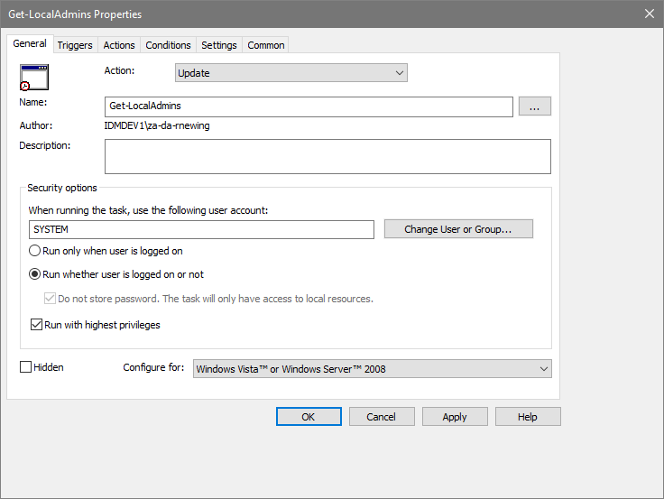
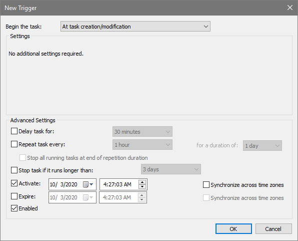
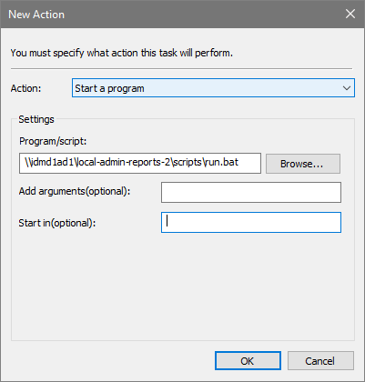

# Performing an offline discovery of local admins

While Access Manager provides the ability to import local administrators from computers by querying them remotely, network accessibility and permissions issues may prevent this method from working across an entire domain.

In this scenario, we can use a script, combined with group policy or another deployment tool to query the administrators group locally on each computer, and save the results to a file share. Once all the computers have uploaded their files, they can then be merged into a single CSV file that can be imported into Access Manager using the CSV import function.

This guide will focus on using the group policy method for deploying this script. If you have another deployment tool such as SCCM, then feel free to use that instead.

## Create a report collection share

You'll need a central location for the servers to save their CSV files to. This share needs to be accessible by all servers that you are auditing.

The [New-LocalAdminReportShare](https://github.com/lithnet/access-manager/blob/master/src/Lithnet.AccessManager/Lithnet.AccessManager.Server.UI/ScriptTemplates/OfflineLocalAdminReport/New-LocalAdminReportShare.ps1) script automatically creates a share, with the correct permissions to allow domain computers to create and update their CSV file.

Download the [New-LocalAdminReportShare.ps1](https://github.com/lithnet/access-manager/blob/master/src/Lithnet.AccessManager/Lithnet.AccessManager.Server.UI/ScriptTemplates/OfflineLocalAdminReport/New-LocalAdminReportShare.ps1) script, open a PowerShell command window, and run the following command

```
.\New-LocalAdminReportShare.ps1 -Path "C:\local-admin-reports" -ShareName "local-admin-reports"
```

We'll use the folder and share name `local-admin-reports` throughout this guide. If you change the name of the share, take note to replace it where it is mentioned throughout this guide.

> Note, as the data contained from these reports will eventually be uploaded into Access Manager, you need to minimize access to the share, to limit the ability for a malicious actor to add unexpected authorization entries. The provided scripts minimize the risks by implementing tight security controls around the data that is gathered, but you should still check and validate that the rules created match the permissions you expect to see.

## Download the data collection scripts

Download the `Get-LocalAdmins.ps1` and `run.bat` files from the [script library](https://github.com/lithnet/access-manager/tree/master/src/Lithnet.AccessManager/Lithnet.AccessManager.Server.UI/ScriptTemplates/OfflineLocalAdminReport) and save them to `C:\local-admin-reports\scripts`. This script folder was created by the `New-LocalAdminReportShare.ps1` script and has been configured with the permissions required to allow computers to read the scripts from this specific location.

## Create a group policy

1. Create a new group policy, and link it to the OU containing the computers you want to audit
2. Navigate to `Computer Configuration` => `Preferences` => `Control Panel Settings` => `Scheduled Tasks`
3. Right click and select `New` => `Scheduled Task (At least Windows 7)`
4. Configure the following settings on the `General` tab:

| Setting                         | Value                                |
| ------------------------------- | ------------------------------------ |
| Action                          | Update                               |
| Name                            | Get-LocalAdmins                      |
| Account                         | SYSTEM                               |
| Run mode                        | Run whether user is logged on or not |
| Run with the highest privileges | Checked                              |



1. On the `Trigger` tab:
   * Click new, and set the `Being the task` drop down to `At task creation/modification`



1. On the `Actions` tab:
   * Click new
   * Set the `action` type to `Start a program`
   * In the `Program/Script` field, enter the path to the run.bat file (eg `\\your-server\local-admin-reports\scripts\run.bat`)



1. Save the scheduled task

When the machines check in for their group policy update, the task will be created and will run, and you will see your report share start filling up with csv files.

If any `.error` files appear, investigate the details of the error and remediate appropriately.

## Merging the files

Once all of your computers have reported their local admin membership, you must validate and merge the data before you can import it into Access Manager.

Download the [Get-ValidatedAndMergedLocalAdminFile.ps1](https://github.com/lithnet/access-manager/blob/master/src/Lithnet.AccessManager/Lithnet.AccessManager.Server.UI/ScriptTemplates/OfflineLocalAdminReport/Get-ValidatedAndMergedLocalAdminFile.ps1) script, and run it from a PowerShell command prompt with the following command line.

```powershell
.\Get-ValidatedAndMergedLocalAdminFile.ps1 -CSVPath 'c:\local-admin-reports' -OutFile 'c:\merged-results.csv'
```

This process will merge the individual CSV files into one master CSV file, after checking for invalid entries.

The following checks are performed on each file

1. The `file owner` should be the machine that created the file. If the file owner does not match the name of the file, a warning is logged, and the file is skipped.
2. If any computer entries inside the file do not match the owner of the file, then those entries are skipped.

This is designed to protect against two specific scenarios, where a malicious user is in control of one of your machines

1. The user tries to create an authorization file for another machine
2. The user tries to add authorization entries to their machines file, for other machines

However, we can't protect against a malicious user who is in control of a machine adding entries to its own file, for the machine they are already in control of. This isn't considered a security risk for this discovery process, because that user is in control of the machine anyway.

If you have not used the provided script to create the file share, then these checks will likely fail. If you want to override them, then you can use the `-IgnoreOwnerErrors` switch to force all the entries to be imported. Ensure you carefully examine the contents of each file.

## Import into Access Manager

Once you've validated and merged your data, you can now import the merged CSV file into Access Manager.

Follow the steps in the [importing mappings from a CSV file](importing-mappings-from-a-csv-file.md) guide.
