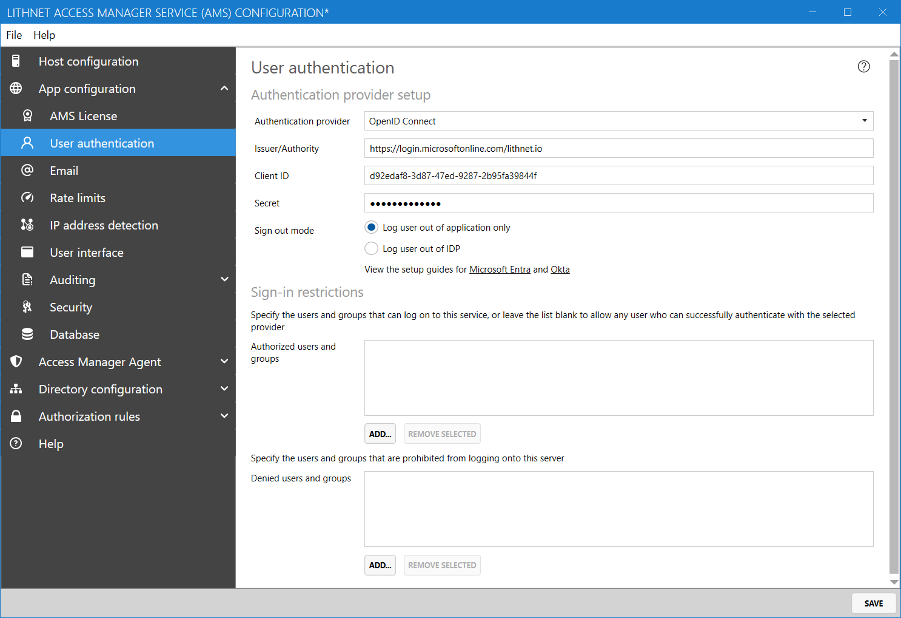

# Setting up authentication with Microsoft Entra ID

The following guide will assist you in configuring your application to use Microsoft Entra for authentication.

## Part 1: Configure a new application in Entra ID

Follow the steps in [Creating an Entra app for Access Manager](../../help-and-support/advanced-help-topics/creating-an-entra-app.md) to create the app registration for Access Manager. Take note of the tenant ID, client ID and secret created here as they will be used in the next step.

Ensure that the appropriate API permissions have been granted for the `User authentication using OpenID Connect` scenario.

## Part 2: Configure Lithnet Access Manager

1. Open the Lithnet Access Manager Service Configuration Tool
2. Select the `App configuration\User Authentication` page
3. Select `Open ID Connect` as the authentication provider
4. Use the `application id` obtained from the Entra ID setup process as the `client ID` value
5. Specify the `client secret` obtained from the Entra ID setup process.
6. Set the authority as appropriate for your tenant (e.g. for `lithnet.io` it would be `https://login.microsoftonline.com/lithnet.io`)

## Part 3: Enable multifactor authentication

For further security, you can set up a conditional access policy to require multifactor authentication for the app
