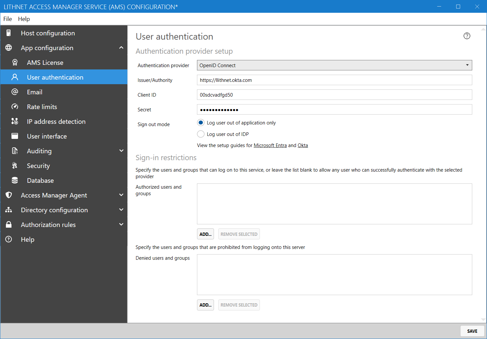

# Setting up authentication with Okta

The following guide will assist you in configuring your application to use Okta for authentication.

## Configure a new application in Okta

1. Log into the Okta admin console with administrative credentials, select `Applications` then `Applications`
2. Click `Create app integration`
3. Select `Open ID Connect` as the sign in method and `Web application` as the application type
4. Enter `Lithnet Access Manager` or another suitable application name and optionally provide a logo
5. Ensure that `authorization code` is the selected grant type
6. For the `sign in redirect URI`, enter the base URL where your Lithnet Access Manager app is hosted followed by `/auth/` (e.g. `https://accessmanager.lithnet.local/auth/`)
7. Set the `sign-out redirect URI` to your base URL, and append `/auth/logout` to the end of it (e.g. `https://accessmanager.lithnet.local/auth/logout`)
8. Assign the appropriate users to the app and save the new app
9. From the new app page, copy the `client ID` and `client secret` value for use later in the setup process
10. Select `Directory` from the main menu bar, and select `Profile editor`. Find the `Lithnet Access Manager` app in the list, and click the app name to open the profile editor.
11. Click `Add attribute` and create a new attribute with a display name and variable name of `upn`, of data type `string`. Select `attribute required` and select `personal` as the attribute type. Save the new attribute
12. Click the `Mappings` button. Scroll down until you fine the `upn` attribute in the right hand app attributes column, and on the left side, select the Okta attribute that contains the Active Directory UPN (e.g. aduser.userPrincipalName). Change the arrow to `Apply mapping on user create and update` 

## Configure Lithnet Access Manager

1. Open the Lithnet Access Manager Service Configuration Tool
2. Select the `App configuration\User Authentication` page
3. Select `Open ID Connect` as the authentication provider
4. Enter the URL of your Okta tenant in the `Issuer/Authority` field
5. Enter the client ID and secret obtained from the Okta setup process

## Enable multifactor authentication

We strongly recommend modifying your application sign-on policy to require multifactor authentication for the use of this app.
