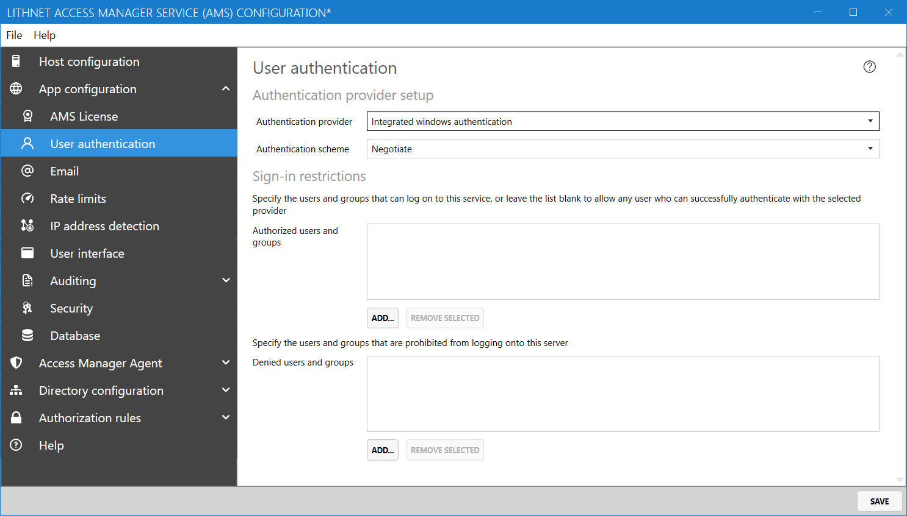

# Setting up integrated windows authentication

The following guide will assist you in configuring your application to use Integrated Windows Authentication (IWA).


Note, that we recommend that you use a strong authentication mechanism such as OpenID Connect, where you have the ability to enforce multifactor authentication on users attempting to access your application. Access Manager fully supports modern OIDC providers such as [Microsoft Entra ID](setting-up-authentication-with-azure-ad.md) and [Okta](setting-up-authentication-with-okta.md).


## Part 1: Configure the SPN
To ensure kerberos authentication works correctly you'll need to register an SPN for the Access Manager service account.

The SPN must be in the format of `HTTP/{dnsName}` where `{dnsName}` is the external-facing DNS hostname used by the clients.

If this SPN is not set correctly, the following warning will appear in the `Service account` section of the `Host configuration` page. You can use the "Set SPN..." script to correct the problem.

## Part 2: Configure Lithnet Access Manager

1. Open the Lithnet Access Manager Service Configuration Tool
2. Select the `App configuration\User authentication` page
3. Select `Integrated windows authentication` as the authentication provider
4. Select `Negotiate` for the authentication scheme.


The use of NTLM and basic auth is not recommended and are provided for testing purposes only.


To restrict clients to the use of Kerberos only, disable incoming NTLM authentication for the server using [group policy](https://docs.microsoft.com/en-us/windows/security/threat-protection/security-policy-settings/network-security-restrict-ntlm-incoming-ntlm-traffic).
