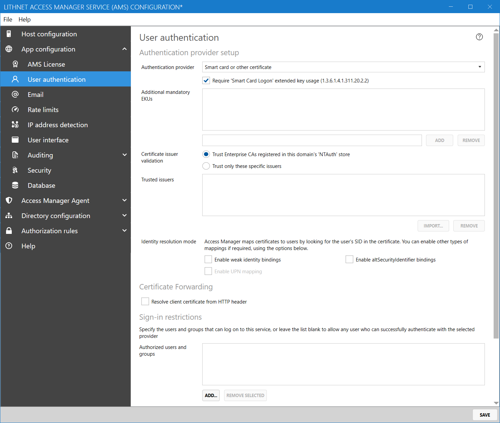

# Setting up smart card authentication

Certificate-based authentication is provided by Access Manager, with the optional support for requiring smart-card authentication.

Certificates must contain a `principal name` attribute in their `Subject Alternative Names` which specifies the user's UPN as found in Active Directory.

Limited support is available for use of altSecurityIdentities in cases where certificates are used without a UPN, however these are not supported outside the forest where AMS is located.

## Configuring Access Manager

To use smart card authentication, where the smart cards are issued by an Active Directory-integrated certificate authority, configure Access Manager as follows.

1. Open the Lithnet Access Manager Service Configuration Tool
2. From the `App configuration/User authentication`, select `Smart card or other certificate` as the authentication provider
3. Select `Require smart card login extended key usage`
4. Select `Trust only Enterprise CAs registered in this domains NTAuth store`



More advanced scenarios are supported through the use of being able to provide your own additional mandatory EKUs, or restricting authentication to specific issuers. Seek advice from your internal team that manages smart card issuance to if you are not sure if any of these settings are required.

## Identity resolution mode
In line with the certificate-based authentication changes announced by Microsoft in [KB5014754](https://support.microsoft.com/en-us/topic/kb5014754-certificate-based-authentication-changes-on-windows-domain-controllers-ad2c23b0-15d8-4340-a468-4d4f3b188f16), Access Manager by default now only accepts certificates containing the user's SID in an extension with OID `1.3.6.1.4.1.311.25.2`.

If you are using older-style certificates, you need to select `Enable weak identity bindings` and select `enable UPN mapping`.

## Enabling altSecurityIdentities

If you do not use the SID or UPN fields in the certificate, and use the altSecurityIdentities capability in Active Directory to support certificates without a UPN, you'll need to perform some additional steps in AMS to enable this support.

The caveat with this implementation is that this only works in the forest that the AMS service is located within. As web-based certificate authentication happens at the TLS level, AMS is unable to prompt for a username or domain hint. Therefore, AMS can only search the local global catalog for the altSecurityIdentity values.

In line with the [Microsoft implementation](https://docs.microsoft.com/en-us/windows/security/identity-protection/smart-cards/smart-card-certificate-requirements-and-enumeration) for altSecurityIdentities, AMS searches the directory for a user match in the following order

```
X509:<I><S>^          Issuer and subject
X509:<S>*^            Subject
X509:<I><SR>          Issuer and serial number
X509:<SKI>            Subject key identifier
X509:<SHA1-PUKEY>     SHA1 public key
X509:<RFC822>*^       Email address 
```

> (\*) Use of these altSecurityIdentity types requires that certificate issuer validation against the NT Auth store is enabled

> (^) These altSecurityIdentity types are considered 'weak bindings' and require the use of the `Enable weak identity bindings` option.

