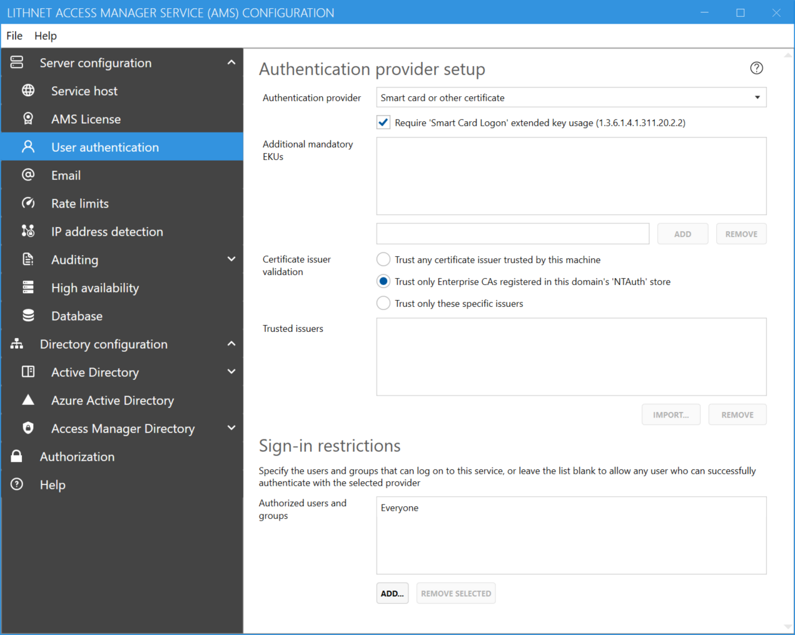

# Setting up smart card authentication

Certificate-based authentication is provided by Access Manager, with the optional support for requiring smart-card authentication.

Certificates must contain a `principal name` attribute in their `Subject Alternative Names` which specifies the user's UPN as found in Active Directory.

Limited support is available for use of altSecurityIdentities in cases where certificates are used without a UPN, however these are not supported outside the forest where AMS is located.

## Configuring Access Manager

To use smart card authentication, where the smart cards are issued by an Active Directory-integrated certificate authority, configure Access Manager as follows.

1. Open the Lithnet Access Manager Service Configuration Tool
2. From the `Server configuration/User authentication menu`, select `Smart card or other certificate` as the authentication provider
3. Select `Require smart card login extended key usage`
4. Select `Trust only Enterprise CAs registered in this domains NTAuth store`



More advanced scenarios are supported through the use of being able to provide your own additional mandatory EKUs, or restricting authentication to specific issuers. Seek advice from your internal team that manages smart card issuance to if you are not sure if any of these settings are required.

## Enabling altSecurityIdentities

The default implementation of smart card/certificate support requires that the certificate contain a subject alternative name (SAN) containing the user's UPN in order for them to successfully log on. This is the default setup when using an Active Directory issued smart card.

If you do not use the UPN, and use the altSecurityIdentities capability in Active Directory to support certificates without a UPN, you'll need to perform some additional steps in AMS to enable this support.

The caveat with this implementation is that this only works in the forest that the AMS service is located within. As web-based certificate authentication happens at the TLS level, AMS is unable to prompt for a username or domain hint. Therefore, AMS can only search the local global catalog for the altSecurityIdentity values.

In line with the [Microsoft implementation](https://docs.microsoft.com/en-us/windows/security/identity-protection/smart-cards/smart-card-certificate-requirements-and-enumeration) for altSecurityIdentities, AMS searches the directory for a user match in the following order

```
X509:<I><S>
X509:<S>*
X509:<I><SR>
X509:<SKI>
X509:<SHA1-PUKEY>
X509:<RFC822>*
```

> (\*) Use of these altSecurityIdentity types requires that certificate issuer validation against the NT Auth store is enabled

## Enabling advanced altSecurityIdentities Support

First, ensure you save and close any instances of the Access Manager Configuration Tool.

Then navigate to the AMS config file, usually located at `C:\Program Files\Lithnet\Access Manager Service\config\appsettings.json`

Locate the `ClientCert` element, and set the `IdentityResolutionMode` value to one of the following values

| Value                           | Description                                                                                                                                                                                                                                                                                                                                                                                        |
| ------------------------------- | -------------------------------------------------------------------------------------------------------------------------------------------------------------------------------------------------------------------------------------------------------------------------------------------------------------------------------------------------------------------------------------------------- |
| `Default`                       | Default behavior (equivalent to `UpnSan`)                                                                                                                                                                                                                                                                                                                                                          |
| `UpnSan`                        | Find the user using the UPN located in the certificate's subject alternative names. If the UPN is not present, or no match can be found in the directory, the user login is denied                                                                                                                                                                                                                 |
| `AltSecurityIdentities`         | Find the user using the altSecurityIdentities attribute. If no match can be found, the user login is denied                                                                                                                                                                                                                                                                                        |
| `UpnSan, AltSecurityIdentities` | First, attempt to find the user using the UPN located in the certificate's subject alternative names. If the UPN is not present, or no match can be found in the directory, try to find the user using the altSecurityIdentities attribute. If no match can be found, the user login is denied. Note that the order of these values does not matter. The UPN check will always be performed first. |

Example

```json
"ClientCert": {
      "RequiredEkus": [],
      "ValidationMethod": "NtAuthStore",
      "RequireSmartCardLogonEku": true,
      "TrustedIssuers": [],
      "IdentityResolutionMode": "UpnSan, AltSecurityIdentities"
    }
```
