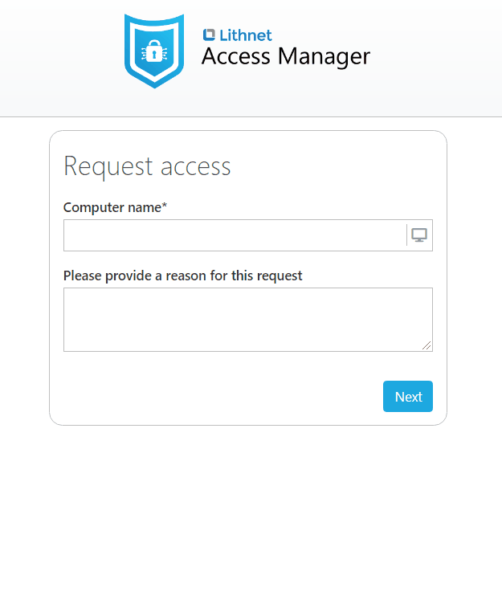
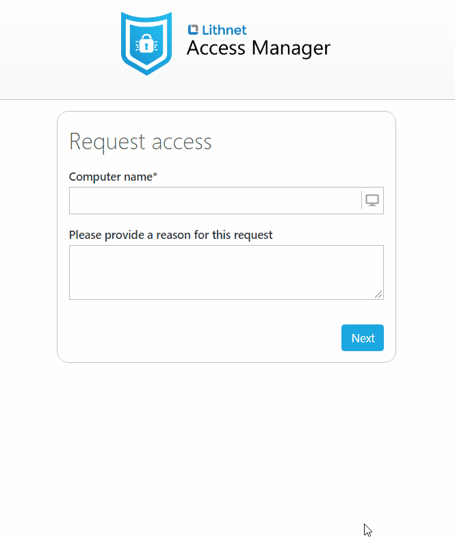
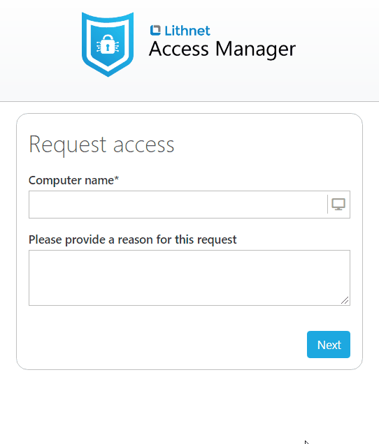
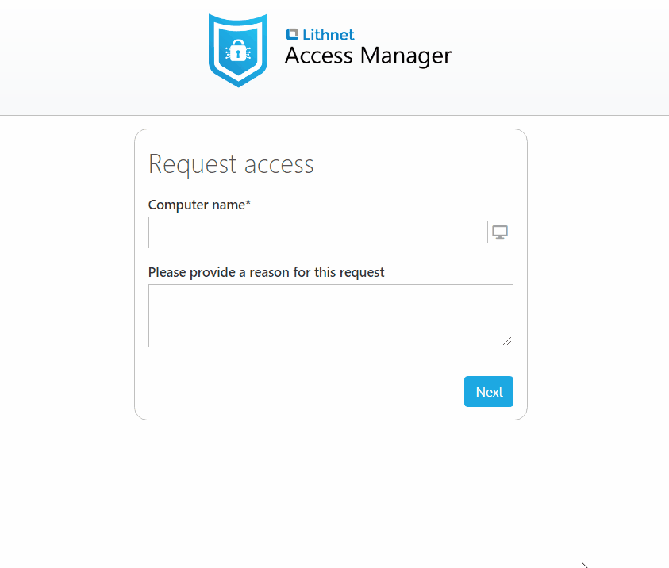
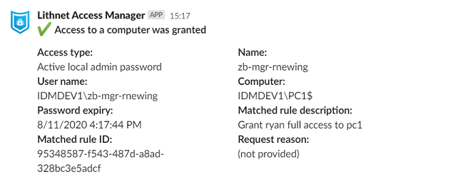

 

# Lithnet Access Manager
Lithnet Access Manager is a tool that allows you to safely delegate sensitive administrative access to computers in your Active Directory environment in a modern and user-friendly way.

It provides a web-based interface that allows users to request local admin passwords, BitLocker recovery keys, and grant just-in-time administrative access to their own accounts. 

It is fully compatible and works out-of-the-box with Microsoft LAPS, or you can replace the Microsoft LAPS agent with the Lithnet Access Manager Agent, which encrypts local admin passwords in the directory, and can optionally save a history of local admin passwords. 

Access Manager provides a granular permission model, coupled with a detailed auditing system, both of which are extensible using PowerShell.

Modern authentication is a key feature of Access Manager, with support for OpenID Connect, allowing strong authentication and MFA with cloud-based identity providers such as Azure AD and Okta. On-premises providers have not been forgotten, with full support for WS-Federation (ADFS), smart cards, and if you need it, integrated windows authentication.

## Defend against ransomware and other lateral movement-based attacks
Access Manager has one simple goal. To reduce the likelihood and impact of a wide-spread compromise in your environment by removing permanent administrative access to your workstations and servers. By making sure every computer has a unique local admin password (through the use of Microsoft LAPS or the Lithnet Access Manager Agent), and removing all other members of the built-in local `Administrators` group, you can limit the ability for credential-stealing ransomware to move laterally across your environment. Access Manager makes it as seamless as possible for admins to access LAPS passwords, or grant themselves temporary just-in-time admin access. Access Manager isn't a silver bullet guaranteed to protect you from this type of attack, but it forms a fundamental part of a defence-in-depth strategy against them. 

We recommend you have a look at our other product [Lithnet Password Protection for Active Directory](https://github.com/lithnet/ad-password-protection), for a tool to help strengthen your environment against commodity password-based attacks. 

## Features
### Web-based access to local admin passwords
Access Manager provides a simple web-based and mobile-friendly interface for accessing local admin passwords. There's no need for admins to install custom software, or have access to AD administrative tools to access LAPS passwords. 

Administrators also have the option of forcing an expiry time when a password is accessed. This ensures that the password is rotated after use.

We use LAPS passwords ourselves, so we know they can be painful at times. We try to take away as much of that pain as possible. From using fonts where you can actually see the difference between a lower-case L and a capital I, to showing a breakdown of the password using the NATO phonetic alphabet to make it easy to read it out to someone. Ever find yourself needing to type a LAPS password into a Windows logon screen? Have access manager read the password to you while you type!
 
Whether you use Microsoft LAPS, or the Lithnet Access Manager agent, the user experience is the same.

### Access historical local admin passwords
Deploying the Lithnet Access Manager Agent to your fleet allows you to upgrade to encrypted local admin passwords and gain the benefit of having previous local admin passwords stored in the directory as well. This means no more issues getting locked out of computers when they are restored from backup or reverted from a snapshot.

### Just-in-time administrative access to computers
Using the same web interface, users can request that their account be added to a group that is a member of the local administrators group of the computer. This access is temporary and automatically removed after the allowed time period. Access Manager makes use of the Active Directory time-based membership feature in Windows Server 2016 and later domain functional levels, or time-based (dynamic) objects in earlier versions of AD.

### Easy access to BitLocker recovery passwords
Authorized users can also request access to the BitLocker recovery passwords for a computer through the same easy-to-use web interface.

### Audit success and failure event logs
All success and failure events are logged to the Windows event log and a file. Optionally, you can send audit events via email, webhooks, and even PowerShell.

The webhook functionality makes it really easy to get alerts via Slack or Microsoft Teams, and there are even built-in templates for these systems.

### Modern authentication options
The web app supports traditional integrated windows authentication, as well as external authentication providers such as [ADFS](configuration/Setting-up-authentication-with-ADFS) or 3rd party OpenID Connect providers such as [Azure AD](configuration/Setting-up-authentication-with-Azure-AD) and [Okta](configuration/Setting-up-authentication-with-Okta). Using an external authentication provider allows you the option of providing additional protections for the application such as multifactor authentication.

## Editions
Access Manager comes in two editions. Community edition is free for all organizations to use. It provides the core capability to defend against ransomware attacks, and support is provided by the GitHub Access Manager community. Enterprise edition is our paid offering that includes additional features such as LAPS for macOS and Linux devices, LAPS for Azure AD joined and registered devices, high availability, advanced authorization scripting, and comes with full support by Lithnet. See our comparison guide for more details.

To get a free enterprise edition trial license, or to enquire about Enterprise edition pricing, please see our [licensing](about-ams/Licensing) page.
