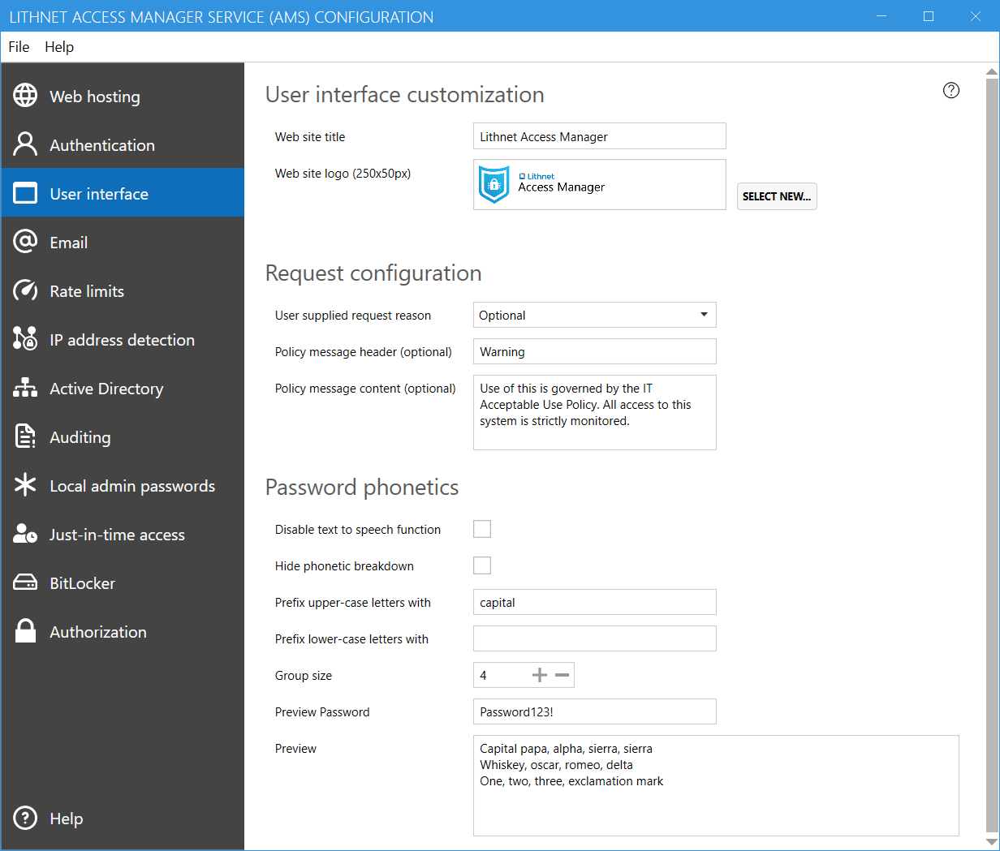

# User interface customization
#### Web site title
If you want to customize the name of the application that users will see in the web interface, you can provide that here. If you leave this blank, the default name will be shown

#### Web site logo
You can replace the Lithnet Access Manager logo with your own company logo by providing it here

# Request configuration
#### User supplied reason
 - Hidden: The user is not given an option to provide a reason for their access request
 - Optional: The user will see a field asking them to provide a reason for their access request. This is optional for them to fill out
 - Required: The user must provide a reason for their access request

#### Policy message header 
Used to optionally shows a custom heading on the access request page 

#### Policy message content
Used to optionally show a custom message on the access request page

# Password phonetics
#### Disable text-to-speech function
The Access Manager web interface provides a text-to-speech function that will read out the value of the password in the NATO phonetic alphabet, where supported by the user's browser.

Selecting this option will hide the text-to-speech function in the web app.

#### Hide phonetic breakdown
The Access Manager web interface provides breakdown of the password in the NATO phonetic alphabet. This makes it easier to read passwords out loud to another person.

Selecting this option will hide the phonetic password breakdown in the web app.

#### Prefix upper-case letters with
Provide a value such as `upper-case` or `capital` to prefix letters with in the phonetic breakdown.

#### Prefix lower-case letters with
Provide a value such as `lower-case` to prefix letters with in the phonetic breakdown. We suggest prefixing only upper-case letters.

#### Group size
Specify how many characters should be in each group in the phonetic breakdown. This changes how many characters are displayed on each line in the phonetic breakdown.

#### Preview password
Type any value in here to see the result of your settings on the output of broken-down password