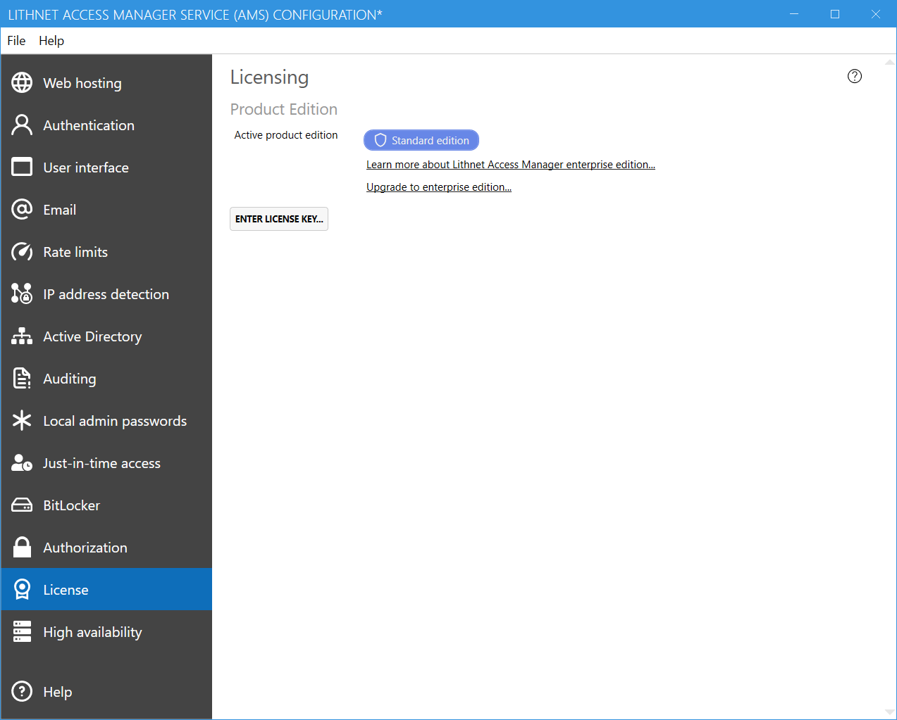

The licensing page allows you to manage and view your license information.

 
Standard edition users will have the option to enter a license key to upgrade to enterprise edition. See the [licensing](/about_ams/Licensing) page for more information.

Once an enterprise license has been assigned, the details of the license are shown, and enterprise features within the application are activated. You can apply a new license at any time by using the `Enter license key` button. To revert back to standard edition, simply click `remove existing license`.

