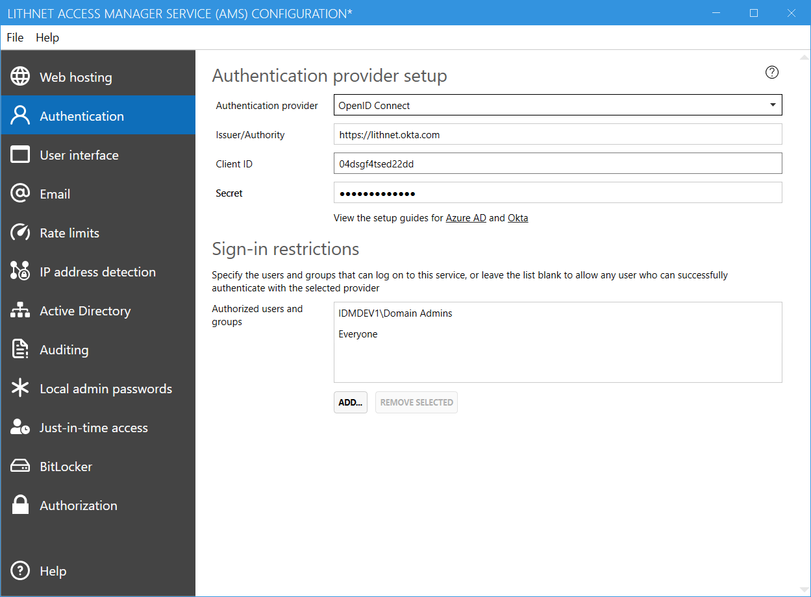

# Setting up authentication with Okta

The following guide will assist you in configuring your application to use Okta for authentication. 

## Configure a new application in Okta
1. Log into the Okta admin console with administrative credentials, select `Applications` then `Applications`
2. Click `Add application`, then `Create new app`
3. Select `Web` as the platform, and `Open ID Connect` as the sign on method
3. Enter `Lithnet Access Manager` or another suitable application name and optionally provide a logo
4. For the login redirect URI, enter the base URL where your Lithnet Access Manager app is hosted followed by `/auth/` (e.g. `https://accessmanager.lithnet.local/auth/`)
5. On the general settings page, click `Edit`
6. Set the logout URL to your base URL, and append `/auth/logout` to the end of it (eg `https://accessmanager.lithnet.local/auth/logout`)
7. Copy the `client ID` and `client secret` value for use later in the setup process
8. Assign the appropriate users to the app
9. Select `Directory` from the main menu bar, and select `Profile editor`. Find the `Lithnet Access Manager` app in the list, and click the `Profile` button
10. Click `Add attribute` and create a new attribute called `upn`, of data type `string`. Select both the `attribute required` and `User personal` check boxes
11. Click the `Map attributes` button. Find the UPN value, and map it to the okta attribute that contains the Active Directory UPN (e.g. aduser.userPrincipalName)

## Configure Lithnet Access Manager
1. Open the Lithnet Access Manager Service Configuration Tool
2. Select the `Server configuration\User Authentication` page
3. Select `Open ID Connect` as the authentication provider
3. Enter the URL of your okta tenant in the `Issuer/Authority` field
4. Enter the client ID and secret obtained from the Okta setup process

## Enable multi-factor authentication
We strongly recommend modifying your application sign-on policy to require multifactor authentication for the use of this app.