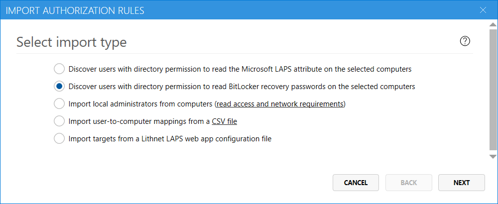

# Importing BitLocker permissions from Active Directory
If you have delegated permissions to read BitLocker recovery passwords in your environment, you can search your directory for users and groups with existing permissions to read the BitLocker attributes, and convert those permissions to Access Manager authorization rules.

## Open the import wizard
Using the Lithnet Access Manager Configuration Tool, navigate to the `Authorization` page, and click `Import authorization rules...`

## Select the import type
Select the BitLocker import type, and click `Next`

## Specify discovery settings

First, select the container that holds the computers that you want to import the permissions from. Access Manager will evaluate the ACLs on each computer object found in this section of the directory tree, looking for users and groups that have `read` and `control access` permissions on the `msFVE-RecoveryPassword` attribute

When Access Manager finds that a user or group has permission on all computers with an OU, it will create a single access rule at the OU-level for that user or group. You can disable this behavior by checking the `Do not consolidate permissions at the OU level` check box. Access Manager will then make an individual authorization rule for every computer that is found.

If there are users and groups that you do not want to import permissions for, add them to the list. The Access Manager service account is automatically pre-added to this list.

You can also choose to ignore certain computers from the import process. For the purposes of permission consolidation, these computers will be treated as if they do not exist at all.

## Specify rule settings
On this page, you can specify the settings for the newly created authorization rules. Choose the permissions you want to assign to the discovered users, and any notifications channels that should apply. 

## Review discovery results
Once the discovery process has completed, you can review the proposed rules before committing them to the authorization store. 

### Merge settings
When a new rule is discovered for a target (computer, group or container) that matches the target of an existing rule, Access Manager will just add the new permissions to the existing rule, rather than create a new rule. You can control this behavior with by unselecting the corresponding checkbox. 

When merging rules, settings from the _existing rule_ are retained when a conflict is found. For example, if an existing rule is configured to expire LAPS passwords after one hour, and the new rule is configured to expire them after two hours, then the settings from the existing rule are retained. You can alter this behavior by selecting the appropriate checkbox.  

### Discovery issues
If any issues are found during the discovery process, a `Discovery issues` section is shown. You can export this list to a CSV file and review the issues before proceeding with the import.

### Discovered rules
The `discovered rules` section shows the proposed rules that Access Manager will create. You can add, edit and delete these rules before finalizing the import. The `effective access` tool can be used to test the proposed rules, and ensure the right users have access to the computers you expect.

### Complete the import
When you have completed your review, and are happy with the proposed rules, click `Import` to merge them into the authorization store.

