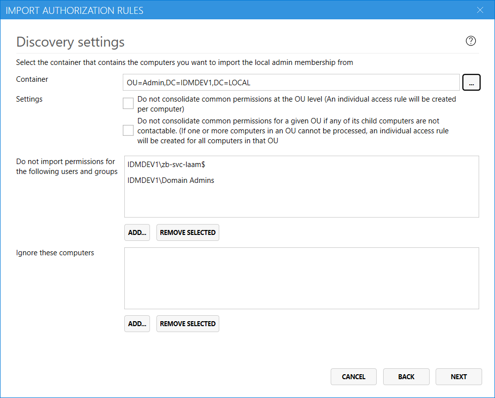

# Importing local administrator group membership from domain-joined Windows devices
Access Manager can remotely connect to computers and obtain the list of members of the local administrators group of each computer, and consolidate that into a set of authorization rules.

You may wish to consider [performing an offline discovery of local admins](Performing-an-offline-discovery-of-local-admins), and importing that data into Access Manager using the CSV import function. Check the prerequisite section below to determine if an online or offline import is suitable for your environment.

## Prerequisites
In order to discover members of the local administrators group on remote computers, the following conditions must be met.
1. The user performing the import process must be a local administrator on the remote computers
2. The computer must be reachable via SMB (TCP port 445) from the Access Manager server.

If these conditions cannot be met, it is recommended that you perform an [offline discovery of local admins](Performing-an-offline-discovery-of-local-admins), and use the CSV import function instead.

## Open the import wizard
Using the Lithnet Access Manager Configuration Tool, navigate to the `Authorization` page, and click `Import authorization rules...`

## Select the import type
Select the local administrators import type, and click `Next`

## Specify discovery settings

First, select the container that holds the computers that you want to import the permissions from. Access Manager will attempt to connect to each computer object found in this section of the directory tree, and obtain the membership of its local admin group.

When Access Manager finds that a user or group has permission on all computers with an OU, it will create a single access rule at the OU-level for that user or group. You can disable this behavior by checking the `Do not consolidate permissions at the OU level` check box. Access Manager will then make an individual authorization rule for every computer that is found.

If any of the computers are uncontactable, Access Manager, by default, will ignore the missing computer for the purposes of consolidating access permissions. This assumes that the missing computers have the same administrators as the other computers in the OU. If this is not the case, select the option to disable consolidate when computers are uncontactable. This approach favours caution, but results in an individual access rule being created for every other computer in that OU.

If there are users and groups that you do want to import permissions for, add them to the list. The Access Manager service account is automatically pre-added to this list. Machine-local accounts are automatically ignored.

You can also choose to ignore certain computers from the import process. For the purposes of permission consolidation, these computers will be treated as if they do not exist at all.

## Specify rule settings
On this page, you can specify the settings for the newly created authorization rules. Choose the permissions you want to assign to the discovered users, and any notifications channels that should apply. 

## Review discovery results
Once the discovery process has completed, you can review the proposed rules before committing them to the authorization store. 

### Merge settings
When a new rule is discovered for a target (computer, group or container) that matches the target of an existing rule, Access Manager will just add the new permissions to the existing rule, rather than create a new rule. You can control this behavior with by unselecting the corresponding checkbox. 

When merging rules, settings from the _existing rule_ are retained when a conflict is found. For example, if an existing rule is configured to expire LAPS passwords after one hour, and the new rule is configured to expire them after two hours, then the settings from the existing rule are retained. You can alter this behavior by selecting the appropriate checkbox.  

### Discovery issues
If any issues are found during the discovery process, a `Discovery issues` section is shown. You can export this list to a CSV file and review the issues before proceeding with the import.

### Discovered rules
The `discovered rules` section shows the proposed rules that Access Manager will create. You can add, edit and delete these rules before finalizing the import. The `effective access` tool can be used to test the proposed rules, and ensure the right users have access to the computers you expect.

### Complete the import
When you have completed your review, and are happy with the proposed rules, click `Import` to merge them into the authorization store.

