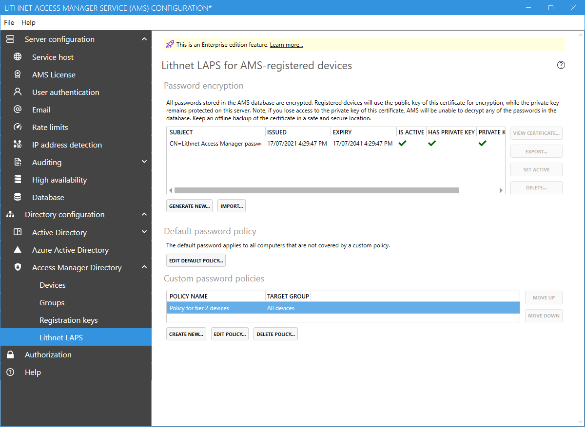
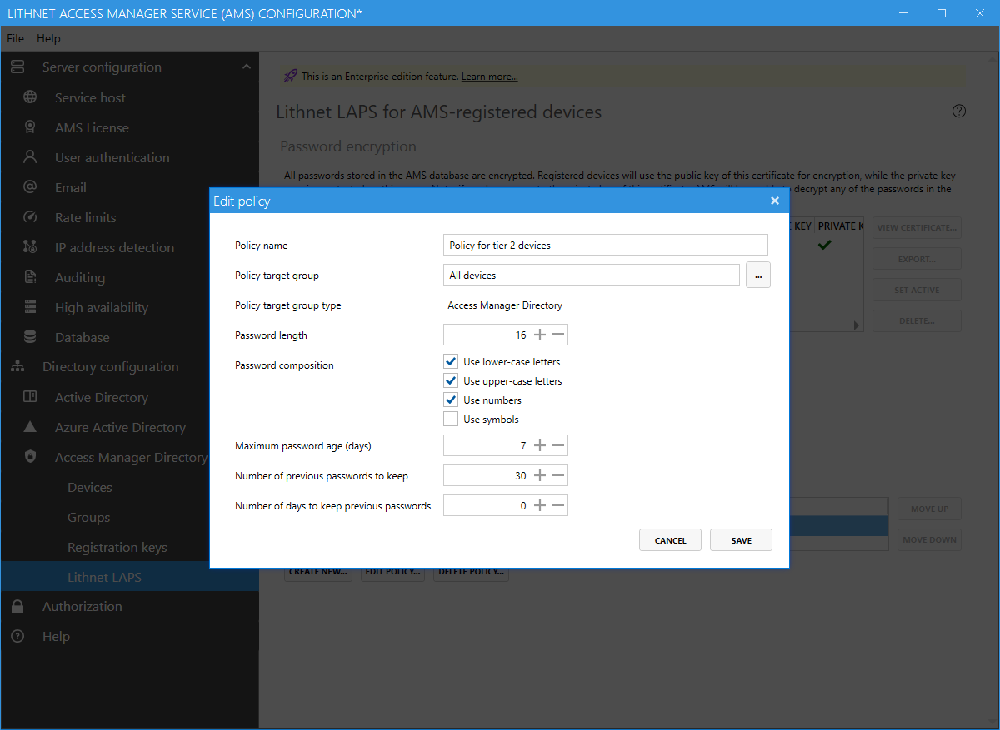

# Lithnet LAPS configuration page (Access Manager Directory)



## Password Encryption
AMS registered devices encrypt their passwords using a certificate provided by the AMS server. When a password change is required, the AMS server will provide the device with the public key of the `active` certificate, and it will use that key to encrypt the password.

When configuring LAPS for the first time, you'll need to create an encryption certificate, making sure to back it up to a location where it will be kept safe and secure.

If the encryption certificate is lost, passwords stored in the AMS directory are unrecoverable.

### List columns
#### Subject
Shows the friendly name of the certificate
#### Issued
Shows the date that the certificate was generated
#### Expiry
Shows the date that the certificate will expire
#### Is Active
Indicates whether the certificate is active. Only the active certificate is used by clients to encrypt their passwords
#### Has private key
Indicates whether the private key for the certificate is available on the server. If the certificate's private key is not available, then passwords that were encrypted by the key cannot be recovered.

Ensure you have backups of your private keys and keep them safe and secure.

#### Private key permissions
Indicates whether the AMS service account has permission to read the private key. You can use the `Reset permission` button to try and fix the permissions on the key. This may happen if you restore a key from a backup by manually importing it.

### Generating a new encryption certificate
At any time you can generate a new encryption certificate by clicking the `Generate new` button. Clients will not use this new certificate until you mark it as active.

If there are previously used certificates shown here, don't remove them. If clients have encrypted their passwords or password history with these old certificates, the AMS service will need them to be able to decrypt them.

### Backing up the private key
It is imperative that you have a safe and secure backup of your encryption keys. Select a certificate to back up and click `View Certificate`. From the `Details` tab, click `Copy to file...`. This will launch the export certificate wizard, which will allow you to export the certificate and private key to a PFX file. Choose a strong password for the PFX, and store the file somewhere safe. It's best to have multiple copies of the file, including an 'offline' copy.

See the guide on [restoring an encryption certificate from backup](configuration/backup-and-restore) for details on how to restore an existing key from a backup.

If you've lost the private key, you can force the agents to set new passwords and encrypt them with a new key by reading the [recovering from a lost encryption certificate](help/Recovering-from-a-lost-encryption-certificate) guide. Unfortunately, there is no way to recover the encrypted password history.

## Default password policy
AMS registered devices get their password policy from the AMS server itself. The default policy is used for all devices not covered by a custom password policy.

## Custom password policies

Custom password policies allow you to target specific policies to specific device groups. Policies can be assigned to AMS groups, or Azure AD groups of computers. Policies are processed in the order they appear on the screen, with the first matching policy taking precedence. 

#### Policy name
A friendly name for this policy

#### Policy target group
The name of the AMS group or Azure AD group that this policy applies to

#### Password length
Specifies the length of the password that is generated by the device

#### Password composition
Specify the character types that must be present in the generated password

#### Maximum password age (days)
The maximum number of days before the password must be rotated. For example, if this is set to 7, then the password would be rotated after 7 days.

#### Number of previous passwords to keep
The minimum number of old passwords to retain in the database.

#### Number of days to keep previous passwords
The minimum number of days to keep previous passwords. If your devices are backed up, you set this value to the maximum retention period for your backups, so that you can always go back and get the local admin password from a previous snapshot.

```{note}
If both the `Number of previous passwords to keep` and `Minimum number of previous passwords to keep` setting is in use, then old passwords will not be removed until both thresholds have passed. For example, if you had a policy to generate a new password every day, to keep a minimum of 5 passwords, and to keep passwords for 365 days, you would have 365 passwords in your history. More examples are in the table provided below.

|Maximum age|Passwords to keep|Days to keep|Effective number of passwords|
|---|---|---|---|
|1|50|0|50|
|1|0|50|50|
|1|5|365|365|
|1|7|1|7|
|1|7|7|7|
```