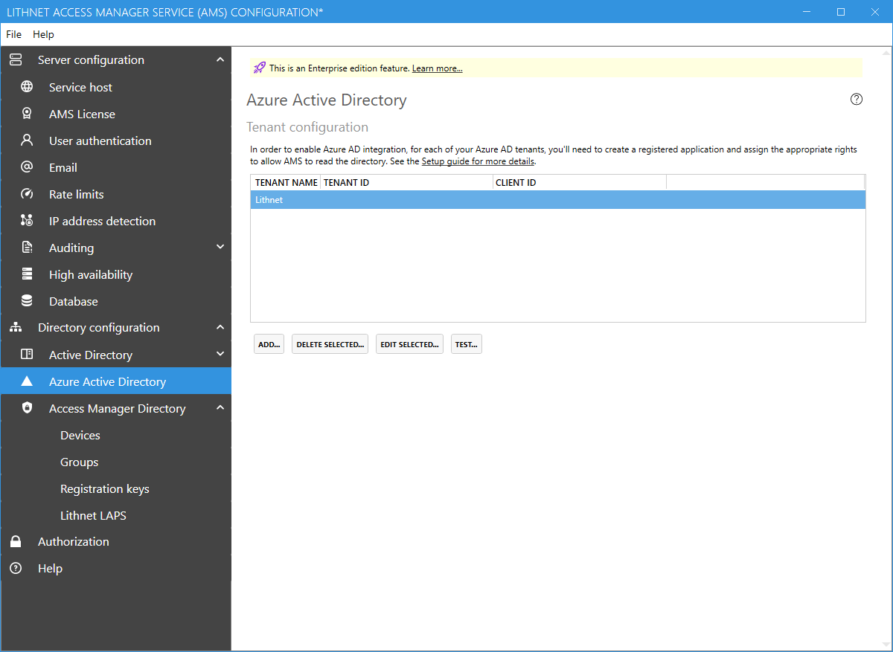

# Azure Active Directory configuration page

## Tenant configuration
In order to support Azure AD-joined and Azure AD-registered devices, you must configure Access Manager with access to your Azure AD tenant. See the guide for [setting up the AMS directory](/configuration/Seting-up-the-AMS-directory) for instructions on how to configure you tenant.
