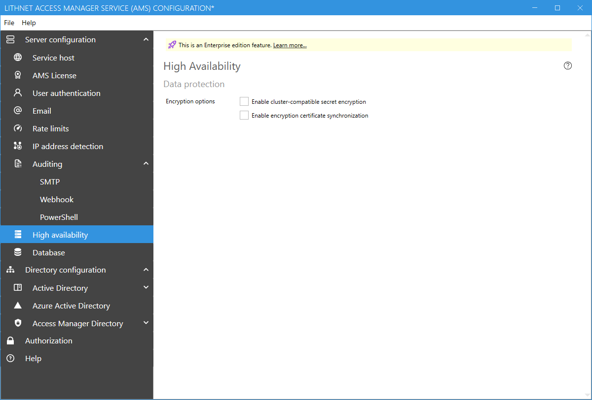

# High availability configuration page
 High availability is an [Enterprise edition feature](/about-ams/Access-Manager-Editions)

## Data protection
:::{note}
Data protection functionality requires at least one domain controller in the domain running Windows Server 2012 R2, and a [KDS root key](https://docs.microsoft.com/en-us/windows-server/security/group-managed-service-accounts/create-the-key-distribution-services-kds-root-key) must have been generated in the domain.
:::

### Cluster-compatible secret encryption
In order to run AMS in a high availability configuration, such as a Windows failover cluster, cluster-compatible secret encryption must be enabled. 

### Encryption certificate synchronization
To ensure that each server in the cluster has access to the necessary decryption certificates you can enable certificate synchronization. This will encrypt the service certificates and store the in the configuration file. 

Do not use this option if you are using certificates stored on a 3rd party device such as an HSM. Configure the device to ensure that all nodes of the cluster have access to decrypt data using the certificate's private key.