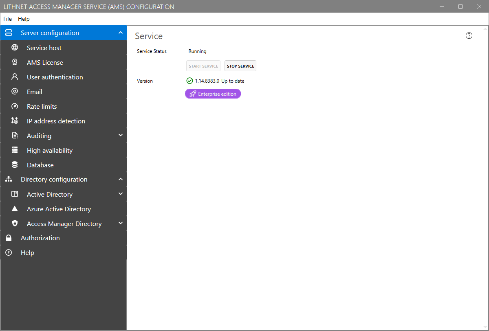

# Server configuration page

## Service
### Service status
Indicates the run state of the Lithnet Access Manager Windows service.

### Version
Shows the current installed version of Access Manager, and shows notifications when new versions are available