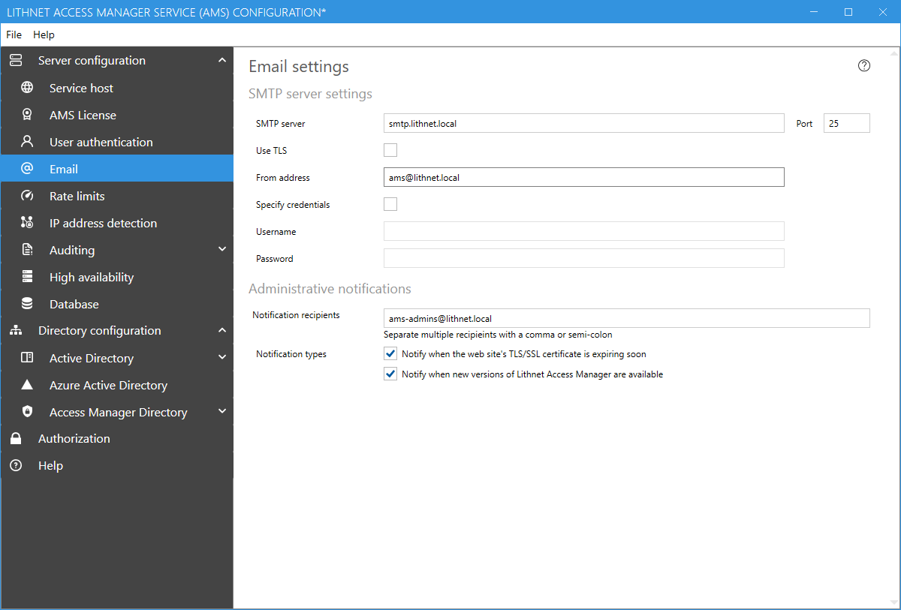
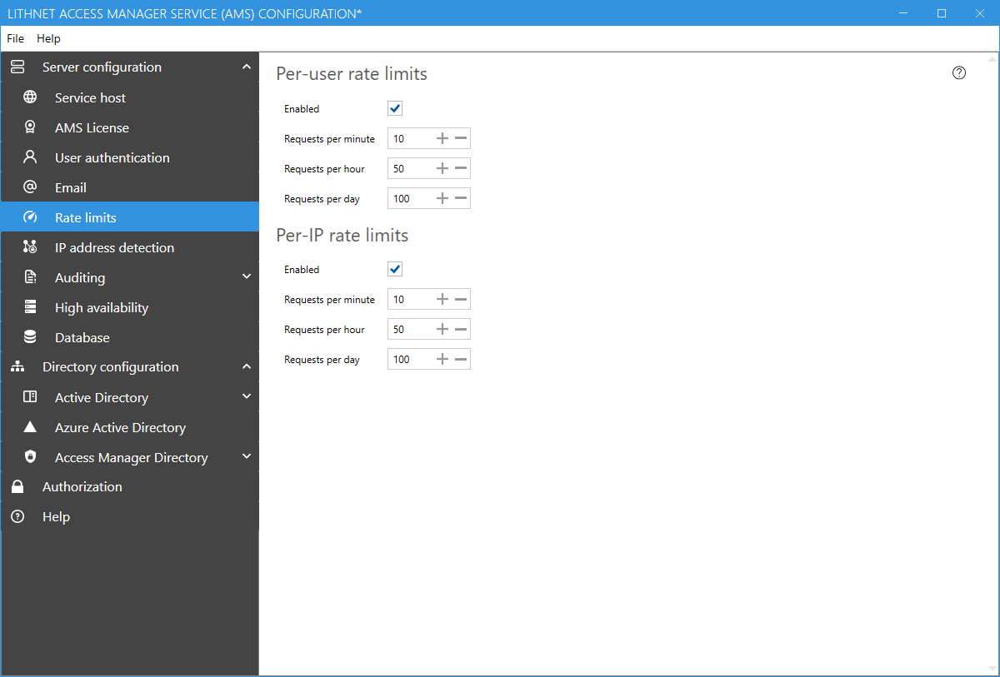
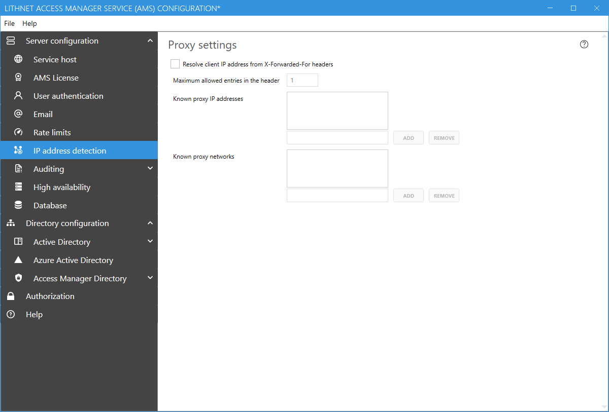
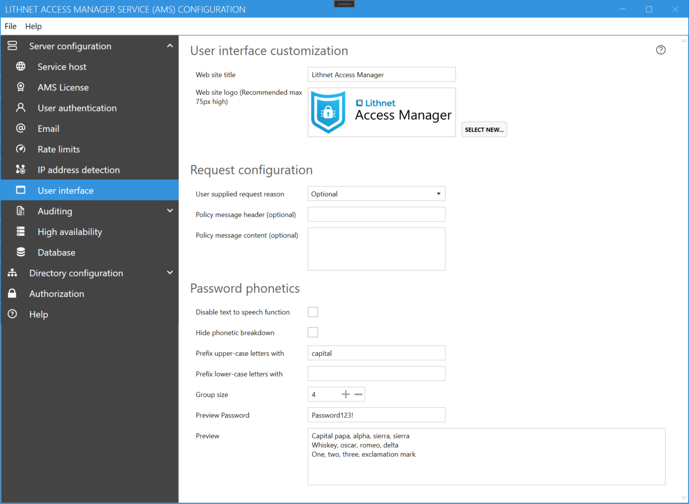
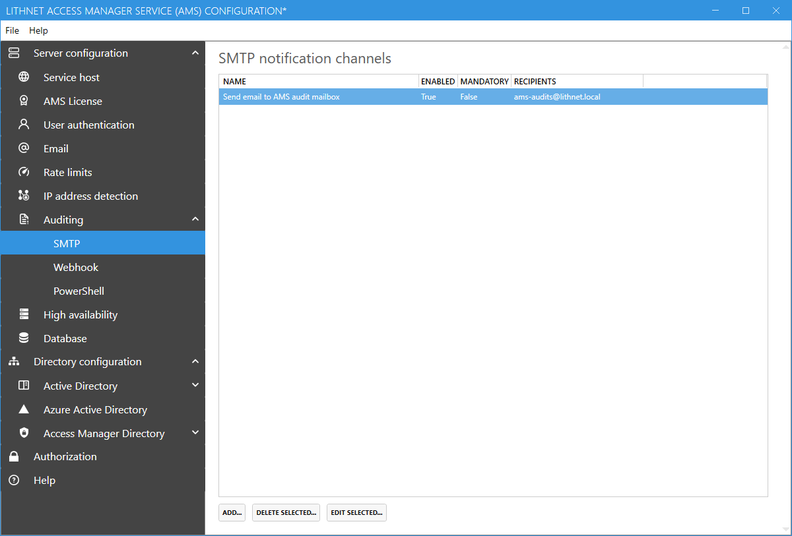
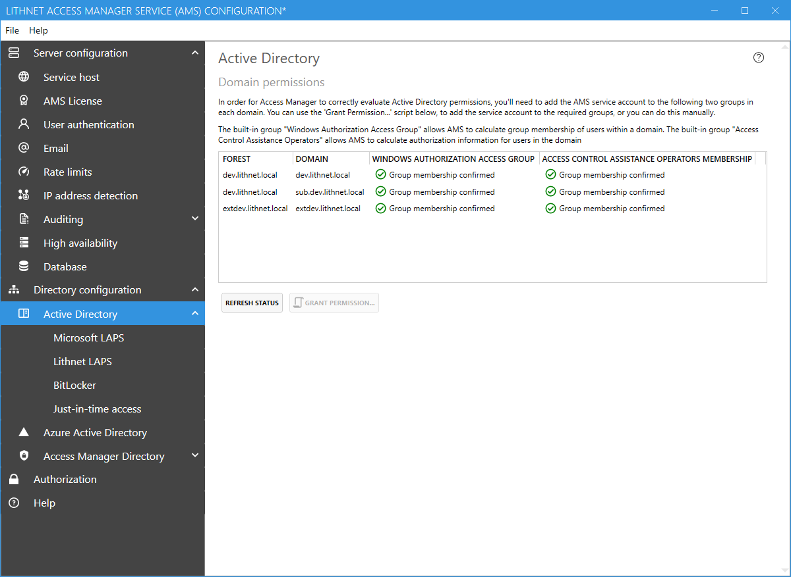

# Installing the Access Manager Service

## Prerequisites
In order to install the Access Manager Service, the following prerequisites must be met;
1. Windows Server 2012 R2 or later 
2. [.NET Core Desktop Runtime](https://dotnet.microsoft.com/download/dotnet-core/3.1/runtime) 3.1.4 or later installed
3. [.NET Core Hosting Bundle](https://dotnet.microsoft.com/download/dotnet-core/3.1/runtime) 3.1.4 or later installed
4. Microsoft SQL Express, if hosting the database locally, or a separate SQL Standard or Enterprise edition server. (SQL express is installed by default)
5. An SSL certificate for the AMS website

## Step 1: Create a service account
The Access Manger Service needs to run under the context of a domain user account. We strongly recommend using a group-managed service account for this purpose. [We've created a guide for setting up a GMSA](/installation/Creating-a-service-account-for-the-Access-Manager-Service) which includes a script to get you up and running quickly.

Do not grant any specific permissions to this account and most certainly don't add it to super-privileged groups like Domain Administrators. As you go through the setup process, you'll be given scripts to delegate permissions specific to the functionality you want to enable.

## Step 2: Prepare an SSL certificate
Determine the host name you will use to access AMS and request an SSL certificate from your certificate provider. Install the certificate in the 'personal' store of the local computer.

You can use the following command to create a self-signed SSL certificate suitable for testing, replacing the DNS name with the name of your AMS server

```PowerShell
New-SelfSignedCertificate -DnsName "ams.domain.local" -CertStoreLocation "cert:\LocalMachine\My"
```

## Step 3: Download and install the AMS service
1. Download the latest version from the [downloads](/installation/Downloads) page.

2. Download and install the [.NET Core Desktop runtime and the .NET Core hosting bundle](https://dotnet.microsoft.com/download/dotnet-core/3.1/runtime), or if your server has internet access you can let the installer download and install these for you

3. Run the AMS installation package. Follow the prompts to install the application and provide the service account created in step 1 when prompted.

## Step 4: Configure the web host
Run the Access Manager Service configuration tool. You'll be prompted to set up the web host.

From the `Server configuration/Service host` page, click the `Select from store...` button and select the certificate you installed in step 2.

Validate that the ports are correct, and click `File`, then `Save`.

[More information on configuring the web host](/help/app-pages/Service-Host-Page)

## Step 5: Configure your authentication provider
AMS supports several different authentication providers. Read the guide on [configuring authentication](/configuration/Setting-up-authentication) and choose an authentication provider. We strongly recommend using a modern authentication provider that supports strong authentication and can enforce multifactor authentication. While integrated windows authentication is provided, we recommend you only use this for testing purposes.

## Step 6: Configure outbound email settings


You'll need to configure an outbound mail server in order to receive audit alerts via email.

[More information on email settings](/help/app-pages/Email-Page)

## Step 7: Set up rate limits



In order to ensure that your service is not used inappropriately, you can place limits of the number of requests a user can make in a given time. You should set these high enough that your users are not going to encounter rate limit issues under normal usage, but low enough to limit the impact of inappropriate or malicious usage of the service.

[More information on rate limiting](/help/app-pages/Rate-Limits-Page)

## Step 8: Configure IP Detection



If you put AMS behind a reverse proxy or load balancer, you'll need to configure IP address detection. This is to ensure that AMS logs the correct IP address in audit logs, and applies rate limiting correctly. 

[More information on IP address detection](/help/app-pages/IP-Address-Detection-Page)


## Step 9: Customize the Web user interface



Configure the user interface as per your organization's requirements. You can customize the name of the application, provide your own logo and even provide some custom policy text for the access request page.

[More information on user interface settings](/help/app-pages/User-Interface-Page)

## Step 10: Configure Auditing


AMS has a powerful auditing engine that allows you to receive notifications when access is granted or denied to a user. AMS logs audit events to the Windows event log all the time, but you can also send audit events via email, through a custom PowerShell script, or even to Slack or Microsoft Teams using a web hook.

[More information on Auditing](/help/app-pages/Auditing-Page)

## Step 11: Configure Active Directory permissions



From the `Active Directory` tab, check that the AMS service account is a member of the `Windows Authorization Access Group` and `Access Control Assistance Operators` built-in groups within each domain. This is required for the AMS service account to be able to calculate access permissions for users and computers within these domains. If any permissions are missing, use the `Grant permission` button to generate a script to grant them.

You will need to restart the service to pick up the new group membership in the local domain.

## Step 12: Configure access to local admin passwords, just in time access, and BitLocker

Now that you have the core application set up, you can configure the Access Manager features you are interested in;

- [Setting up Microsoft LAPS](/configuration/Setting-up-Microsoft-LAPS)
- [Setting up Lithnet LAPS for Active Directory, Azure AD, macOS and Linux](/configuration/Setting-up-Lithnet-LAPS)
- [Setting up JIT access](/configuration/Setting-up-JIT-access)
- [Setting up BitLocker access](/configuration/Setting-up-BitLocker-access)
