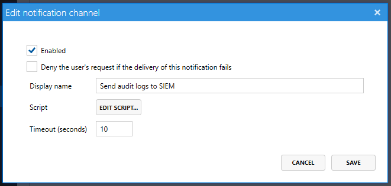

# Customized auditing with PowerShell notification channels



Access Manager's auditing framework allows you to extend the product's auditing capabilities through the use of PowerShell scripts. Using a PowerShell notification channel, you can send audit events to any system you can connect to with PowerShell.

## Example script

The following script is a very simple example that extracts some audit information from the supplied `eventData` object, and writes to the PowerShell information stream.

```powershell
function Write-AuditEvent{
    param(
    $eventData)

    Write-Information "We're in PowerShell for auditing!";

    # Learn more about PowerShell auditing scripts https://go.lithnet.io/fwlink/jgazdugh

    $user = $eventData.User.FullyQualifiedName
    $target = $eventData.Request.Target
    $result = $eventData.Response.Code
    $accessType = $eventData.Response.AccessType
    $isSuccess = $eventData.Response.IsSuccess
    
    if ($isSuccess)
    {
        Write-Information "User $user successfully requested $accessType access to $target";
    }
    else
    {
        Write-Information "User $user was denied $accessType access to $target with response code $result";
    }
}

```
## Script Parameters

### `$eventData`

The `$eventData` variable is na object that contains information about the access request. See the `Available variables` section below for the list of available variables you can use.

## Logging information

You can use the Write-Information, Write-Warning, Write-Verbose cmdlets to write to the AMS log file. Note that if you use Write-Error, or if an exception is thrown and not handled, the auditing event will fail. If you tick the `Deny the user's request if the delivery of this notification fails` option, the user's request will be denied.

## Performance

If you use the `Deny the user's request if the delivery of this notification fails`, the user's access request cannot be granted until your script completes. From the user's perspective, they will be waiting in the browser while the audit event takes place. If you have a slow script, or lots of scripts, this wait time may seem excessive.

If you do not use this option, the user is granted their access request, and the audit event is delivered asynchronously. Any failures will be logged in the AMS logs, but the user will not be denied access.

Scripts must complete within 10 seconds, or they are cancelled by the Access Manager engine.

## Available variables

The [audit variables](audit-variables.md) page contains a full list of all valid variables that you can use throughout your scripts.

## Legacy (v1) PowerShell scripts
Access Manager v1 used a slightly different PowerShell script format. These scripts are still supported by Access Manager v2, but only work for Computer access auditing. You should upgrade any scripts to v2 scripts to ensure full audit information for all types of access requests is available.

```powershell
function Write-AuditLog{
    param(
    [hashtable]$tokens,
    [bool]$isSuccess
)
}
```
