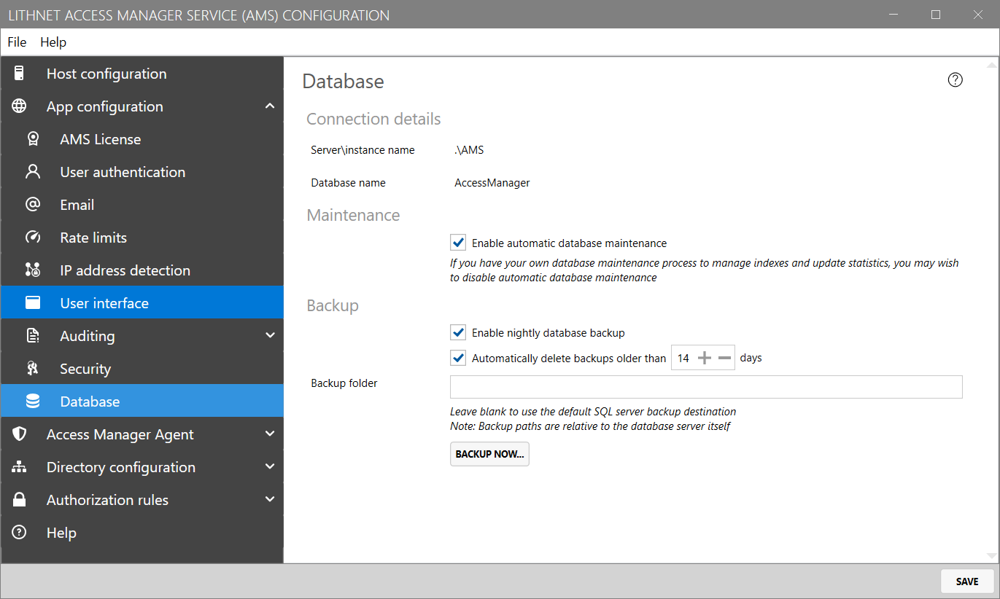

# Backup and Restore

## Backing up the AMS server
All the data for your AMS instance is stored in the AMS database. It is important that you regularly back up this database, and ensure that the backups are stored safely.

If you chose to install AMS using the pre-configuration SQL express instance, then you can configure backups through the `App configuration/Database` screen.

If you are using Azure SQL, Amazon RDS, or an external SQL server instance, you must configure the backups manually on those host platforms.

## Backing up the AMS master key

The AMS master key protects all sensitive information inside the database. It is uniquely protected so that the AMS service account can decrypt it automatically. If that process fails, you will need a master key recovery password to restore access to the service.

From the `App config/Security` page, ensure that you have created a recovery password, and store this password in an offline, secure location.

In the event that the service cannot decrypt its own master key, you'll be prompted for a recovery password when you launch the configuration tool.

### Backing up the encryption certificates

If you have deployed the Access Manager Agent, and are using the encrypted password functionality, you'll need to ensure you have a backup of your password encryption certificate, and it's private key. There is one encryption certificate per forest.

From the `Directory configuration/Active Directory/Lithnet LAPS` page, select the forest that contains the certificate you want to back up, and click `View Certificate`. From the `Details` tab, click `Copy to file`, making sure to select the option to export the private key when prompted. Choose a very strong password, and store the resulting PFX somewhere very safe. Preferably in offline storage. Remember that access to this key will allow someone to decrypt all the local admin passwords in your domain.

Repeat the process for the encryption certificates located on the `Directory configuration/Access Manager directory/Lithnet LAPS` page.

## Restoring AMS from a backup

### Restoring the database when using the pre-configured SQL Express instance

* Stop the Lithnet Access Manager service using the Windows services console.
* Download and install [SQL Server Management Studio (SSMS)](https://docs.microsoft.com/en-us/sql/ssms/download-sql-server-management-studio-ssms?view=sql-server-ver16) 
* Once installed, connect to the SQL express instance using the server and instance of `.\AMS` in the `Server` field
* Follow [the steps located in this guide](https://docs.microsoft.com/en-us/sql/relational-databases/backup-restore/restore-a-database-backup-using-ssms?view=sql-server-ver16) for performing the actual restore.
* Once the database has been restored, restart the Lithnet Access Manager Service from the services console
* Open the configuration tool and confirm the new settings

### Restoring the database when using an externally-managed database

* Stop the Lithnet Access Manager service using the Windows services console.
* Refer to the Azure or Amazon RDS documentation for restoring the database in their respective environments.
* Once the database has been restored, restart the Lithnet Access Manager Service from the services console
* Open the configuration tool and confirm the new settings

### Restoring the encryption certificate

If you have an encryption key back you want to restore, then use the AMS configuration tool to import the PFX file into the database. This can be performing using the `import` button on either the `Directory configuration/Access Manager Directory/Lithnet LAPS` or `Directory configuration/Active Directory/Lithnet LAPS`, depending on which type of encryption certificate it is.

## Recovering from a lost encryption certificate private key

If you lose access to the encryption certificate's private key, any current and historical passwords encrypted with that key are not recoverable. This is why backups are so important.

However, you can publish a new key, and force the agents to generate a new password and encrypt it with that key. See the guide on [Recovering from a lost encryption certificate](recovering-from-a-lost-encryption-certificate.md) for more details.
