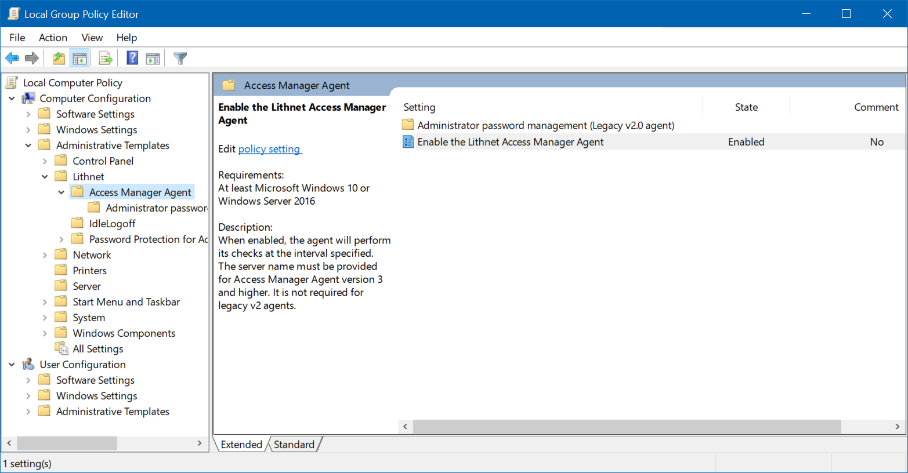

# Configuring the Access Manager Agent via group policy


The Access Manager v3 agent no longer gets its password settings from group policy. V3 agents obtain their password settings from the AMS server via [agent policy](setting-up-agent-policies.md)


If your agents are joined to an Active Directory domain, you can use Group Policy to configure the agent.

When you install the Access Manager Agent on a computer, the group policy ADMX files get automatically installed. However, if you are using a central policy store, you'll need to manually copy the ADMX and ADML files to the store.

The following files need to be copied
* `C:\Windows\PolicyDefinitions\lithnet.admx`
* `C:\Windows\PolicyDefinitions\lithnet.accessmanager.agent.admx`
* `C:\Windows\PolicyDefinitions\lithnet.accessmanager.agent.password.admx`
* `C:\Windows\PolicyDefinitions\en-US\lithnet.adml`
* `C:\Windows\PolicyDefinitions\en-US\lithnet.accessmanager.agent.adml`
* `C:\Windows\PolicyDefinitions\en-US\lithnet.accessmanager.agent.password.adml`

The central policy store is located at `\\<domain>\sysvol\<domain>\Policies\PolicyDefinitions`

Using the group policy editor, create a new group policy object, and link it to the OU containing your computer objects. Open the policy and navigate to `Administrative Templates`, `Lithnet`, `Access Manager Agent`.

Edit the `Enable the Lithnet Access Manager Agent` policy, and specify the server name. Note that the Agent check interval only applies to the v2 agent. The v3 agent's check in interval is configured in its agent policy defined on the AMS server.

### v2 Agent settings
The settings contained under `Administrator password management (Legacy v2.0 agent)` are not used at all by the v3 agent, and are provided for backwards compatibility with the v2 agent. The v3 agent does not store it's passwords in Active Directory and gets it agent policy from the AMS server directly.

For information on configuring these settings for the v2 agent, please see the [v2 agent documentation](https://docs.lithnet.io/ams/v2.0/configuration/deploying-features/setting-up-lithnet-laps/setting-up-lithnet-laps-for-active-directory#step-5-configure-the-access-manager-agent-group-policy).
