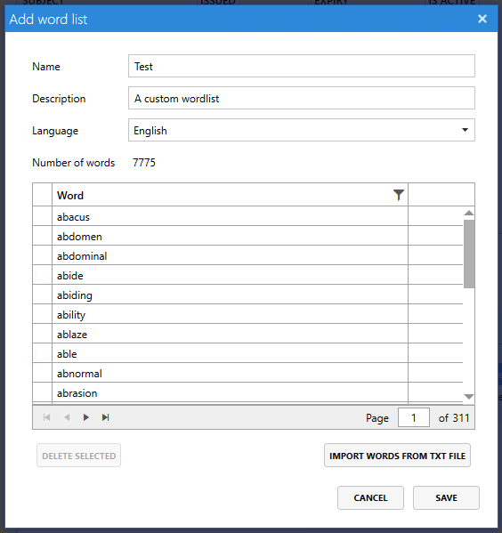

# Creating and managing word lists

Access Manager comes with a default word list used for generating passphrases. However, you can create your own custom word lists that can be used to generate LAPS passphrases. 

From the `Access Manager agent/Password settings` page, you can see the word lists currently available on your system.

The built-in word lists cannot be modified, but you can duplicate or add your own word lists.

## Adding a new word list

Click the `Add..` button to add a new word list.

Click the `Import words from txt file` button to import your custom word list. The text file should have one word per line, and must contain at least 2000 individual words.

Once you save the word list, you can assign the word list to computers using the [agent policy](setting-up-agent-policies.md).
