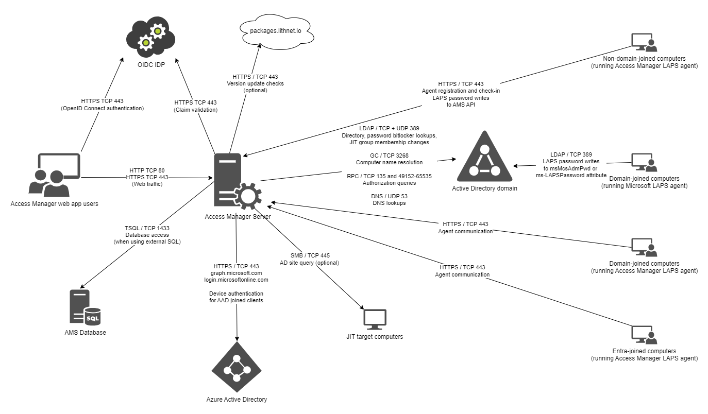

# Ports and Traffic Flows

The following diagram details the traffic flows and port requirements for a typical Access Manager environment.

| Source | Destination | Destination ports | Description | 
| --- | --- | --- | ------ |
| AMS server | packages.lithnet.io | TCP 443 | Allows the AMS server to check and notify when updates are available (optional) |
| AMS server | graph.microsoft.com| TCP 443 | Used to access the graph API when authenticating Microsoft Entra joined devices |
| AMS server | login.microsoftonline.com | TCP 443 | Used to authenticate to the graph API when authenticating Microsoft Entra joined devices |
| AMS server | The hostname specified in the issuer/authority field of the OIDC setup page | TCP 443 | Required for claims validation when using OpenID Connect |
| AMS server | Active Directory Domain Controllers | LDAP TCP 389, CLDAP UDP 389 | Directory lookups, site lookups, BitLocker Password lookups, LAPS password lookups, JIT group membership modifications |
| AMS server | Active Directory Domain Controller Global Catalog Servers | Global Catalog TCP 3268 | Computer name lookups |
| AMS server | Active Directory Domain Controllers | RPC Endpoint Mapper TCP 135, RPC dynamic port range 49152-65535 | Authorization queries and ACL evaluation |
| AMS server | Active Directory DNS servers | DNS UDP 53 | DNS lookups |
| AMS server | SQL Database | TSQL TCP 1433 | Connectivity to the AMS database (when not using SQL Express) |
| AMS server | JIT target computers | RPC over SMB 445 | Used to query a computer when performing a JIT request to determine what DC and site it is in. This is optional, and AMS will fall back to using sites and services to try and find the closest DC to the target computer |
| Access Manager Agent | AMS Server | HTTPS TCP 443 | Agent registration, check in, and password management | 
| Access Manager web-app users | AMS Server | HTTP TCP 80, HTTPS TCP 443 | Access to the web app |
| Access Manager web-app users | OpenID Connect Identity Provider | HTTPS TCP 443 | OpenID Connect authentication |
