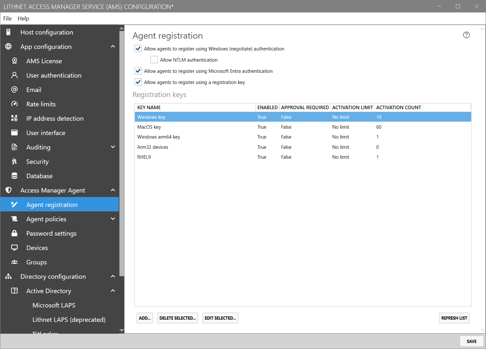

# Access Manager Agent - Agent Registration page

The `Agent registration` page provides the ability to configure how Access Manager Agents can register with the Access Manager server.

## Agent registration settings

### Allow agents to register using Windows (negotiate) authentication

Enabling Windows authentication allows Active Directory-joined devices to use their machine identity to authenticate to the Access Manager directory.

If this setting is enabled, devices can use Kerberos to authenticate to the Access Manager server.

By default, NTLM authentication is *disabled*, as it has been formally [deprecated by Microsoft](https://learn.microsoft.com/en-us/windows/whats-new/deprecated-features#deprecated-features) due to it's inherent [security weaknesses and vulnerabilities](https://learn.microsoft.com/en-us/previous-versions/windows/it-pro/windows-10/security/threat-protection/security-policy-settings/network-security-restrict-ntlm-ntlm-authentication-in-this-domain#security-considerations). We highly recommend keeping NTLM authentication *disabled* unless explicitly required.


If you wish to allow agents to register with their Active Directory identity, you will need to configure a service prinicipal name (SPN) on the service account used by the Access Manager Service.

If this SPN is not set, the following warning will appear in the `Service account` section of the `Host configuration` page:



### Allow agents to register using Microsoft Entra authentication

Enabling Microsoft Entra support allows Windows 10 and higher devices that are *joined* to Microsoft Entra to authenticate to the Access Manager directory. These devices will use their Microsoft Entra credentials to register with AMS.

### Allow agents to register using a registration key

Enabling support for key-based device registration allows support for devices that are not joined to an Active Directory or Microsoft Entra.

You must enable key-based device registration in order to support non-domain joined devices running macOS, Linux, and/or Windows.

## Registration key settings

create and manage device registration keys. A registration key is required for a device to register with the AMS service, when an alternative form of authentication, such as Windows or Microsoft Entra authentication is not available.

A registration key is used by a device only once, to allow it to register its own unique set of credentials with the AMS server, which is used from that point on.

### Configuring a registration key

When you create a new registration key, a unique string value is automatically generated. You must assign a friendly name to this key, and optionally set parameters around reuse and approval.

#### Friendly name

You can choose a unique name for the key, so its use can be identified in the UI and in audit logs.

#### Key value

The read-only registration key that was generated by the system

#### Activation limit

You can choose to limit the number of times the key can be used, but default keys can be used an unlimited number of times. If you are creating the key for use on a specific device, then you can set this value to `1`, which will invalidate the key after its use.

#### Manual activation

You can choose to require that the device be manually approved in the `Devices` section of the app, before it can start sending its password changes.

#### Activation count

Shows the number of times the key has been used to successfully activate a device

#### Automatically-assigned groups

You can automatically add devices that use the key to any number of AMS groups that you specify. You can use this feature to ensure that specific access rules and password policies automatically apply to newly registered devices.
