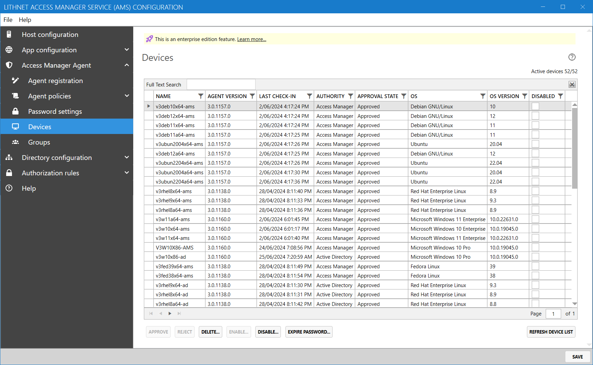

# Devices page

 You can manage up to 100 devices for free. Managing more than 100 devices is an [Enterprise edition feature](../../access-manager-editions.md)

The `Devices` page contains a list of all devices that are registered with the Access Manager service.

You can double-click on a device to see extended information.

### Approve or reject a device

If a device was registered using a registration key that requires approval, the device will have an `Approval state` of `Pending`. In this state, the device will check in every 60 minutes to see if it has been approved. Once it is approved, it can communicate with the server, and communicate password changes. If the registration is rejected, the device will discontinue its registration attempts and go into a dormant state.

## Delete a device

Deleting a device is a permanent operation that removes all records of the device, and its entire password history from Access Manager. The device's credentials will be invalidated, and it will no longer be able to communicate with the Access Manger server.

## Disable a device

Disabling the device prevents the device from authenticating to the Access Manager server, until it is enabled again. The device will continue to retry connecting to the server at its regular recheck interval (by default every 60 minutes).

## Expire the password

Marking the password as expired will force the device to update its password at its next regular check in.
