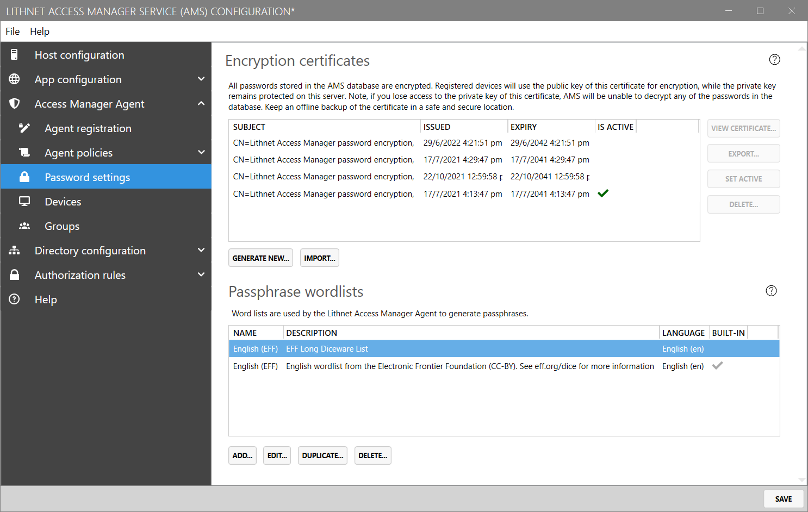
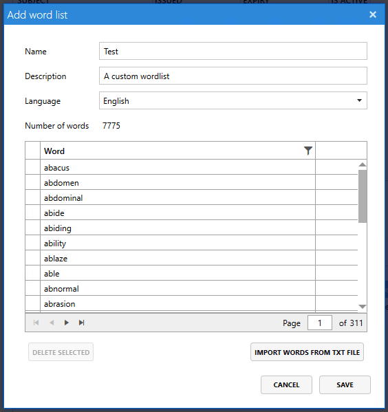

# Password settings page

The `Password settings` page provides the ability to configure how Access Manager Agent passwords are encrypted, and provides the ability to configure word lists for use in constructing passphrases.

## Encryption certificates

AMS registered devices encrypt their passwords using a certificate provided by the AMS server. When a password change is required, the AMS server will provide the device with the public key of the `active` certificate, and it will use that key to encrypt the password.

When configuring LAPS for the first time, you'll need to create an encryption certificate, making sure to back it up to a location where it will be kept safe and secure.

If the encryption certificate is lost, passwords stored in the AMS database are unrecoverable.

### List columns

#### Subject

Shows the friendly name of the certificate

#### Issued

Shows the date that the certificate was generated

#### Expiry

Shows the date that the certificate will expire

#### Is Active

Indicates whether the certificate is active. Only the active certificate is used by clients to encrypt their passwords

### Generating a new encryption certificate

At any time you can generate a new encryption certificate by clicking the `Generate new` button. Clients will not use this new certificate until you mark it as active.

If there are previously used certificates shown here, don't remove them. If clients have encrypted their passwords or password history with these old certificates, the AMS service will need them to be able to decrypt them.

### Backing up the private key

It is imperative that you have a safe and secure backup of your encryption keys. Select a certificate to back up and click `View Certificate`. From the `Details` tab, click `Copy to file...`. This will launch the export certificate wizard, which will allow you to export the certificate and private key to a PFX file. Choose a strong password for the PFX, and store the file somewhere safe. It's best to have multiple copies of the file, including an 'offline' copy.

See the guide on [restoring an encryption certificate from backup](../advanced-help-topics/backup-and-restore.md) for details on how to restore an existing key from a backup.

If you've lost the private key, you can force the agents to set new passwords and encrypt them with a new key by reading the [recovering from a lost encryption certificate](../advanced-help-topics/recovering-from-a-lost-encryption-certificate.md) guide. Unfortunately, there is no way to recover the encrypted password history.

## Passphrase word lists

When Access Manager Agent policies are configured to generate passphrases for use with local administrator accounts, they do so using *word lists* - lists of thousands of unique words that are delivered to clients in order for them to generate secure passphrases.

By default, Access Manager comes bundled with one word list: the [EFF diceware wordlist](https://www.eff.org/files/2016/07/18/eff_large_wordlist.txt) from the [Electronic Frontier Foundation](https://www.eff.org/dice), containing 7776 unique English words for use in passphrases.

If, for example, you wish to generate passphrases in a language better suited to your user base, you can import your own word lists with which Access Manager can generate passphrases.

You can find a list of "diceware" word lists in other languages for use with Access Manager [here](https://theworld.com/~reinhold/diceware.html#Diceware%20in%20Other%20Languages|outline).

### Importing word lists

To import a word list, first select `Add...` at the bottom of the "Passphrase word lists" section of the page.

#### Name

A name for the word list, used in Agent Policy configuration

#### Description

A description for the word list

#### Language

Select a language for the word list

#### Words

In order to add words to a word list, you can click the `Import words from txt file` button in the bottom right-hand corner of the window.

This file should be formatted such that there is one word per line in ASCII-format (no special characters); and at least 2,000 words are included.
