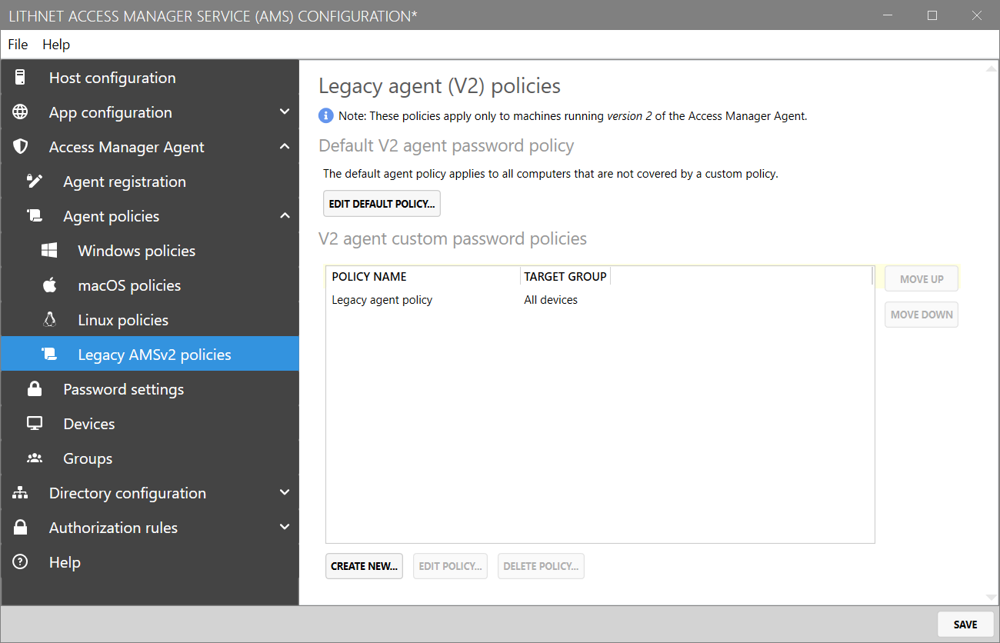
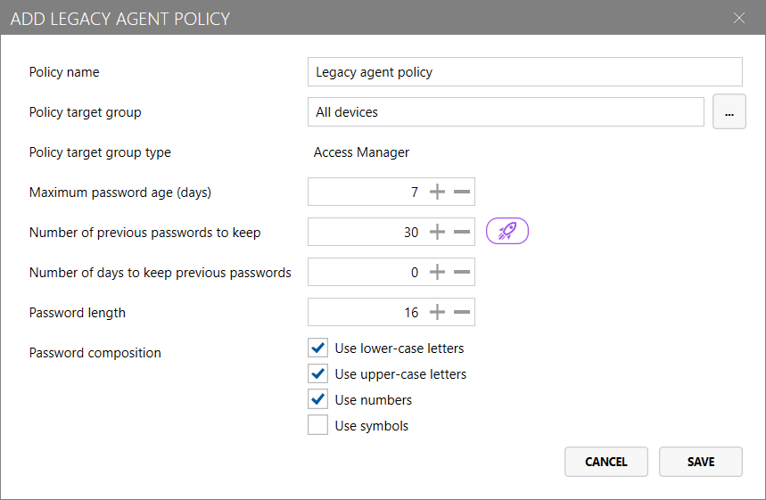
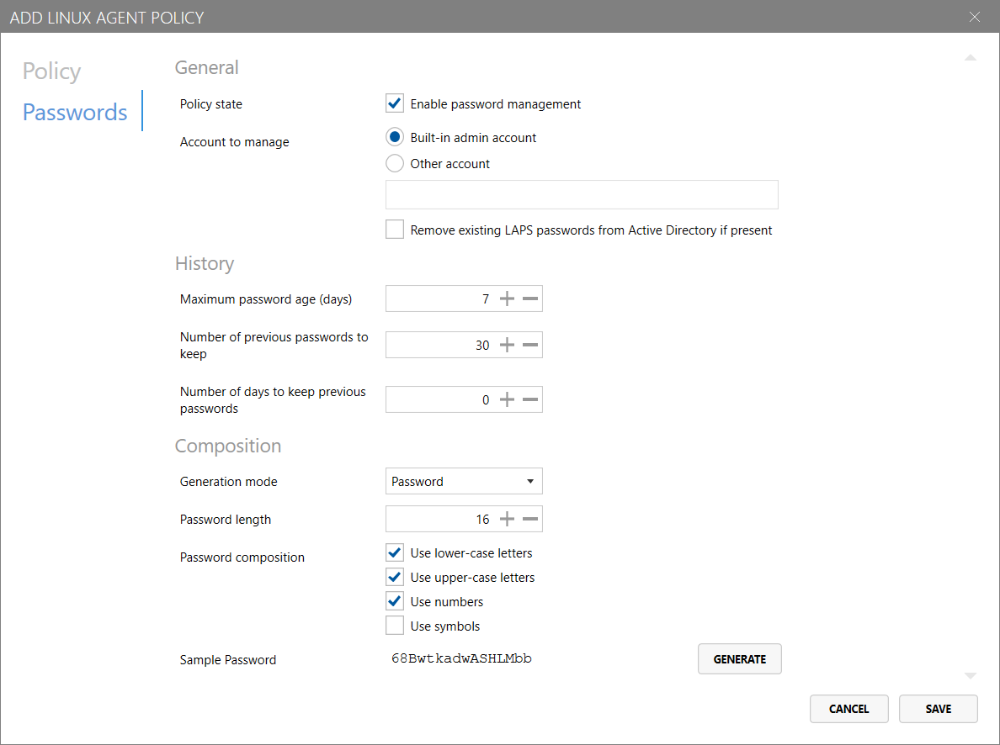

# Access Manager Agent Policies (AMSv2) Page


**Note**: Access Manager Agent v2 is supported by servers running either Access Manager v2 or v3.

However, [features introduced in Access Manager v3](../whats-new.md) are not available in these agents.

Agent Policies configured under the "Legacy agent (V2) policies" page will only target devices running Access Manager Agent v2.

For more information on planning your AMS v3 migration, see our [upgrading from Access Manager v2 to v3](./upgrading-from-v2.md) guide.


The `Legacy agent (v2) policies` page in the `Access Manager Agent/Agent policies` area of Access Manager allows you to configure policies for devices running Access Manager Agent (version 2.0 *only*).

You can create custom Access Manager Agent v2 policies that are targeted at specific computers, groups and containers defined AMS.

If no policies are configured, or no an agent does not match any of the custom policies configured, the "Default  agent policy" will be applied to the agent.

You can view or edit the default policy for Linux agents by clicking `Edit default policy...` at the top of the page.

## Create or edit an agent policy

You can create a new Access Manager Agent policy for Linux devices by clicking the `Create new...` button at the bottom of the page.

### Policy settings

#### Policy name

Specify the name for the custom agent policy.

> Note: This field is not configurable for the default policy.

#### Policy target group

This list allows you to target specific computers, groups and containers defined in the AMS directory  that the policy will be applied to.


It is important to note that Access Manager evaluates policies in the order they are presented in the UI.

When an agent checks in to the Access Manager server, the server will evaluate each policy - in order - to determine if the policy is applicable to the agent (given the configured targets). The *first policy that matches* will be applied to the agent.

If no policy is configured with a target that captures the given device, the device's policy will fall back to the default agent policy.

For this reason, it is important to consider the order in which your policies are organised; as a rule of thumb, policies with more specific targets should be placed *higher* in the list than more generically-targeted policies.


> Note: This field is not configurable for the default policy.

### Password settings

#### History

* __Maximum password age (days)__: The maximum number of days before the password must be rotated. For example, if this is set to 7, then the password would be rotated after 7 days.
* __Number of previous passwords to keep__: The number of historical passwords to store in the Access Manager directory.
* __Number of days to keep previous passwords__: The number of days to keep historical passwords for; setting this field to "0" disables aging out of historical passwords.

#### Composition

The following configuration options are available to configure how Access Manager Agent v2 generates passwords for the built-in Administrator account:

* __Password length__: The length of passwords to be generated for local administrator accounts
* __Password composition__
    * __Use lower-case letters__: If configured, generated passwords will contain lower-case letters
    * __Use upper-case letters__: If configured, generated passwords will contain upper-case letters
    * __Use numbers__: If configured, generated passwords will contain numbers
    * __Use symbols__: If configured, generated passwords will contain symbols