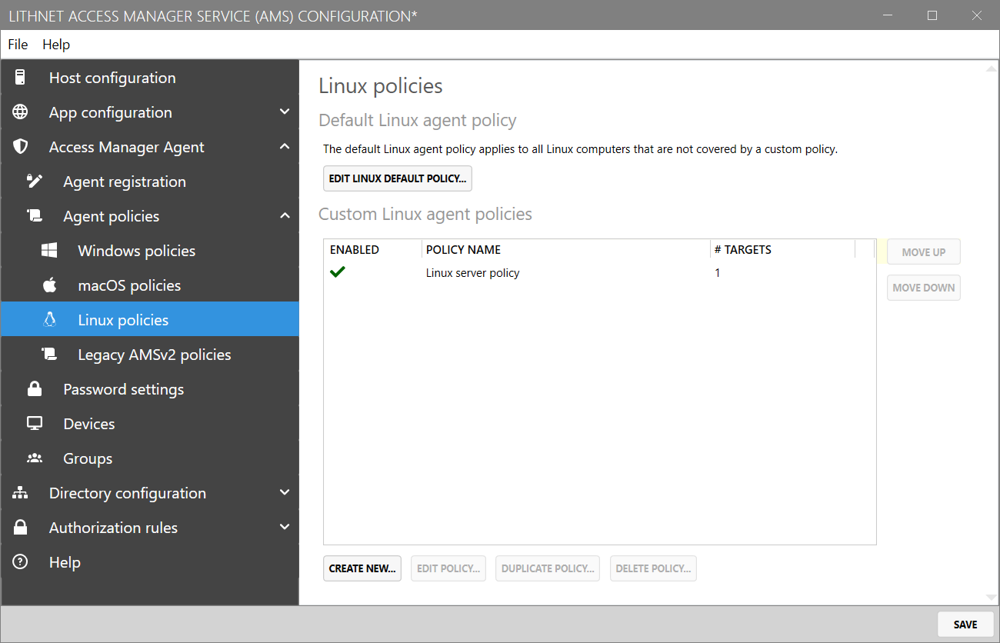
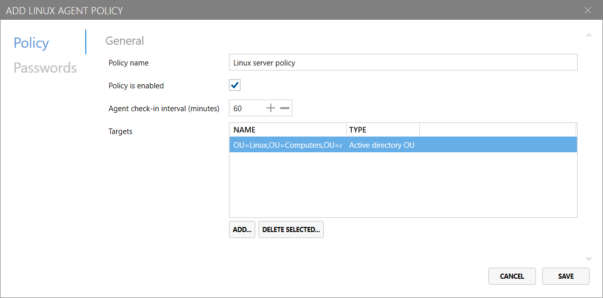
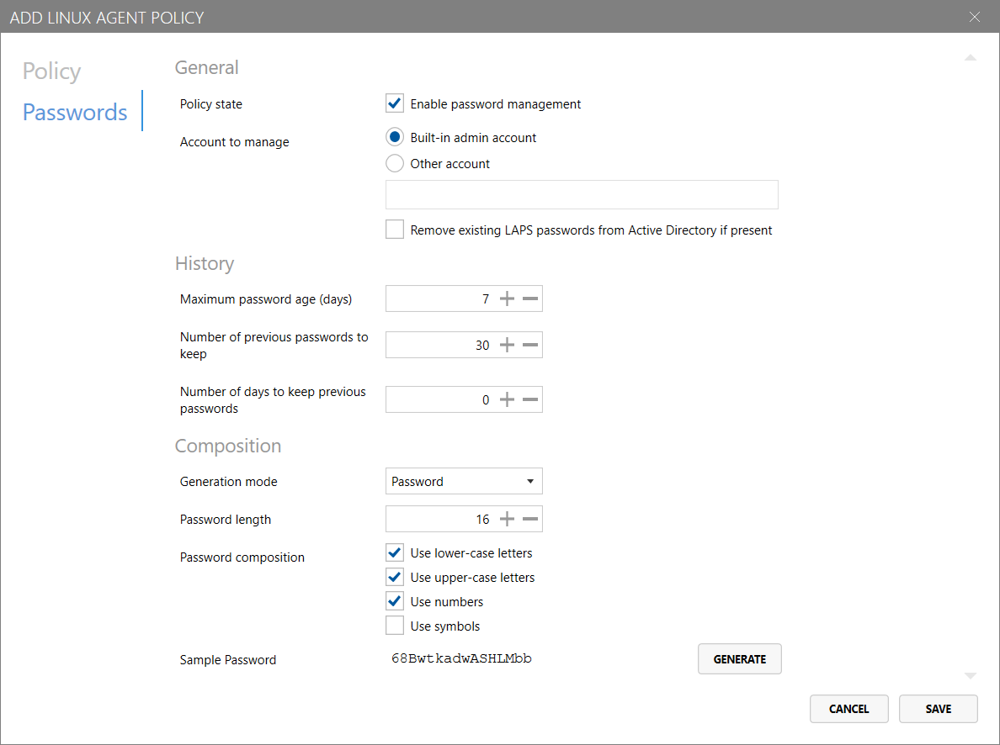
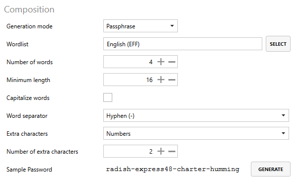

# Access Manager Agent Policies (Linux) Page

The `Linux policies` page in the `Access Manager Agent/Agent policies` area of Access Manager allows you to configure policies for devices running Access Manager Agent for Linux (version 3.0 or higher).

You can create custom Access Manager Agent policies that are targeted at specific computers, groups and containers - from Active Directory, Microsoft Entra, or AMS.

If no policies are configured, or no an agent does not match any of the custom policies configured, the "Default Linux agent policy" will be applied to the agent.

You can view or edit the default policy for Linux agents by clicking `Edit default Linux policy...` at the top of the page.

## Create or edit an agent policy

You can create a new Access Manager Agent policy for Linux devices by clicking the `Create new...` button at the bottom of the page.

### Policy settings
The first tab of the Linux agent policy configuration screen configures general information about the policy.

#### Policy name

Specify the name for the custom agent policy.

> Note: This field is not configurable for the default policy.

#### Policy is enabled

Determines whether the custom agent policy is enabled for targeting.

> Note: This field is not configurable for the default policy.

#### Agent check-in interval (minutes)

Configures how frequently the agent should attempt to check-in to the server - in minutes - to receive policy updates, reset local administrator account passwords (if required) and backup disk encryption keys (if required). Defaults to 60 minutes.

#### Targets

This list allows you to target specific computers, groups and containers - from Active Directory, Microsoft Entra, or AMS - that the policy will be applied to.


It is important to note that Access Manager evaluates policies in the order they are presented in the UI.

When an agent checks in to the Access Manager server, the server will evaluate each policy - in order - to determine if the policy is applicable to the agent (given the configured targets). The *first policy that matches* will be applied to the agent.

If no policy is configured with a target that captures the given device, the device's policy will fall back to the default Linux policy.

For this reason, it is important to consider the order in which your policies are organised; as a rule of thumb, policies with more specific targets should be placed *higher* in the list than more generically-targeted policies.


> Note: This field is not configurable for the default policy.

### Password settings
The second tab of the Linux agent policy configuration screen - `Passwords` - configures password management and composition settings.

#### Enable password management

Configures whether the Access Manager Agent should attempt to manage and rotate the local administrator password on the device.
ßß
#### Account to manage

* If __Built-in admin account__ is selected, the Access Manager Agent will manage the password of the Linux `root` account.
* If __Other account__ is selected, the Access Manager agent will manage the password of the account with the name specified in the field below.

You can optionally configure the following settings for managing local accounts:

* __Remove exiting LAPS passwords from Active Directory if present__: If this device's local administrator password was previously stored in Active Directory, this setting will clear existing passwords once the agent checks in (if applicable).

#### History

* __Maximum password age (days)__: The maximum number of days before the password must be rotated. For example, if this is set to 7, then the password would be rotated after 7 days.
* __Number of previous passwords to keep__: The number of historical passwords to store in the Access Manager directory.
* __Number of days to keep previous passwords__: The number of days to keep historical passwords for; setting this field to "0" disables aging out of historical passwords.

#### Composition

If the `Generation mode` is set to __"Password"__, the following configuration options are available:

* __Password length__: The length of passwords to be generated for local administrator accounts
* __Password composition__
    * __Use lower-case letters__: If configured, generated passwords will contain lower-case letters
    * __Use upper-case letters__: If configured, generated passwords will contain upper-case letters
    * __Use numbers__: If configured, generated passwords will contain numbers
    * __Use symbols__: If configured, generated passwords will contain symbols

---

If the `Generation mode` is set to __"Passphrase"__, the following configuration options are available:

* __Wordlist__: The wordlist used to generate passphrases; configurable on the [Password settings page](access-manager-agent-password-settings-page.md)
* __Number of words__: The number of words to include in a generated passphrases
* __Minimum length__: The minimum length of passphrases generated by the Access Manager Agent
* __Capitalize words__: If configured, the first letter of each word in the passphrase will be capitalized.
* __Word separator__: The character used to separate words in the passphrase:
    * *Space*: Place a space " " between each word
    * *Hyphen*: Place a dash "-" between each word
    * *Underscore*: Place an underscore "_" between each word
* __Extra characters__: If required, randomly place extra characters at the end of one of the words in the passphrase to increase complexity.
    * *None*: Do not add extra characters to the passphrase
    * *Numbers*: Add extra numbers somewhere in the passphrase
    * *Symbols*: Add extra symbols somewhere in the passphrase
    * *Numbers & Symbols*: Add extra numbers & symbols somewhere in the passphrase
* __Number of extra characters__: The number of extra characters to add to the passphrase, as specified above.