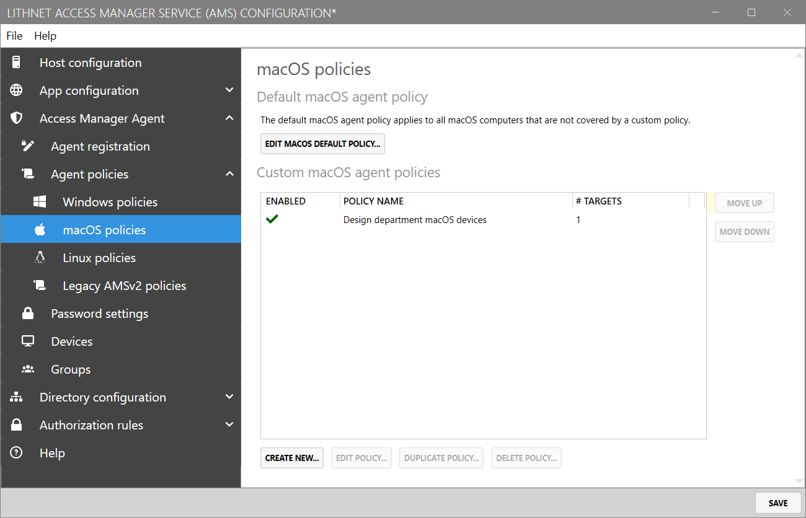
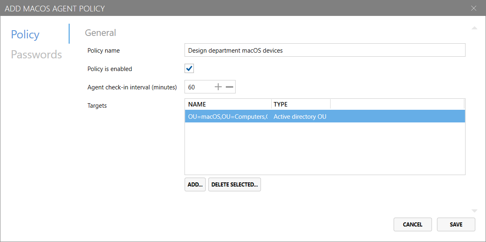
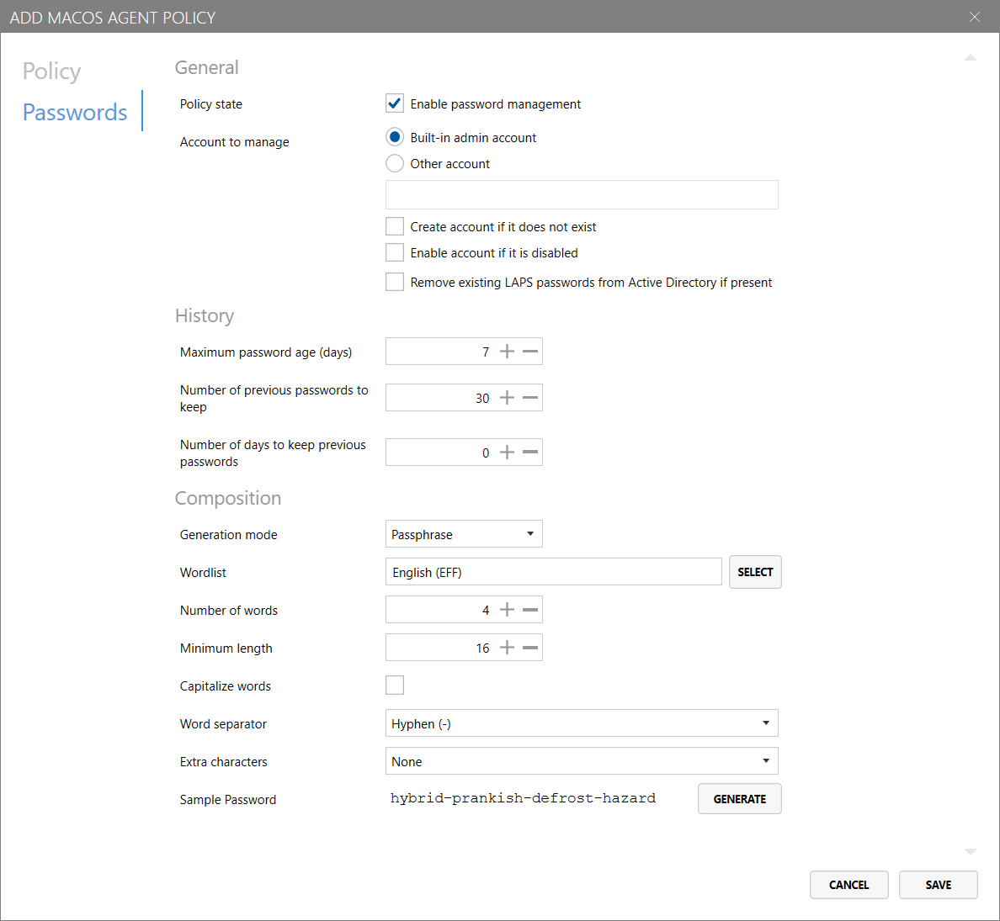
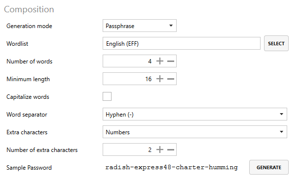

# Access Manager Agent - macOS polices page

The `macOS policies` page in the `Access Manager Agent/Agent policies` area of Access Manager allows you to configure policies for devices running Access Manager Agent for macOS (version 3.0 or higher).

You can create custom Access Manager Agent policies that are targeted at specific computers, groups and containers - from Active Directory, Microsoft Entra, or AMS.

If no policies are configured, or no an agent does not match any of the custom policies configured, the "Default macOS agent policy" will be applied to the agent.

You can view or edit the default policy for macOS agents by clicking `Edit default macOS policy...` at the top of the page.

## Create or edit an agent policy

You can create a new Access Manager Agent policy for macOS devices by clicking the `Create new...` button at the bottom of the page.

### Policy settings

The first tab of the macOS agent policy configuration screen configures general information about the policy.

#### Policy name

Specify the name for the custom agent policy.


Note: This field is not configurable for the default policy.


#### Policy is enabled

Determines whether the custom agent policy is enabled for targeting.


Note: This field is not configurable for the default policy.


#### Agent check-in interval (minutes)

Configures how frequently the agent should attempt to check-in to the server - in minutes - to receive policy updates, reset local administrator account passwords (if required) and backup disk encryption keys (if required). Defaults to 60 minutes.

#### Targets

This list allows you to target specific computers, groups and containers - from Active Directory, Microsoft Entra, or AMS - that the policy will be applied to.


It is important to note that Access Manager evaluates policies in the order they are presented in the UI.

When an agent checks in to the Access Manager server, the server will evaluate each policy - in order - to determine if the policy is applicable to the agent (given the configured targets). The _first policy that matches_ will be applied to the agent.

If no policy is configured with a target that captures the given device, the device's policy will fall back to the default macOS policy.

For this reason, it is important to consider the order in which your policies are organised; as a rule of thumb, policies with more specific targets should be placed _higher_ in the list than more generically-targeted policies.



Note: This field is not configurable for the default policy.


### Password settings

The second tab of the macOS agent policy configuration screen - `Passwords` - configures password management and composition settings.

#### Enable password management

Configures whether the Access Manager Agent should attempt to manage and rotate the local administrator password on the device.


Starting from version 3.0.1500 and later, Access Manager Agent supports managing the password for accounts with _secure token_ enabled. However, Access Manager is unable to enable secure token for accounts. This must be done via an external process.

Read the [secure token setup](../advanced-help-topics/enabling-secure-token-support-macos.md) guide for more information.


#### Account to manage

* If **Built-in admin account** is selected, the Access Manager Agent will manage the password of the macOS `root` account.
* If **Other account** is selected, the Access Manager agent will manage the password of the account with the name specified in the field below.

You can optionally configure the following settings for managing local accounts:

* **Create account if it does not exist**: If this setting is enabled, the Access Manager Agent will create a local account with the specified name if it does not exist on the device.
* **Enable account if it is disabled**: If this setting is enabled, the Access Manager Agent will automatically enable the managed administrator account.
* **Remove exiting LAPS passwords from Active Directory if present**: If this device's local administrator password was previously stored in Active Directory, this setting will clear existing passwords once the agent checks in (if applicable).

#### History

* **Maximum password age (days)**: The maximum number of days before the password must be rotated. For example, if this is set to 7, then the password would be rotated after 7 days.
* **Number of previous passwords to keep**: The number of historical passwords to store in the Access Manager database.
* **Number of days to keep previous passwords**: The number of days to keep historical passwords for; setting this field to "0" disables aging out of historical passwords.

See [Password history and retention](../advanced-help-topics/password-history-retention.md) for more information how how these settings work to ensure you have the right number of passwords retained.

#### Composition

If the `Generation mode` is set to **"Password"**, the following configuration options are available:

* **Password length**: The length of passwords to be generated for local administrator accounts
* **Password composition**
  * **Use lower-case letters**: If configured, generated passwords will contain lower-case letters
  * **Use upper-case letters**: If configured, generated passwords will contain upper-case letters
  * **Use numbers**: If configured, generated passwords will contain numbers
  * **Use symbols**: If configured, generated passwords will contain symbols

***

If the `Generation mode` is set to **"Passphrase"**, the following configuration options are available:

* **Wordlist**: The wordlist used to generate passphrases; configurable on the [Password settings page](access-manager-agent-password-settings-page.md)
* **Number of words**: The number of words to include in a generated passphrases
* **Minimum length**: The minimum length of passphrases generated by the Access Manager Agent
* **Capitalize words**: If configured, the first letter of each word in the passphrase will be capitalized.
* **Word separator**: The character used to separate words in the passphrase:
  * _Space_: Place a space " " between each word
  * _Hyphen_: Place a dash "-" between each word
  * _Underscore_: Place an underscore "\_" between each word
* **Extra characters**: If required, randomly place extra characters at the end of one of the words in the passphrase to increase complexity.
  * _None_: Do not add extra characters to the passphrase
  * _Numbers_: Add extra numbers somewhere in the passphrase
  * _Symbols_: Add extra symbols somewhere in the passphrase
  * _Numbers & Symbols_: Add extra numbers & symbols somewhere in the passphrase
* **Number of extra characters**: The number of extra characters to add to the passphrase, as specified above.
