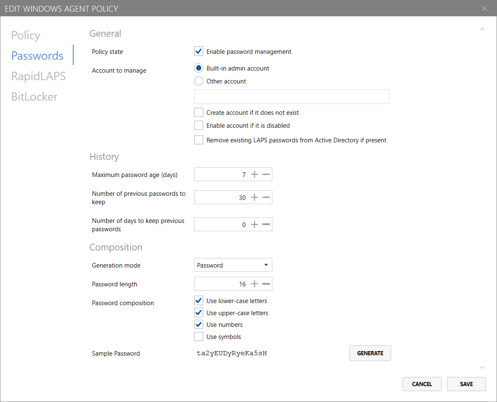
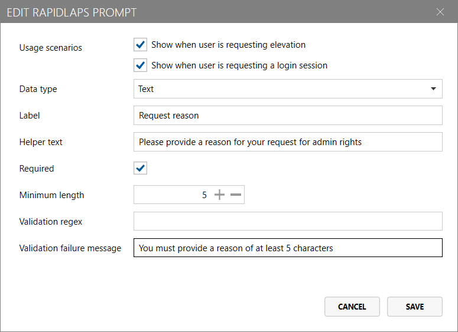

# Windows policies page

The `Windows policies` page in the `Access Manager Agent/Agent policies` area of Access Manager allows you to configure policies for devices running Access Manager Agent for Windows (version 3.0 or higher)

You can create custom Access Manager Agent policies that are targeted at specific computers, groups and containers - from Active Directory, Microsoft Entra, or AMS.

If no policies are configured, or no an agent does not match any of the custom policies configured, the "Default Windows agent policy" will be applied to the agent.

You can view or edit the default policy for Windows agents by clicking `Edit default Windows policy...` at the top of the page.

## Create or edit an agent policy

You can create a new Access Manager Agent policy for Windows devices by clicking the `Create new...` button at the bottom of the page.

### Policy settings
The first tab of the Windows agent policy configuration screen configures general information about the policy.

#### Policy name

Specify the name for the custom agent policy.


Note: This field is not configurable for the default policy.


#### Policy is enabled

Determines whether the custom agent policy is enabled for targeting.


Note: This field is not configurable for the default policy.


#### Agent check-in interval (minutes)

Configures how frequently the agent should attempt to check-in to the server - in minutes - to receive policy updates, reset local administrator account passwords (if required) and backup disk encryption keys (if required). Defaults to 60 minutes.

#### Targets

This list allows you to target specific computers, groups and containers - from Active Directory, Microsoft Entra, or AMS - that the policy will be applied to.


It is important to note that Access Manager evaluates policies in the order they are presented in the UI.

When an agent checks in to the Access Manager server, the server will evaluate each policy - in order - to determine if the policy is applicable to the agent (given the configured targets). The *first policy that matches* will be applied to the agent.

If no policy is configured with a target that captures the given device, the device's policy will fall back to the default Windows policy.

For this reason, it is important to consider the order in which your policies are organised; as a rule of thumb, policies with more specific targets should be placed *higher* in the list than more generically-targeted policies.



Note: This field is not configurable for the default policy.


### Password settings
The second tab of the Windows agent policy configuration screen - `Passwords` - configures password management and composition settings.

#### Enable password management

Configures whether the Access Manager Agent should attempt to manage and rotate the local administrator password on the device.


If Microsoft LAPS (new or legacy) is configured to manage the password on a machine, the Access Manager Agent's password change capability will be disabled, to ensure consistency.


#### Account to manage

* If __Built-in admin account__ is selected, the Access Manager Agent will manage the password of the [default Windows "Administrator" account](https://learn.microsoft.com/en-us/windows/security/identity-protection/access-control/local-accounts#administrator).
* If __Other account__ is selected, the Access Manager agent will manage the password of the account with the name specified in the field below.

You can optionally configure the following settings for managing local accounts:

* __Create account if it does not exist__: If this setting is enabled, the Access Manager Agent will create a local account with the specified name if it does not exist on the device.
* __Enable account if it is disabled__: If this setting is enabled, the Access Manager Agent will automatically enable the managed administrator account.
* __Remove exiting LAPS passwords from Active Directory if present__: If this device's local administrator password was previously stored in Active Directory, this setting will clear existing passwords once the agent checks in (if applicable).

#### History

* __Maximum password age (days)__: The maximum number of days before the password must be rotated. For example, if this is set to 7, then the password would be rotated after 7 days.
* __Number of previous passwords to keep__: The number of historical passwords to store in the Access Manager database.
* __Number of days to keep previous passwords__: The number of days to keep historical passwords for; setting this field to "0" disables aging out of historical passwords.

See [Password history and retention](../../help-and-support/advanced-help-topics/password-history-retention.md) for more information how how these settings work to ensure you have the right number of passwords retained.

#### Composition

If the `Generation mode` is set to __"Password"__, the following configuration options are available:

* __Password length__: The length of passwords to be generated for local administrator accounts
* __Password composition__
    * __Use lower-case letters__: If configured, generated passwords will contain lower-case letters
    * __Use upper-case letters__: If configured, generated passwords will contain upper-case letters
    * __Use numbers__: If configured, generated passwords will contain numbers
    * __Use symbols__: If configured, generated passwords will contain symbols

It is important to ensure that the configured settings are compatible with any local account password requirements you may have [specified in Group Policy](https://learn.microsoft.com/en-us/previous-versions/windows/it-pro/windows-10/security/threat-protection/security-policy-settings/password-must-meet-complexity-requirements#reference).

---

If the `Generation mode` is set to __"Passphrase"__, the following configuration options are available:

* __Wordlist__: The wordlist used to generate passphrases; configurable on the [Password settings page](access-manager-agent-password-settings-page.md)
* __Number of words__: The number of words to include in a generated passphrases
* __Minimum length__: The minimum length of passphrases generated by the Access Manager Agent
* __Capitalize words__: If configured, the first letter of each word in the passphrase will be capitalized.
* __Word separator__: The character used to separate words in the passphrase:
    * *Space*: Place a space " " between each word
    * *Hyphen*: Place a dash "-" between each word
    * *Underscore*: Place an underscore "_" between each word
* __Extra characters__: If required, randomly place extra characters at the end of one of the words in the passphrase to increase complexity.
    * *None*: Do not add extra characters to the passphrase
    * *Numbers*: Add extra numbers somewhere in the passphrase
    * *Symbols*: Add extra symbols somewhere in the passphrase
    * *Numbers & Symbols*: Add extra numbers & symbols somewhere in the passphrase
* __Number of extra characters__: The number of extra characters to add to the passphrase, as specified above.

### RapidLAPS settings (Windows only)

The third tab of the Windows agent policy configuration screen - `RapidLAPS` - configures the RapidLAPS feature of the Access Manager Agent.

*RapidLAPS* integrates into the Windows login screen and admin elevation prompts, allowing you to speed up the LAPS process wherever you use local admin accounts. With *RapidLAPS*, using just a QR code, or PIN, you can remotely authorize and log into any LAPS-enabled computer, without ever having to type a long and complicated password.

This feature works whether you are using Windows LAPS, legacy LAPS, or the Access Manager agent to manage your LAPS passwords.

#### Enable RapidLAPS for login

When configured, this setting will add a "Login with Lithnet RapidLAPS" tile to the Windows login screen, allowing login to the local administrator account via Access Manager.

#### Enable RapidLAPS for elevation

When configured, this setting will add an "Elevate with Lithnet RapidLAPS" tile to the Windows admin elevation prompt, allowing elevation of applications, installers, and system actions with the local administrator account via Access Manager.

#### User prompts

Optionally, you can present users with a series of "prompts" whenever they login or elevate with RapidLAPS. Responses to these prompts are delivered to the server if a login or elevation is attempted, and are presented to the user authorizing the request in the Access Manager web app (as well as being stored in the audit log).

The following options are configurable for user prompts:
* __Usage scenarios__: Configure whether the prompt is shown with RapidLAPS requests at either the *login screen* or during *elevation*.
* __Data type__: The type of prompt
  * *Text*: A simple text-box
  * *Multiline text*: A text box with multiple lines for long-form responses
  * *Drop-down list*: A drop down box, where a user can select an option from a list
  * *Checkbox*: A simple checkbox
  * *Label*: A piece of text that will appear in the prompt window (e.g., for providing organization-specific guidance)
* __Helper text__: An optional message presented alongside the prompt
* __Required__: Whether the specific prompt is required
* `Text` and `Multiline text`-specific fields
    * __Minimum length__: The minimum length of the text input; set to "0" to disable length requirements
    * __Validation regex__: An optional regular expression for validating text
    * __Validation failure message__: An optional message to present to users when the validation requirements are not met
* `Drop-down list`-specific fields
    * __List options__: A list of options a user can select in the drop down

### BitLocker settings (Windows only)

The fourth tab of the Windows agent policy configuration screen - `BitLocker` - configures BitLocker encryption key backup.


Note that the Access Manager Agent does not enable BitLocker on any devices. These settings only specify which BitLocker keys should be backed up, if they are found on the system.


#### Enable backup of OS drive encryption keys

If configured, the Access Manager Agent will securely backup BitLocker encryption keys for the volume that Windows is installed to the Access Manager server.

#### Enable backup of fixed drive encryption keys

If configured, the Access Manager Agent will securely backup BitLocker encryption keys for fixed devices, excluding the drive windows is installed to the Access Manager server.

#### Enable backup of removable drive encryption keys

If configured, the Access Manager Agent will securely backup BitLocker encryption keys for removable drives such as USB sticks to the Access Manager server.