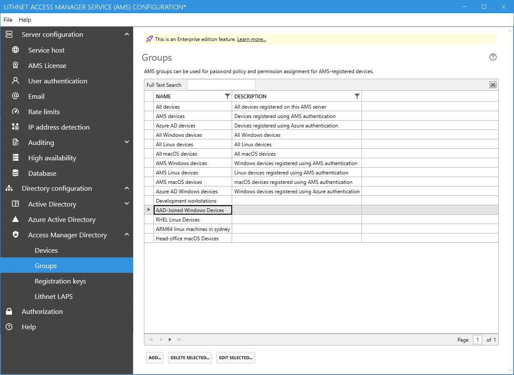

# Access Manager Directory Groups page

 The Access Manager directory is an [Enterprise edition feature](../../access-manager-editions.md)

The `groups` page provides the ability to create and manage AMS groups. AMS groups are stored in the Access Manager directory, and can contain devices that are registered with AMS. Groups can then be used in authorization rules, and for the application of password policies.

The following groups are built-in, and their membership is automatically manged by the system;

| Group name               | Description                                                                                   |
| ------------------------ | --------------------------------------------------------------------------------------------- |
| All devices              | All devices registered with this AMS server                                                   |
| AMS devices              | Devices registered using a registration key                                                   |
| Azure AD devices         | Devices registered using Azure authentication                                                 |
| All Windows devices      | All devices running a Windows operating system                                                |
| All Linux devices        | All devices running a Linux operating system                                                  |
| All macOS devices        | All devices running a macOS operating system                                                  |
| AMS Windows devices      | Devices running a Windows operating system that were registered using a registration key      |
| AMS Linux devices        | Devices running a Linux operating system that were registered using a registration key        |
| AMS macOS devices        | Devices running a macOS operating system that were registered using a registration key        |
| Azure AD Windows devices | Devices running a Windows operating system that were registered using Azure AD authentication |

Note, built in groups cannot be edited or deleted.

### Adding a group

You can use the `Add` button to add a new custom group. You must give the group a unique name, and then use the group membership selector to add devices to the group.

## Deleting a group

Deleting a group removes it permanently from the directory. You must ensure that you unassign the group from any registration keys and password policies before you delete it.
