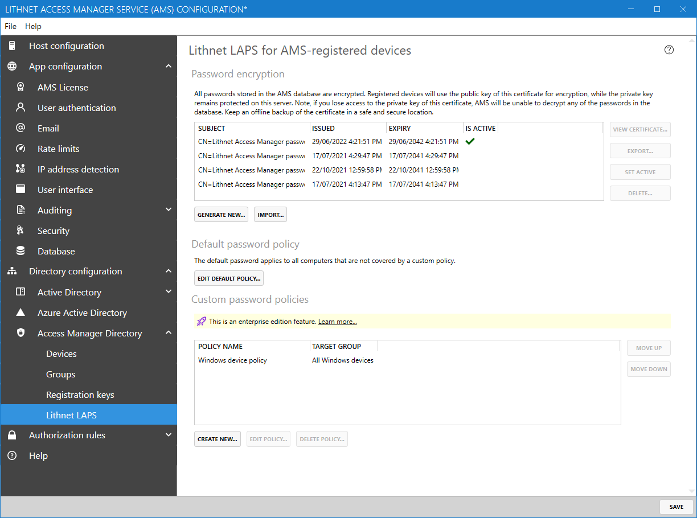
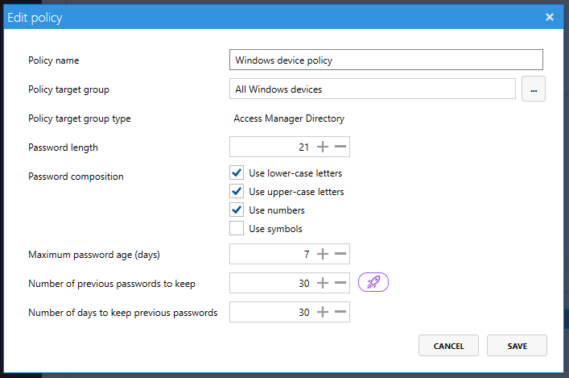

# Lithnet LAPS configuration page (Access Manager Directory)

## Default password policy

AMS registered devices get their password policy from the AMS server itself. The default policy is used for all devices not covered by a custom password policy.

## Custom password policies

 Custom password policies is an [Enterprise edition feature](../../access-manager-editions.md)

 Custom password policies allow you to target specific policies to specific device groups. Policies can be assigned to AMS groups, or Microsoft Entra groups of computers. Policies are processed in the order they appear on the screen, with the first matching policy taking precedence.

### Fields

#### Policy name

A friendly name for this policy

#### Policy target group

The name of the AMS group or Microsoft Entra group that this policy applies to

#### Password length

Specifies the length of the password that is generated by the device

#### Password composition

Specify the character types that must be present in the generated password

#### Maximum password age (days)

The maximum number of days before the password must be rotated. For example, if this is set to 7, then the password would be rotated after 7 days.

#### Number of previous passwords to keep
 Password history is an [Enterprise edition feature](../../access-manager-editions.md)

The minimum number of old passwords to retain in the database.

#### Number of days to keep previous passwords

The minimum number of days to keep previous passwords. If your devices are backed up, you set this value to the maximum retention period for your backups, so that you can always go back and get the local admin password from a previous snapshot.

If both the `Number of previous passwords to keep` and `Minimum number of previous passwords to keep` setting is in use, then old passwords will not be removed until both thresholds have passed. For example, if you had a policy to generate a new password every day, to keep a minimum of 5 passwords, and to keep passwords for 365 days, you would have 365 passwords in your history. More examples are in the table provided below.

|Maximum age|Passwords to keep|Days to keep|Effective number of passwords|
|---|---|---|---|
|1|50|0|50|
|1|0|50|50|
|1|5|365|365|
|1|7|1|7|
|1|7|7|7|
