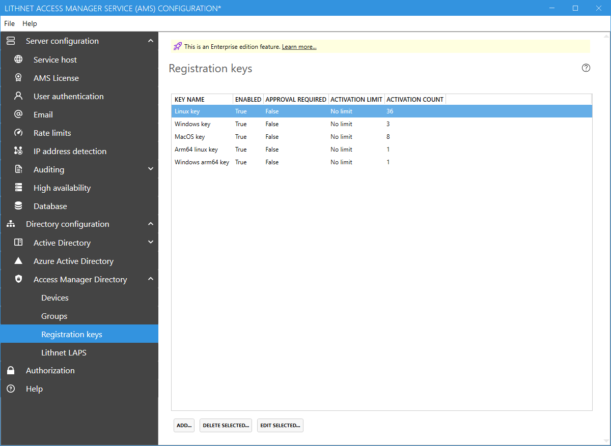
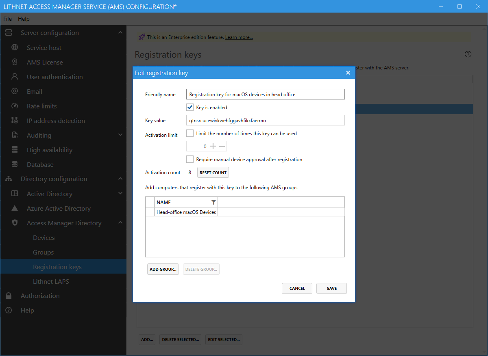

# Access Manager Directory Registration Keys page

 The Access Manager directory is an [Enterprise edition feature](../../access-manager-editions.md)

The `Registration Keys` page provides the ability to create and manage device registration keys. A key is required for a device to register with the AMS service, when an alternative form of authentication, such as Azure Active Directory authentication is not available.

A registration key is used by a device only once, to allow it to register its own unique set of credentials with the AMS server, which is used from that point on.

## Registration key settings

When you create a new registration key, a unique string value is automatically generated. You must assign a friendly name to this key, and optionally set parameters around reuse and approval.

#### Friendly name

You can choose a unique name for the key, so its use can be identified in the UI and in audit logs.

#### Key value

The read-only registration key that was generated by the system

#### Activation limit

You can choose to limit the number of times the key can be used, but default keys can be used an unlimited number of times. If you are creating the key for use on a specific device, then you can set this value to `1`, which will invalidate the key after its use.

#### Manual activation

You can choose to require that the device be manually approved in the `Devices` section of the app, before it can start sending its password changes.

#### Activation count

Shows the number of times the key has been used to successfully activate a device

#### Automatically-assigned groups

You can automatically add devices that use the key to any number of AMS groups that you specify. You can use this feature to ensure that specific access rules and password policies automatically apply to newly registered devices.
