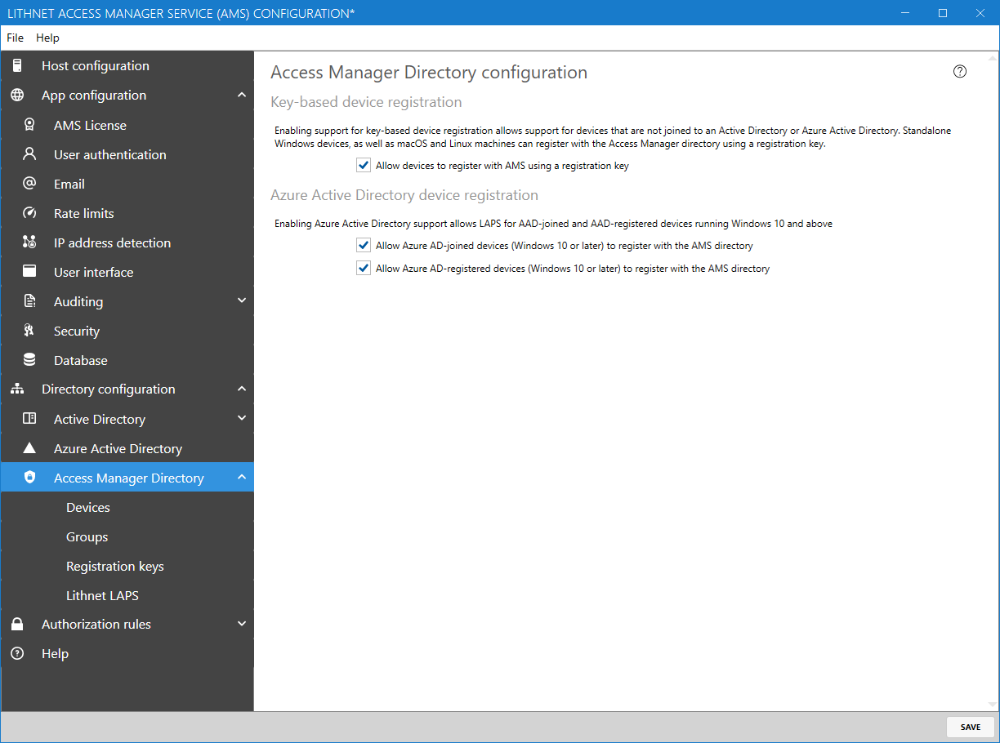

# Access Manager Directory configuration page

Access Manager has its own internal directory, used for registering and storing passwords of devices that are not joined to an Active Directory domain. Devices need to authenticate to the Access Manger directory, and can do so using either a registration key, or Azure Active Directory credentials.

### Key-based device registration

Enabling support for key-based device registration allows support for devices that are not joined to an Active Directory or Azure Active Directory.

You must enable key-based device registration in order to support devices running macOS, Linux, and non-domain joined Windows devices.

## Azure Active Directory device registration

Enabling Azure Active Directory support allows Windows 10 and higher devices that are either Azure AD joined or registered to authenticate to the Access Manager directory. These devices will use their AAD credentials to register with AMS.
